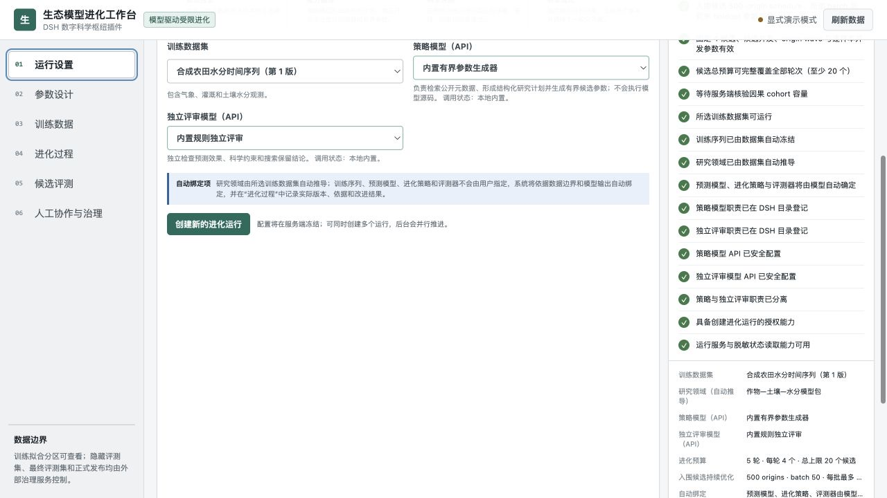
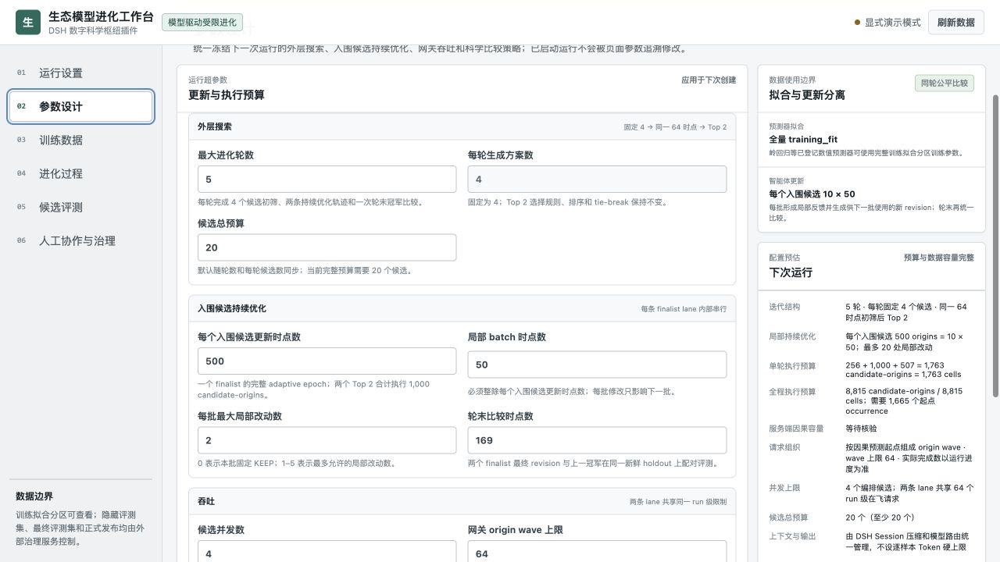
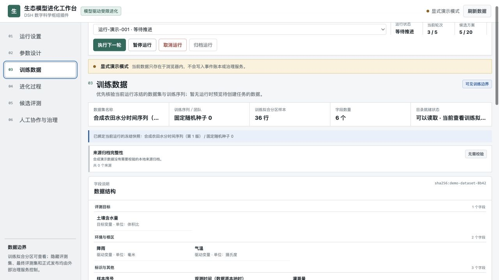
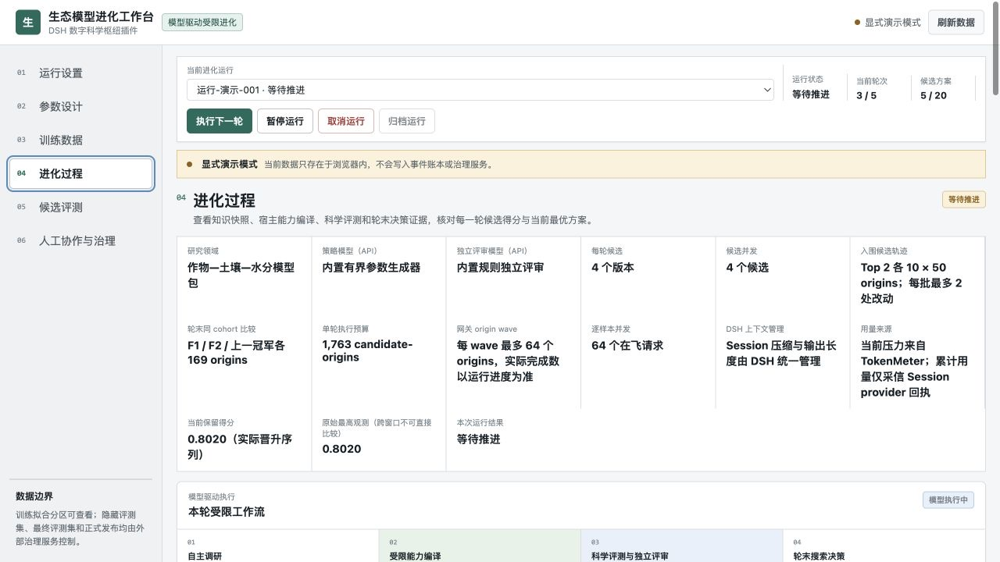
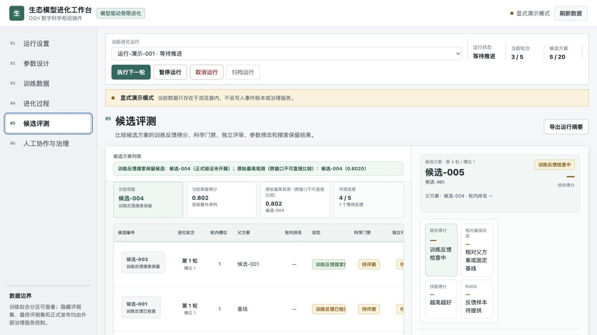
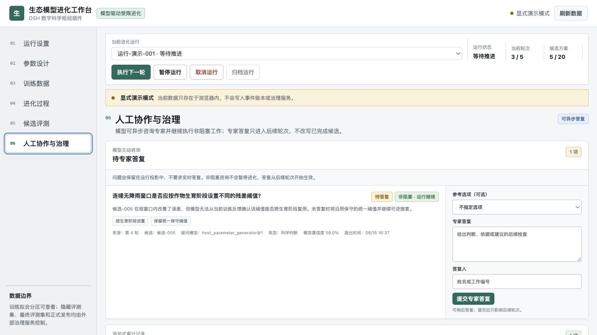

# EcologyRSI-DSH 生态模型进化工作台

一个把农业与生态预测研究中的“数据边界—模型调研—候选生成—科学评测—人工治理”串成可复现闭环的轻量 DSH 插件。

> 当前交付：`0.3.46` 可交付候选版 · Python 3.10+ · DSH `0.1.0-rc.6` · 本地服务端口 `8777/8848`

## 为什么做这个工作台

生态和农业模型研究通常不只是“换一个更大的模型”。真正影响结论能否复现、能否解释的，往往是数据集和观测序列是否固定，时间切分有没有泄漏，候选方案是否在同一条件下比较，网上看到的算法是否真的能在当前数据上执行，以及失败的尝试和人工判断有没有留下证据。过去这些步骤容易散落在脚本、笔记和临时对话中，研究者很难在下一轮准确回答“改了什么、为什么改、效果是否真的变好”。

EcologyRSI-DSH 把模型放在“研究助理”的位置，把数据、评测、参数范围和发布边界留在宿主侧。模型可以检索公开知识、提出预测模型或参数方向、解释弱点并生成多个候选版本；宿主只编译已登记的能力，在相同的时间前向分区上训练和评测，再按照明确的门禁和当前最佳方案（incumbent）规则选择下一轮父方案。这样做的价值不在于承诺某一个模型在所有温室都最优，而在于让探索过程可追溯、可比较、可暂停，也能在结果不理想时复盘原因。

## 研究价值

| 研究问题 | 工作台提供的支撑 |
|---|---|
| 如何让不同候选在同一条件下比较？ | 创建运行时冻结数据集、episode、时间分区、预测器/评测器版本、随机种子和门禁；每轮共享同一知识快照。 |
| 如何避免把论文摘要或模型幻觉直接变成代码？ | 在线知识只进入可审计的元数据快照，并映射到宿主已登记、范围受限的能力；未适配算法只能作为研究线索。 |
| 如何判断“变好”而不是只看一个漂亮分数？ | 使用时间前向反馈集、仅在 `training_fit` 中选择的持续性/24 小时季节性强基线、多时距指标、物理范围约束和独立评审；同轮候选必须在相同样本窗口比较，新版评分还要求实用差异与 24 小时配对区块置信度。 |
| 如何保留失败经验和人的判断？ | 候选、负例、隔离样本、人工意见和轮末决策写入追加式账本，支持暂停、干预、重放和导出。 |
| 如何从一个数据集扩展到更多生态问题？ | 数据适配器、预测器、评测器和知识映射采用注册表接口，可逐步接入温室环境、作物水分、产量和机理模型，而不改变进化闭环。 |

当前交付是面向本地研究开发的可交付版本，不是生产控制系统。它采用 Python 3.10、标准库、单进程和 SQLite；不执行模型生成的 Python/Shell 源码，不连接真实温室设备，也不开放隐藏评测或正式发布权限。研究结果应被理解为在明确数据边界内的离线证据，而不是控制收益或跨场景泛化的保证。

## 默认一轮如何执行

当前外层仍是“每轮 4 个候选、筛选后保留 Top 2”的选择逻辑；变化只发生在每个入围候选内部。默认执行合同如下：

| 阶段 | 默认工作量 | 作用 |
|---|---:|---|
| 同窗初筛 | `4 × 64` candidate-origins | 四个候选使用同一批 64 个预测起点，确定 Top 2 |
| 入围候选 adaptive epoch | `2 × 500` candidate-origins | 每个入围候选连续执行 `10 × 50` origins；每个 batch 结束后最多接受 2 处局部修改，下一批使用新 revision |
| 轮末同 cohort 比较 | `3 × 169` candidate-origins | 两个 finalist 的最终 revision 与上一冠军在同一冻结 holdout 上重新评测 |
| 单轮合计 | `1,763` candidate-origins | 对默认 3 个目标 × 3 个时距任务，等于 `15,867` 个评分单元 |

一个 prediction origin 是一个预测起点，不是一个“目标 × 时距”评分单元。默认温室任务的一次 origin 会同时产生温度、相对湿度和 CO₂ 在 1、6、24 小时的 9 个结果。500 因而表示每个入围候选的 500 次完整预测，而不是 500 个单独评分值。数据起点不足时，系统按可复现 occurrence 循环复用已用数据；每次使用仍记录窗口身份，不会把跨 cohort 原始分数直接比较。

默认候选并发为 4，逐样本并发为 64（可配置 1–128），网关 origin wave 上限为 64；两条 finalist lane 共享同一个 run 级在飞预算。同一 provider 另有 128 个物理在飞请求的全局 FIFO 上限。

## 界面概览

前端以 DSH Web Profile 插件形式运行，用户只需要选择训练数据集、策略模型 API、独立评审模型 API 和进化轮数。研究领域、训练序列、预测模型、进化策略和评测器由数据集目录与模型调研结果自动推导并冻结，不要求用户在多个内部实现之间反复做技术选择。

下面六张截图由 `0.3.46` 的 `?demo=1` 显式演示模式重新生成，全部是浏览器内合成示例，只用于说明当前界面和预算口径，不代表真实 AGC 评测结果；截图中没有真实路径、运行 ID、令牌或内部网关地址。



运行设置页先检查数据集就绪、模型职责分离、凭据与路由的静态可执行条件，再允许创建任务；它不会在启动时额外发送 API 探测请求。右侧同时展示自动绑定项、研究边界和数据容量，允许在数据不足时按 occurrence 循环使用冻结数据。



参数设计页统一配置轮数、候选总预算、每个入围候选的 epoch 时点数、局部 batch、每批最大局部改动数、轮末 holdout、候选并发和逐样本并发。右侧按 candidate-origins 和评分单元同时计算单轮/全程预算，避免把一次包含 9 个结果的完整预测误算成 9 次模型请求。DSH-native 运行不设逐样本 Token 硬上限；上下文压缩和输出长度由 DSH Session 与模型路由统一管理。



训练数据页把字段单位、训练拟合/训练反馈分区、冻结快照、来源完整性和进化训练资产放在一起，便于在看分数前先确认“用的是什么数据”。



进化过程页按“检索 → 能力编译 → 训练 → 科学评测 → 独立评审 → 轮末决策”展示每轮证据，并区分全程进度、当前 epoch 进度、真实请求状态和最近心跳。Top 2 进入正式 epoch 后，页面逐 batch 展示 revision 迁移、局部修改和诊断结果；蓝色点是同轮候选，绿色线只连接实际保留的 incumbent。



候选评测页同时呈现误差、基线、约束违规、参数变化、训练产物校验值和搜索结论，避免把单个综合分数误读成最终发布结果。



人工协作与治理页分开显示非阻塞的模型咨询、暂停后才生效的人工意见和仅记录意见，并明确隐藏评测、正式验证和发布权限仍由外部治理服务控制。

六个工作区的阅读顺序是：

1. **运行设置**：确认数据集和两个模型角色，创建并冻结运行清单。
2. **参数设计**：设置 finalist epoch、局部 batch、每批改动数、轮末 holdout、并发和总预算。
3. **训练数据**：核对字段、时间分区、样本预览和数据血缘。
4. **进化过程**：查看知识快照、候选阶段、实时请求、微批 revision 和 incumbent 轨迹。
5. **候选评测**：比较指标、科学门禁、独立评审和保留理由。
6. **人工协作与治理**：暂停后追加方向、参数覆盖、约束或父方案选择，检查哪些意见被执行、哪些只被记录。

## 已实现能力

- 接入 Autonomous Greenhouse Challenge 2018 黄瓜和 2019 番茄真实历史数据，完成 CSV 规范化、小时聚合、字段单位、缺失值处理、快照校验和时间前向分区；来源归档另按官方大小与 MD5 审计。
- 保留确定性合成数据 `generated-toy-series@1`，用于不依赖外部数据的工程回归。
- 提供四类候选生成路径：继承父代的有界参数扫描、消费上一轮指标的局部自适应搜索、服务端 DSH Bearer 网关模型提案，以及由模型输出调研计划、再由宿主编译的 `autonomous_model@1`。
- 每轮先生成可审计的知识快照：内置核验目录离线可用，可选通过 OpenAlex 检索论文元数据；只有映射到本地已注册且由本运行冻结选中的能力才进入候选上下文，在线结果和未安装算法只作为研究线索。
- 提供合成水分预测器、温室滚动残差预测器和外生变量岭回归残差预测器；服务端按数据集与模型自主研究结果自动绑定兼容评测器，可执行 1 小时或 1/6/24 小时多时距评测，目标为室内气温、相对湿度和 CO2 浓度。
- 支持内置规则评审或独立的 OpenAI-compatible 远程评审模型；候选生成模型与评审模型不能使用同一个模型标识。
- 提供中文 DSH webview 插件，包含“运行设置、参数设计、训练数据、进化过程、候选评测、人工协作与治理”六个工作区。
- 通过“查看分区”切换训练拟合/训练反馈样本，并展示字段和单位、来源归档校验、未就绪数据资产、每候选一条的进化训练轨迹、数据与分区校验值、候选参数、训练产物、多时距预测预览、得分轨迹、历史最高得分、真实六阶段状态、评测指标、搜索保留结果和脱敏事件。
- 支持暂停后追加方向建议、参数覆盖、数值边界约束或指定父方案；恢复后只处理下一轮。可唯一解析的方向建议按固定步长应用，参数覆盖与约束由宿主校验，无法唯一解析的文字只记录为“未执行”，历史记录不被改写。
- 支持运行创建、暂停、恢复、取消、逐轮推进、SQLite 重放、摘要、导出、校验和导入。

## 架构

```text
中文 DSH 插件 / HTTP 客户端
              |
              v
      本地 JSON API（脱敏投影）
              |
   +----------+-----------+
   |          |           |
数据注册表  策略路由器   科学评测器
   |          |           |
AGC CSV    本地策略或     训练产物 +
适配与分区  DSH 模型网关  独立评审
   +----------+-----------+
              |
       Evolution Director
              |
       追加式 SQLite 账本
```

浏览器只读取面向界面的脱敏投影。数据凭据、DSH Bearer 凭据、完整任务清单和原始事件载荷均保留在服务端。

后端实现按职责分层，已删除顶层同名兼容模块，业务代码直接从所属子包导入：

```text
src/ecologyrsi_dsh/
  application/    CLI 与配置装配
  core/           领域实体、事件账本、进化状态机
  data/           数据合同、目录、下载准备、温室适配与分区
  evolution/      候选策略与人工干预约束
  evaluators/     预测、科学评测与指标
  integrations/   模型绑定与 OpenAI-compatible 网关
  knowledge/      知识目录、公开元数据检索、能力映射与轮末判断
  presentation/   训练资产、运行投影与导出
  api/            HTTP 端点、命令执行、事件、静态资源和服务生命周期
```

前端不需要打包器，按功能拆分在 `plugins/ecology_evolution/assets/js/`；根目录 `app.js` 只负责事件绑定和启动。维护原则是入口保持薄层、共享合同集中、模块按职责拆分；现有账本、模型网关、评测器和部分前端渲染模块仍偏大，后续功能扩展前应优先继续拆分，而不是向这些文件追加新的职责。

## 快速启动

本项目当前固定使用 DSH `0.1.0-rc.6`。请先安装 Node.js（包含 `npm`）和
Python 3.10 或更高版本，再按以下顺序执行。

### 1. 安装 DSH

```bash
npm install --global @deepseek-ai/dsh@0.1.0-rc.6
dsh --help
```

如果本机已经安装了这个版本，可以跳过本步骤。不要直接省略版本号安装最新预览版，
因为 DSH 仍在快速迭代，本项目的宿主插件和 preset 已按 `0.1.0-rc.6` 的运行时接口冻结。

### 2. 安装 EcologyRSI-DSH

```bash
cd <repo-dir>
export LANG=en_US.UTF-8
export LC_ALL=en_US.UTF-8
python3 -m venv .venv
source .venv/bin/activate
python -m pip install -e .
ecologyrsi-dsh install-dsh-runtime --profile web
```

`install-dsh-runtime` 会把 EcologyRSI 宿主插件和当前六个不可变角色 preset ID
安装到 DSH 的 `web` profile。安装器会校验版本和内容摘要；同一份未发生漂移的
安装可以安全地重复执行。本版本不安装历史 preset，也不承诺旧运行合同兼容。

### 3. 启动服务

下面的命令在一个终端中启动内部 Python sidecar，并以前台方式启动 DSH Web：

```bash
export LANG=en_US.UTF-8
export LC_ALL=en_US.UTF-8
source .venv/bin/activate
mkdir -p .runtime

export ECOLOGYRSI_DSH_RUNTIME_TOKEN="$(python -c 'import secrets; print(secrets.token_hex(32))')"
export ECOLOGYRSI_SIDECAR_TOOL_TOKEN="$(python -c 'import secrets; print(secrets.token_hex(32))')"
export ECOLOGYRSI_DSH_RUNTIME_URL="http://127.0.0.1:8848"

ecologyrsi-dsh serve \
  --host 127.0.0.1 \
  --port 8777 \
  --db "$PWD/.runtime/ecologyrsi-dsh.sqlite3" &
ECOLOGYRSI_SIDECAR_PID=$!
trap 'kill "$ECOLOGYRSI_SIDECAR_PID" 2>/dev/null || true' EXIT

dsh --profile web --port 8848
```

打开 <http://127.0.0.1:8848/>，点击侧栏中的“生态模型进化”。浏览器只访问 DSH
的 `8848` 端口；`8777` 是仅供 DSH 宿主插件调用的本机 sidecar，不是需要单独打开的
前端端口。按 `Ctrl-C` 停止 DSH 后，上述 `trap` 会同时停止本次启动的 sidecar。

页面会读取当前真正可运行的数据集、预测模型、策略、评测器和 DSH 模型，不能运行的
目录项不会进入启动选项。首要选择是“数据集”，研究领域由数据集目录自动推导。

### 可选：无后端静态演示

无后端的静态演示必须显式使用 `demo=1`，且不会写入 SQLite：

```bash
python -m http.server 4173 --directory plugins/ecology_evolution
```

打开 <http://127.0.0.1:4173/?demo=1>。

## 真实数据

建议显式指定可移植的数据根目录，然后先审计、再按需准备数据：

```bash
export ECOLOGYRSI_DATA_ROOT=/path/to/greenhouse
PYTHONPATH=src python -m ecologyrsi_dsh data audit
PYTHONPATH=src python -m ecologyrsi_dsh data fetch agc_cucumber_2018
PYTHONPATH=src python -m ecologyrsi_dsh data fetch agc_tomato_2019
```

`data fetch` 从目录记录的 HTTPS 地址下载到
`$ECOLOGYRSI_DATA_ROOT/<dataset_id>/_archives/`，使用唯一临时文件，完成预期大小和 MD5 校验后才发布归档。默认继续安全解压；`--archive-only` 可只准备归档。已校验归档和已经满足必需文件合同的解压目录会直接复用；已有但校验不一致的归档或解压文件不会被覆盖。ZIP 会拒绝绝对路径、`..` 路径穿越、符号链接和特殊文件；番茄 7z 使用系统 `bsdtar`，同样先检查成员路径和类型。

未设置 `ECOLOGYRSI_DATA_ROOT` 时，程序使用
`~/.ecologyrsi-dsh/data/greenhouse`；显式设置环境变量始终具有最高优先级。

目录下包含数据集标识同名子目录。当前支持自动准备的状态如下：

| 数据集标识 | 内容 | 许可 | 当前状态 |
|---|---|---|---|
| `agc_cucumber_2018` | 2018 黄瓜，6 个温室 episode，每个约 2754 个小时行 | CC0-1.0 | 可运行 |
| `agc_tomato_2019` | 2019 番茄，6 个温室 episode，每个约 3983 个小时行 | CC0-1.0 | 可运行 |
| `agc_lettuce_online_rgbd_2021` | 生菜在线 RGB-D | CC-BY-4.0 | 仅目录登记 |
| `agc_lettuce_timeseries_rgbd_2022` | 生菜时序与 RGB-D | CC-BY-4.0 | 仅目录登记 |

两个生菜条目尚未实现规范化适配器，不能创建运行。服务启动时会按必需文件模式重新计算就绪状态，因此“目录中登记”不等于“本机可运行”。

真实数据说明接口同时返回 `readiness.provenance` 和 `readiness.source_integrity`。后者核对 `<dataset>/_archives/` 中来源归档的文件名、大小与 MD5；当前归档记录为黄瓜 `243eaa9041da23d0c4bf99576715aa44`、番茄 `2a0c7f3332881caef54ca8f4dc60c9a3`。归档缺失或不匹配会在界面明确告警，但不会把已经解压并满足必需文件合同的数据伪装成未就绪；运行就绪与来源可追溯性是两个独立状态。

### 时间前向分区

真实温室 episode 按时间顺序固定划分，所有范围均为左闭右开的行区间：

```text
约 0%       30%       60%          80%          100%
  | training_fit | 1h | training_feedback | 24h | development | 24h | gate |
```

- 前 60% 为训练区，其中前半用于 `training_fit`，后半用于 `training_feedback`，两者之间设置 1 小时 embargo。
- 随后的 20% 为 `development`，与训练区之间设置 24 小时 embargo。
- 最后约 20% 为 `gate`，与开发区之间设置 24 小时 embargo。
- 名称含 `Reference` 的 episode 标记为 `external_holdout`。
- 插件从 5 个非 Reference 优化 episode 中按数据集目录确定性绑定一个；绑定结果进入样本请求、运行清单、数据 digest 和训练产物血缘。当前界面不要求用户单独选择 episode。
- 浏览器样本 API 只允许 `training_fit` 和 `training_feedback`；`development`、`gate`、`external`、`hidden`、`test`、`final` 的原始行一律拒绝。
- 当前本地自适应闭环只在 `training_fit` 拟合，在后续 `training_feedback` 评测；不会使用 `development`、`gate` 或外部留出集调参。

## 策略、评测与模型

| 类型 | 标识 | 说明 |
|---|---|---|
| 策略 | `parameter_sweep@1` | 继承已完成父候选参数，同轮按稳定槽位扫描有界维度 |
| 策略 | `adaptive_local@1` | 根据父候选得分、是否通过和相对改进确定调整方向与步长 |
| 策略 | `dsh_authenticated@1` | 服务端 Bearer 网关模型接收脱敏父参数、聚合指标、评审建议和人工意见后提案，宿主继续校验字段与范围 |
| 策略 | `autonomous_model@1` | 服务端模型生成一次结构化调研计划，宿主从已登记能力编译有界参数提案 |
| 预测模型 | `greenhouse-rolling-residual@1` | 使用目标历史窗口与训练拟合分区偏差开展 1 小时预测 |
| 预测模型 | `greenhouse-exogenous-ridge@1` | 使用外气象、设定值、动作、根区等外生特征学习相对持续性基线的残差 |
| 预测模型 | `greenhouse-targetwise-ridge@1` | 分目标缩放岭回归残差修正；单个目标的缩放系数为 0 时独立使用持续性预测 |
| 评测器 | `toy_time_forward@1` | 合成数据验证分区工程评测 |
| 评测器 | `greenhouse_time_forward@1` | 真实温室 1 小时训练拟合/训练反馈时间前向评测 |
| 评测器 | `greenhouse_multihorizon_time_forward@1` | 岭回归专用的 1/6/24 小时训练拟合/训练反馈评测 |
| 候选生成 | `host_parameter_generator@1` | 内置有界参数生成器 |
| 独立评审 | `rule_judge@1` | 内置固定规则门禁 |

模型和评测器必须兼容：滚动残差模型只支持 1 小时评测；外生变量岭回归和目标级岭回归同时兼容 `greenhouse_time_forward@1` 的 1 小时评测与 `greenhouse_multihorizon_time_forward@1` 的 1/6/24 小时评测；合成预测器只支持 toy 评测。工作台会自动对齐可选项，服务端仍在运行写入前再次拒绝不兼容组合。

滚动残差候选修改 `blend`、`window`、`bias_scale`；统一缩放的岭回归候选修改 `history_steps`、`ridge_alpha`、`residual_scale`；目标级岭回归则分别修改空气温度、相对湿度和二氧化碳的残差缩放系数，其中某个目标的系数为 0 时该目标单独使用持续性预测。所有参数都由策略模型在宿主登记范围内提出，不由用户选择。岭回归的特征选择、缺失值填补和标准化只在 `training_fit` 拟合，并按真实小时戳构造 1/6/24 小时目标；结果变量不进入外生特征。评测在后续 `training_feedback` 比较三项目标的 MAE、RMSE、归一化 RMSE、技能得分、缺失行和物理范围违规。评分基线在预测前仅用 `training_fit` 对每个“目标 × 时距”比较持续性与 24 小时季节性基线，同样本 RMSE 更低者被冻结并绑定 digest；模型生成预测仍保留原持续性参照，不受评分基线替换影响。固定科学门禁要求每个目标/时距不劣于冻结强基线、总体技能得分大于 0 且预测不违反目标物理范围；若使用远程 judge，还必须同时得到独立评审接受，候选才算 `passed`。

`passed` 不等于被搜索保留。同一轮候选必须共享完全相同的评测窗口，本轮通过科学门禁和独立评审的候选才进入选择。没有 incumbent 时，候选还须通过有效性、实用差异和逐单元稳健性门禁才能建立初始搜索基线；已有 incumbent 时，DSH-native 会把同轮全部候选作为一个预声明比较族，在完全一致的 24 小时区块上执行 3 日 moving-block、1,000 次确定性重采样的 centered max-T 稳定性检验，同时要求 `candidate_score - incumbent_score > 0.005`、不少于 8 个配对区块、足够连续起点且所有目标/时距均不退化。Director 只接受账本中该轮统一分析已经选出的 champion，不能由手工 `approved` 绕过，也不会再叠加另一套旧式 pairwise bootstrap 二次判定。私有计算保留全部区块的充分统计量，公共投影不暴露区块明细。同一可比窗口会跨轮保留证据等级和评分更优的搜索父方案，避免后续搜索从退化候选继续；不同轮窗口不同时不比较原始分数，本轮最佳只作为下一轮搜索父方案。以上结果仍属于 `exploratory_adaptive_data`；生产结论必须另经独立 holdout 正式验证。

## 网上知识检索与可执行方案筛选

新建 DSH-native 运行把自主研究协议冻结为 `dsh-model-search-reflect@1`。每轮形成下面的可重放闭环：

1. `generation.search-plan`：策略模型读取上一轮聚合指标、批次反思和当前父 Genome，自主提出最多 6 条启动检索词与关注问题；该结构化输出本身不执行网络请求，也看不到原始反馈行。
2. Host 检索工具：宿主先执行模型检索词，再补充确定性的领域/弱点查询；读取内置核验目录，并在启用联网时查询 OpenAlex 元数据。网络失败只产生告警并回退内置目录。
3. `generation.research-synthesis`：Researcher 只能引用本轮冻结证据，整理与候选槽位数量完全一致的多套、彼此不同、可由登记能力实现的优化方向。参数方向必须显式声明 `increase` 或 `decrease`，预测器/Planner Skill 方向声明 `select`；Host 会在整组方向上预分配互不重复的合法行为 witness，并拒绝藏在自由文本中的精确参数赋值。
4. `candidate.propose`：每个候选槽位绑定其中一个方向，Candidate Proposer 输出初始 GenomeMutation；Host 将它编译成登记预测器、工具策略或工作流参数，同时校验目标、方向、范围和步长，拒绝任意代码、越界、无效变更和重复行为。
5. 四个候选先在相同的 64-origin screening cohort 上完成严格向量链并确定 Top 2。两个 finalist 随后各自按 50-origin batch 执行 500-origin adaptive epoch；batch 反馈只用于候选内部诊断与生成下一 revision，每批最多接受 `max_local_edits_per_batch` 处有界修改。
6. 两个 finalist 的最终 revision 与上一 incumbent 在同一 169-origin 冻结 holdout 上评测。Host 只依据这次同 cohort 结果、科学门禁、最小实用差异和配对稳定性决定是否更新 incumbent；`generation.reflect` 再读取显式绑定候选、direction digest、最终排名和改进/退化证据的结果映射，指导下一轮 synthesis。

启动检索不是唯一检索时机。Researcher、Candidate Proposer、Sample Planner、Sample Critic、Generation Judge 和 Coordinator 在各自阶段加载必需 Skill 后，都可以在遇到证据缺口时调用零到三次同一个 `web_search`。模型只提交 1–4 条短查询和阶段内 `retrieval_key`，不能选择 provider：包装器先调用 DSH 内部 `ctx.web.search`；若 provider 不可用、出错，或结果少于 2 个不同 HTTPS 来源、少于 2 个有标题/摘要的证据来源、与查询没有词项重合，Python sidecar 才自动调用 OpenAlex 元数据回退。主结果与回退结果按 URL 去重、最多保留 8 个来源，并以 `DshRetrievalExecuted` 事件持久化；相同阶段检索在恢复时先重放，不重复联网。动态结果只作为推理参考，不能自行进入冻结 `evidence_ref`、改变预测向量、评分、门禁或晋级。

插件不暴露 provider 专用工具，也不开放 `web_fetch`。显式取消会终止当前检索而不发起回退；检索仍必须发生在 Skill 之后、预测/结构化终端工具之前，Sample Planner 的一次登记预测工具调用保持不变。

这里的“实现方案”指把模型方案编译成 EcologyRSI 插件自己的受限 Genome，并调用宿主已登记的科学工具；不会修改 DSH 基本框架，也不会执行模型生成的 Python、Shell、依赖安装或任意网络代码。新增算法必须先由开发者实现、测试并登记为插件能力，之后才能被策略模型选择。

在线内容不会被下载为代码，也不能修改参数范围、数据分区、评测器或科学门禁。服务端默认仅使用内置目录；插件创建的运行默认启用 OpenAlex 元数据检索。可用 `ECOLOGYRSI_KNOWLEDGE_ONLINE=0` 在部署层强制关闭，或设置为 `1` 强制开启。每轮最多执行 6 条、每条最多 180 字符的短查询；模型生成的查询拥有最高优先级，Host 的具体弱点词随后执行，宽泛领域词最后兜底。结果够用就停止，空结果才继续，并按 OpenAlex work ID 去重。系统不会把全部领域、弱点和失败词拼成一个长查询。OpenAlex 单次请求默认等待 20 秒，可用 `ECOLOGYRSI_OPENALEX_TIMEOUT` 设置正数秒值；超时、连接错误及 HTTP 408/425/429/5xx 最多额外重试 3 次并短指数退避，存在 `Retry-After` 时在单次 5 秒安全上限内按服务端建议值等待，其他 HTTP 错误立即回退到内置目录。若共享系统代理对 OpenAlex 返回 429，且部署策略允许该固定 HTTPS 来源直连，可在启动服务时仅设置 `NO_PROXY=api.openalex.org`，模型 provider 仍继续使用原代理。每次响应仍只读取最多 1 MB 的元数据，不做启动探活。

## 进化投影与训练资产

运行投影包含两个面向解释和治理的派生视图：

- `projection.rounds` 按轮展示知识检索与方案筛选、提案、候选生成、训练、评测、独立评审和保留决策，并列出来源、执行映射与轮末判断。
- `projection.training_assets` 为每个已生成候选派生且仅派生一条脱敏进化训练轨迹。轨迹按顺序串起样本输入上下文、智能体检索与提案、宿主能力编译、训练与逐样本预测、评测反馈、参数优化方向、父子候选关系和最终搜索决策；同时保留阶段 `episode`、血缘、复现字段、事件收据链和自校验 digest。预测记录只提供有限的结构化结果摘要，不返回隐藏评测、原始数据行或模型私有推理。

训练资产的 `admission.tier` 只取 `iterative_positive`、`iterative_negative`、`quarantine`、`pending`：分别表示迭代中被保留、迭代中被拒绝、候选失败需隔离、流程尚未形成决策。四类资产都固定为 `formal_training_ready=false` 和 `requires_governance_review=true`；它们只是迭代证据，未经治理审核，不能直接作为正式 SFT/DPO 数据。

## DSH 原生 Agent 运行时

0.3.46 新建运行使用 `dsh_native_plugin_evolution@1`：Agent Session、上下文压缩、
subagent 和 Workflow 由 DSH 管理，Python 只提供科学工具与持久账本。安装后直接运行：

```bash
ecologyrsi-dsh install-dsh-runtime --profile web
dsh --profile web --port 8848
```

完整的首次安装、sidecar 启动和令牌配置见上文“快速启动”。浏览器只访问 DSH 的
`8848` 端口，不需要单独启动前端端口；Python sidecar 默认仅监听
`127.0.0.1:8777`。

## DSH OpenAI-compatible 模型目录

推荐分别配置候选生成模型和独立评审模型。插件的两个角色下拉框共同读取后端 `dsh_models` 登记目录；具备安全后端路由、服务端凭据和对应角色的条目可以直接用于运行，角色不匹配、缺少凭据或被 URL 安全策略阻止的条目会禁用。目录通过 `configured_strategy_model_count`、`configured_review_model_count`、`executable_strategy_model_count`、`executable_review_model_count` 和 `roles_ready` 报告运行就绪状态。DSH Web Profile 打开插件时，会通过宿主 `llm.models` 目录把当前已登记的 provider/model 脱敏传入握手。后端 `dsh_models` 是执行配置与调用健康状态的权威目录；仅存在于宿主的模型仍会显示，但会以 `host_route_not_available_to_sidecar` 原因禁用，不能被当前后端选择或执行。密钥只放在服务端环境变量中：

未设置 `ECOLOGYRSI_DSH_MODELS_JSON` 时，Python 服务会自动读取当前用户的 `~/.dsh/settings.yaml` 和权限为 `0600` 的 `~/.dsh/.credentials.yaml`，把 DSH 的 provider/model 目录转换为同一份 `provider/model` ID。设置 `ECOLOGYRSI_DSH_DISCOVERY=0` 可关闭自动发现，设置 `ECOLOGYRSI_DSH_SETTINGS_FILE` 或 `ECOLOGYRSI_DSH_CREDENTIALS_FILE` 可指定文件位置。自动发现只接受 OpenAI-compatible provider；非回环 `http://` 地址会以 `insecure_http_blocked` 原因显示为不可用，交付配置必须使用 HTTPS。创建运行只校验路由、凭据、执行配置和角色，不发送 API 健康探测；真实连通性与 JSON 契约由提案或评审请求检查。这些请求默认单次可等待 900 秒、最多尝试 4 次，对 408/425/429/5xx、超时和瞬时网络故障指数退避，并尊重服务端 `Retry-After`。可用 `ECOLOGYRSI_DSH_MODEL_TIMEOUT`、`ECOLOGYRSI_DSH_MODEL_MAX_ATTEMPTS`、`ECOLOGYRSI_DSH_MODEL_RETRY_BASE_SECONDS` 和 `ECOLOGYRSI_DSH_MODEL_RETRY_MAX_SECONDS` 调整；瞬时失败只记录业务调用诊断，不撤销已持久化的验证状态。

```bash
export ECOLOGYRSI_POLICY_TOKEN='replace-with-server-secret'
export ECOLOGYRSI_JUDGE_TOKEN='replace-with-server-secret'
export ECOLOGYRSI_DSH_MODELS_JSON='[
  {
    "id": "policy-main",
    "label": "DSH 候选生成模型",
    "roles": ["propose"],
    "gateway_url": "https://dsh.example/v1",
    "model": "policy-model-name",
    "api_key_env": "ECOLOGYRSI_POLICY_TOKEN"
  },
  {
    "id": "judge-main",
    "label": "DSH 独立评审模型",
    "roles": ["judge"],
    "gateway_url": "https://dsh.example/v1",
    "model": "judge-model-name",
    "api_key_env": "ECOLOGYRSI_JUDGE_TOKEN"
  }
]'
```

网关调用 `{gateway_url}/chat/completions`，使用 Bearer 认证和 JSON object 响应格式。远程地址必须使用 HTTPS；只有 `localhost` 或回环 IP 可以使用 HTTP。URL 不允许内嵌凭据、查询参数或片段。模型目录和 API 投影会删除密钥及密钥环境变量名。

自主运行必须在目录中配置两个不同的模型连接 ID，并分别声明 `propose` 与 `judge` 角色；单模型配置不属于当前交付合同。

### New API / GLM 5.2 双角色示例

New API 只要提供 OpenAI-compatible 的 HTTPS `/v1` 入口即可接入。下面把同一服务中的 GLM 5.2 分成候选生成和独立评审两个模型连接；请将 `<new-api-host>` 替换为实际部署地址，并确认该部署使用的模型标识确实是 `glm-5.2`（不同网关可能使用别名）。密钥只放在服务端环境变量，不要写入插件或提交到仓库：

```bash
export NEWAPI_GLM52_POLICY_TOKEN='replace-with-newapi-server-secret'
export NEWAPI_GLM52_JUDGE_TOKEN='replace-with-newapi-server-secret'
export ECOLOGYRSI_DSH_MODELS_JSON='[
  {
    "id": "newapi-glm52-policy",
    "label": "New API GLM 5.2 候选生成",
    "roles": ["propose"],
    "gateway_url": "https://<new-api-host>/v1",
    "model": "glm-5.2",
    "api_key_env": "NEWAPI_GLM52_POLICY_TOKEN"
  },
  {
    "id": "newapi-glm52-judge",
    "label": "New API GLM 5.2 独立评审",
    "roles": ["judge"],
    "gateway_url": "https://<new-api-host>/v1",
    "model": "glm-5.2",
    "api_key_env": "NEWAPI_GLM52_JUDGE_TOKEN"
  }
]'
```

创建运行时使用 `strategy_model_id: "newapi-glm52-policy"` 和 `review_model_id: "newapi-glm52-judge"`。两者可以使用同一 New API 账号，但必须保持不同的连接标识和角色；服务端会分别检查执行配置并把无凭据的配置摘要冻结到运行清单。网关会自动请求 `{gateway_url}/chat/completions`，不要把该路径重复写入 `gateway_url`。

工作台不提供独立的模型连接验证步骤。服务端在每次真实模型调用中使用 Bearer 凭据，并严格校验 OpenAI-compatible JSON 响应契约；连接或契约失败会写入脱敏健康状态和运行阶段记录，不暴露凭据或网关地址。运行就绪读取 `execution_available` 和 `roles_ready`。

## 模型自主调研与受限能力编译边界

模型自主工作流默认启用：创建运行只冻结数据、模型路由与预算，不调用模型 API；后台开始首轮后，策略模型才在轮次上下文中返回受限 JSON 计划，内容包括候选团队角色、预测模型族、搜索策略、公开来源摘要、能力采用理由和置信度。每一代只生成并持久化一份共享研究计划，同代候选复用该计划。未明确切换到另一预测器时，系统继承当前已采用的预测器并按它生成参数 schema；显式切换时不会把旧 pipeline 的蓝图或 synthesis 错配到新算法。生产 `research_compile_evolve@1` 每轮都必须重新提交与冻结证据相绑定的 Blueprint 和 synthesis；当宿主确认无兼容可执行证据时，只能返回显式 `algorithm_synthesis_degradation`，不能通过省略字段静默继承。首次漏字段、错误降级或未引用本轮调研证据时，网关会带契约反馈再请求一次；第二次仍不合格则在严格模式中阻断轮次。服务重启时优先重放已冻结计划，不重复发起研究请求。联网调研只读取固定的 OpenAlex 论文元数据和有界摘要；离线时使用内置知识目录。

每次逐代 research 还会收到一个完全由追加式事件账本重放派生的 `cross_generation_experience`。系统最多扫描最近 24 个可用运行，按运行轮转选取最多 8 个来源运行、12 个已分析代的修改、算法综合、算法失败、样本失败、弱目标/时距、修复成效和是否改善；问题分别进入 `active_unresolved` 与 `resolved_archived`，两组各最多 16 项。问题只有在后续同类评测证据中不再出现时才归档，后续没有相应评测证据时仍保持未解决。整个摘要采用聚合白名单，不含原始样本、预测记录或代码，UTF-8 JSON 硬限制为 16 KiB；容量超限时确定性裁剪并记录 omitted 计数。因此第 N 代可以使用不止第 N-1 代的经验，同时相同事件流在重启后会派生相同摘要。

历史结果分为“方向性经验”和“硬参数 guardrail”。小样本、单一 cohort 的结果可进入弱点与修复摘要，但不会冻结后续搜索参数。只有数据集、时间分区、评测器 ID 及 digest 完全一致，且同一 `target × horizon` 在至少 2 个样本窗口中分别有不少于 20 个样本、总样本数不少于 40、每次 skill 均非负且约束违规为 0 时，才进入硬保护候选。两个 cohort digest 不同只表示窗口不同，不代表样本独立；宿主还要求底层 population digest 完全相同，并根据 selected count 和环形 window offset 验证窗口两两不重叠。字段缺失、population 不同、窗口重叠或同一参数有多个分别达标的冲突值都不生成 hard guardrail。同一 cohort 的多代证据只计一次，并取最保守的样本数和 skill。有效保护值会在远端提案、人工覆盖和有界干预完成后由宿主最终恢复，模型上下文中的建议不能修改它。因此 `N=9` 的链路验收每个目标/时距只有 1 个样本，绝不会被标记为已验证硬约束。

这里的“能力编译”是策略模型提出选择和参数方向，宿主将已采用的知识映射、候选参数和冻结数据边界编译成不可变算法 IR。IR 只含宿主登记的特征、拟合、预测和后处理算子；模型不能写入或执行任意 Python、Shell、动态导入、依赖安装或网络工具。在生产 `research_compile_evolve@1` 工作流中，若研究计划要切换预测器，必须同时提交与宿主登记的 pipeline、算子顺序和参数名称完全匹配的 `algorithm_blueprint`；蓝图引用的同代冻结证据中，至少一条必须是 `adopted` 或 `available_not_selected` 的 predictor，并明确映射到该 pipeline。只提交预测器 ID、引用其他 pipeline，或仅有 `research_only` / `metadata_only` 证据，都不能编译执行。

策略模型在该蓝图之上提交 `algorithm_synthesis`，但它只能引用蓝图已经引用的同代冻结证据，只能选择该 pipeline 已登记的 `parameter_focus`，并且 pipeline 必须与蓝图一致；它不能增加算子、参数、依赖或代码。宿主把冻结的 plan、Blueprint 和 synthesis digest 一并编译到受限算法 IR。每个候选随后必须依次通过 compile、静态 debug 和 `training_fit` 内部时间前向 training smoke，确认登记算子、有限输出、物理边界和算子轨迹后，才进入真实样本合同。闭式岭回归等传统模型只作为宿主登记预测工具：每个 origin 必须由远程 Planner 显式选择工具；只有 Planner 表示不确定、工具结果异常或执行失败时才调用远程 Critic，候选完成宿主评分后再做聚合反思。瞬时 smoke 工具故障可重试，确定性失败进入轮末 `algorithm_failures`；同代 synthesis 与 compile/debug/评测/晋升结果的关联进入跨代经验，但明确标记为观察关联而非因果归因。

真实自主运行只使用 `dsh-strict-origin-bundle@4`。一个“智能体样本”表示一个预测起点：远程 Planner 在 DSH 子会话中选择登记的联合向量工具，Host 一次生成温度、相对湿度、CO₂ 在 1、6、24 小时的 9 个结果；不确定或失败时才进入远程 Critic 修复/拒绝路径，随后由 Host 逐单元评分。严格 checkpoint 只在整个向量和当前策略要求的角色动作完整后原子落盘，恢复时只复用能验证该冻结执行策略的 origin。候选级聚合反思可以读取评分后的结果，但无权改写已经持久化的预测。

严格运行只有在冻结统计门槛满足，且已评测 origin 具有完整 Planner/工具证据以及条件触发时的 Critic 证据，才允许晋升。finalist 的 batch 得分只诊断当前局部方向，不承担跨 batch 晋升判断；每个 revision 的改动数受 `max_local_edits_per_batch` 限制，数值步长和所有结构变更仍受宿主信赖域及能力注册表约束。轮末必须把两个最终 revision 与 incumbent 放回同一 holdout，未显著改善时继续保留 incumbent，不用跨窗口原始分数制造“快速进化”。

DSH-native 运行不接收 `token_limit`，上下文压缩和输出长度由 DSH Session 与模型路由统一管理。

覆盖率止损只在固定 cohort 的总体或任一目标/时距“最大可达覆盖率”低于冻结门槛时触发，即使所有尚可恢复和未执行样本全部成功也无法通过才会停止后续远程微批。未执行样本仍生成 `attempts=0` 的明确失败记录，并沿用现有最坏回退参与评分；该止损不缩小分母、不提高分数，也不改变总体和逐任务 80% 门槛。

需要在不创建完整多轮进化运行的情况下验收真实样本链路时，可执行下面的显式工程检查。脚本从 `--db` 指定的账本中只读选择最近一条同时冻结 planner 与 critic 的 `RunCreated` 绑定；可用 `--reference-run-id` 固定某次运行，`--planner`、`--critic` 和对应 digest 仅用于断言账本中的冻结值。它完整拟合 `training_fit`，再从 3 个目标 × 3 个时距各取一个不依赖标签的时间分位点。planner 只选择工具，岭回归仅在被选择后由宿主执行，critic 再接受或指定修复工具；总体和每个预测任务都必须达到 80% 覆盖率。输出明确标记为不可用于科学评分、候选晋级或训练资产。脚本先验证 wheel、sdist、完整交付包、内外部校验和与当前逐文件源码完全同源，再把这些 SHA-256 写入 `release_binding`；网络验收结束后会重新执行并逐字段比较同一绑定，期间任何源码或产物变化都会使验收失败。因此必须先构建并校验当前发布物。验收脚本不会放行非回环明文 HTTP provider，正式交付必须使用 HTTPS。

```bash
make release
RELEASE_PYTHON="$(uv python find --no-project --system '>=3.10')"
"$RELEASE_PYTHON" -B scripts/real_api_agent_tool_acceptance.py \
  --db /tmp/ecologyrsi-dsh-dsh-adapter.sqlite3 \
  --samples-per-task 1 \
  --minimum-coverage 0.8 \
  --dist-dir dist \
  --output dist/ecologyrsi_dsh-0.3.46-real-api-agent-tool-acceptance.json
```

验收无论通过或失败都会原子写入 JSON 报告；省略 `--output` 时默认写到系统临时目录下的
`ecologyrsi-dsh-real-api-agent-tool-acceptance-latest.json`。输出可以放在 `dist/` 的独立 JSON
或项目目录之外，但不能覆盖源码清单成员、输入账本、wheel、sdist、完整交付包或
`SHA256SUMS`；冲突路径只向标准输出返回脱敏失败，不写文件。失败报告只保留模型 ID、请求角色、
耗时、错误分类、重试次数和覆盖率等脱敏诊断，不保存提示词、响应正文、密钥或网关地址；命令
返回非零表示本次真实链路证据不足，并不自动表示 API 凭据失效。验收 JSON 在发布构建之后
生成并保持外置，避免报告递归绑定包含自身的归档；交付记录应另行保存该报告本身的 SHA-256。

因此，自主调研和实现计划是可审计的建议输入，不等于模型已经证明了科学有效性，也不等于正式发布或设备控制授权。候选仍必须经过训练、时间前向评测、独立评审和宿主保留规则；训练资产仍标记为需要治理审核。

## DSH 插件与服务令牌

插件清单位于 `plugins/ecology_evolution/plugin.json`，当前标记为 `delivery-candidate`，但仍是未签名 webview 包。DSH 可直接托管其中的静态前端，不需要另起前端端口；Python 后端保持独立部署，由 DSH 同源代理转发。宿主在收到 `plugin.ready` 后通过 `postMessage` 发送：

```json
{
  "type": "dsh.context",
  "api_base": "/api/ecology-evolution",
  "capability_token": "service-token-from-host",
  "identity": {"subject_id": "researcher-17", "display_name": "研究员甲"},
  "capabilities": ["evolution.projection.read", "evolution.run.create"],
  "models": [{"model_id": "dsh-policy@1", "roles": ["propose"]}]
}
```

非回环监听必须配置服务端能力令牌：

```bash
export ECOLOGYRSI_SERVICE_TOKEN='replace-with-runtime-token'
```

插件只接受同源父窗口，或 URL 中通过 `parent_origin` 明确授权的父窗口；`api_base` 只允许 `/api`、`/api/v1`、`/api/ecology-evolution`、`/api/ecology-evolution/v1`，并且只接受同源 API 或通过 `api_origin` 明确授权的来源。能力 token 仅保存在宿主适配模块的内存闭包中，不进入导出或公开插件状态。宿主 capability 与服务 capability 的交集只用于控制页面操作入口，不是后端的用户级 scope 授权；当前进程级服务令牌一旦通过，即可访问服务声明的全部 API。模型执行能力以后端目录为准，宿主独有模型只作为禁用目录项展示，不会由前端直接调用。推荐使用 `provider/model` 作为目录 ID；自定义 ID 只要保留相同的 `model` 字段，也可通过宿主原始模型 ID 别名匹配。

### 安装到 DSH Web Profile

`integrations/dsh_ecology_plugin/` 是实际的 Cordis 双端宿主插件。Node 端在 DSH 端口托管工作台并代理 EcologyRSI API；浏览器端向 DSH 侧栏注册“生态模型进化”，点击后在全屏覆盖层中打开工作台并完成 `plugin.ready` / `dsh.context` 握手。

```bash
ecologyrsi-dsh install-dsh-runtime --profile web
```

安装器会校验并安装当前版本的打包插件与六个不可变角色 preset ID。安装器还会在
`$DSH_HOME/profiles/web/cordis.patch.yml` 中维护下列完整原生运行时注入。不要手工缩减
`inject` 列表，否则 Planner 工具调用、子 Agent、会话持久化或跨代上下文会变成不可用：

```yaml
- insert:
    - id: ecologyrsi-evolution
      name: '@ecologyrsi/dsh-evolution-plugin'
      inject: [webServer, agents, sessions, tokenMeter, subagents, tools, sessionPersistence, sessionProjections, agentPresets, llm, web]
      config:
        staticRoot: '/path/to/EcologyRSI-DSH/plugins/ecology_evolution'
        backendOrigin: 'http://127.0.0.1:8777'
        # 与 Python 服务的 ECOLOGYRSI_SERVICE_TOKEN 保持一致；
        # 由 Node 代理服务端注入，不会进入 iframe URL 或前端代码。
        serviceToken: 'replace-with-runtime-token'
```

启动 Python 后端和 DSH 后，用户只访问 DSH 地址，例如 <http://127.0.0.1:8848/>。`8777` 是仅供 DSH 同源代理访问的回环后端，不再是用户入口。

如果 Python 服务设置了 `ECOLOGYRSI_SERVICE_TOKEN`，请在上面的宿主配置中设置同值
`serviceToken`，或在启动 DSH 的 Node 进程环境中设置同名变量。代理会覆盖浏览器侧
请求令牌；这样服务令牌不会落入插件 URL、静态 JavaScript 或浏览器存储。

API 请求使用 `Authorization: Bearer ...`。当前后端只比较进程级 `ECOLOGYRSI_SERVICE_TOKEN`：该令牌授予全部服务 API，尚未实现 task/run/session 级令牌签发与 scope 校验。因此不应把服务令牌交给不可信客户端；正式多用户部署需要由可信 DSH 代理签发并校验带 scope 的令牌。本地 HTTP 服务不提供 TLS，非本机部署必须置于受控的 HTTPS 反向代理之后，不能直接暴露到公网。

## HTTP API

sidecar 主前缀是 `/api`；浏览器通过 DSH 同源代理使用 `/api/ecology-evolution`。

| 方法 | 路径 | 用途 |
|---|---|---|
| GET | `/api/health` | 无外部扫描的静态存活、版本和科学边界信息 |
| GET | `/api/plugin/ecology_evolution` | 插件能力清单 |
| GET | `/api/catalog` | 可用数据、策略、评测器和脱敏模型目录 |
| GET | `/api/datasets/{id}` | 数据说明、就绪状态和科学边界 |
| GET | `/api/datasets/{id}/samples?partition=training_fit&offset=0&limit=20` | 授权训练样本分页 |
| GET | `/api/runs` | 未归档运行投影列表 |
| GET | `/api/runs?include_archived=true` | 包含已归档运行的历史列表 |
| GET | `/api/runs/{id}` | 单个运行的脱敏投影 |
| GET | `/api/commands/{command_id}` | 查询异步 pause/cancel 等命令收据 |
| GET | `/api/runs/{id}/events?tail=500` 或 `?after={seq}` | 首次读取最近 1–500 条，后续按游标增量读取；不要组合两个参数以免跳过中间事件 |
| GET | `/api/runs/{id}/samples?candidate_id={candidate_id}&offset=0&limit=50` | 候选逐样本结果分页（每页最多 200 条） |
| POST | `/api/runs` | 创建并可选自动推进运行 |
| POST | `/api/runs/{id}/control` | `start/pause/resume/cancel/complete` |
| POST | `/api/runs/{id}/advance` | 推进 1 至 32 轮 |
| POST | `/api/runs/{id}/interventions` | 追加人工意见 |
| POST | `/api/runs/{id}/archive` | 归档终态运行，默认列表隐藏但保留证据 |
| POST | `/api/runs/{id}/restore` | 恢复已归档运行 |
| DELETE | `/api/runs/{id}` | 永久删除已归档终态运行，请求体必须精确确认 `confirm_run_id` |

逐样本接口在评测开始前返回 `status=pending`，执行中返回 `running`，正常封口后返回 `completed`；候选异常终止且已有部分结果时返回 `aborted`。行顺序由完整评测 cohort 的固定 `sample_index` 决定。`raw_reward = |baseline - observed| - |predicted - observed|`，正值表示相对冻结评分基线降低了绝对误差；`normalized_reward = clip(raw_reward / training_fit_scale, -1, 1)` 用于跨目标学习信号。每行还返回 `model_reference_baseline`、`baseline_id`、`baseline_profile_digest` 和归一化奖励。失败行不得获得正 reward，并以 `prediction_source=scoring_fallback`、`scoring_fallback` 和 `scoring_fallback_source` 明确标识，不代表模型成功输出。

创建模型自主温室运行的完整显式请求示例（预测模型、搜索策略和评测器由服务端绑定）：

```json
{
  "dataset_id": "agc_cucumber_2018",
  "episode_id": "agc_cucumber_2018:Croperators",
  "execution_protocol": "dsh_native_plugin_evolution@1",
  "optimization_protocol": "top2_adaptive_epoch@1",
  "optimization_schedule": {
    "schema_version": "ecologyrsi-dsh.top2-adaptive-epoch-schedule/1",
    "screening_origin_count": 64,
    "finalist_count": 2,
    "formal_origin_count_per_finalist": 500,
    "local_batch_origin_count": 50,
    "max_local_edits_per_batch": 2,
    "selection_holdout_origin_count": 169,
    "local_evaluation_mode": "prequential"
  },
  "strategy_model_id": "newapi-glm52-policy",
  "review_model_id": "newapi-glm52-judge",
  "rounds": 5,
  "candidate_concurrency": 4,
  "sample_agent_batch_size": 64,
  "sample_concurrency": 64,
  "budget": {
    "max_generations": 5,
    "candidates_per_generation": 4,
    "max_candidates": 20
  },
  "model_workflow": "research_compile_evolve@1",
  "autonomous_mode": true,
  "seed_policy": "fixed",
  "auto_advance": true,
  "idempotency_key": "greenhouse-run-001"
}
```

自主运行使用 `auto_advance: true` 进入连续模式：服务端完成一轮后自动排入下一轮，直到达到轮数/候选预算、暂停、取消或失败；页面只轮询真实阶段事件，不需要反复点击“下一轮”。服务默认使用 4 个有界 worker 推进不同运行；同一运行始终只能持有一个世代租约，每执行一代就回到队尾。`ECOLOGYRSI_AUTO_PROGRESS_WORKERS` 可显式配置为 1–8。不同运行和同一运行内的候选可以并行；同一 provider 的 DSH stage 统一经过全局 FIFO 准入，物理在飞上限为 128，失败冷却对该 provider 的全部运行生效。服务重启后会从 SQLite 恢复未归档的连续运行，并在每轮开始前重新校验冻结的数据、预测器、策略、评测器和远程模型绑定；绑定发生漂移时以 `frozen_runtime_binding_drift` 停止运行并提示新建。

默认界面固定使用每轮 4 个候选，5 轮对应 20 个候选总预算。每个提案都记录 `proposal_source`，投影分别统计远程成功、宿主种子和显式宿主回退，不把“未调用 API”显示成“调用完成”。

新建运行不再接受含义含混的 `samples_per_update`；所有工作量都由 `optimization_schedule` 以 prediction origins 表示。外层固定先对 4 个候选各筛选 64 origins，再冻结 Top 2。每个 finalist 独立执行 500-origin adaptive epoch：默认分成 10 个 50-origin batch，每批完成后允许 Host 接受最多 2 处有界局部修改，并让下一批使用新 revision。epoch 结束后，两个最终 revision 与上一冠军在同一批 169-origin holdout 上重新评测。169 是 169 次完整预测；默认任务内部产生 `169 × 9 = 1,521` 个评分单元，但并不是 1,521 次独立模型请求。

默认单轮预算为 `4 × 64 + 2 × 500 + 3 × 169 = 1,763 candidate-origins`，即 15,867 个评分单元。候选并发默认 4；逐样本并发默认 64、可配置 1–128；两条 finalist lane 共享 run 级逐样本并发，同一 provider 的物理在飞上限为 128。每轮按预测起点构造候选无关的确定性窗口；可用起点少于计划 occurrence 时会循环复用，但同一比较阶段仍冻结一致的 cohort 身份。

每个 origin 调用一次 Planner，由 Planner 在 DSH 子会话内选择并调用登记的联合向量预测工具；只有不确定或失败时才调用 Critic。Host 将 9 条评分记录原子持久化，候选完成后再执行聚合反思。岭回归可以完整扫描 `training_fit` 拟合参数，但只能作为 Planner 主动调用的注册工具，不能替代智能体决策阶段。

单个 origin 耗尽重试预算不会终止整个候选，但评分后处理保证失败行相对冻结强基线的 reward 不大于 0，不能通过失败或丢样本提高分数。局部 batch 的分数只用于生成下一 revision；轮末 F1/F2/incumbent 使用同一 holdout 的 centered max-T 选择门禁，并同时要求 0.005 实用差异和一致的评分合同。跨代反思按完整 `behavior_digest` 防止失败行为的精确重放；相同科学参数但不同 agent 程序仍可继续探索。`execution_diagnostics` 分别给出物理分区行数、selected/deferred 评分单元和 origins、eligible/used/skipped 目标、累计候选工作量、拟合 pass、提案来源和轮次耗时。正式 `EvaluationRecorded` 到达前，页面只把可验证的 checkpoint 聚合标为部分进度。

创建合同以 `dataset_id` 为首要输入；策略模型 API、独立评审模型 API 和轮数是另外三个用户输入。Web 界面会提交目录已绑定的 `episode_id`；原始 API 省略时，服务端确定性选择首个可优化 episode。服务端根据数据集目录记录的 `domain_id`、适配器、许可和模型能力推导 `domain_pack` / `research_domain`，再由模型研究结果冻结预测模型、策略和评测器；这些内部绑定不由前端用户手工覆盖。

提交人工意见前必须暂停运行。支持 `guidance`、`parameter_override`、`constraint` 和 `parent_selection`。`guidance` 只有在唯一识别一个允许参数和一个增减方向时才按固定步长应用；`constraint` 只接受唯一的 `<=`/`>=` 数值边界，并在参数覆盖之后由宿主强制执行。歧义、冲突、否定或越出宿主范围的输入会被消费但明确标记为“仅记录（未执行）”。这些操作都不会改写固定评测器、数据分区或门禁规则。

```json
{
  "kind": "parameter_override",
  "message": "将历史步数固定为 6。",
  "created_by": "研究员甲",
  "parameter_overrides": {"history_steps": 6},
  "idempotency_key": "human-input-001"
}
```

## 测试与发布

```bash
make test
find plugins/ecology_evolution -name '*.js' -exec node --check {} \;
node plugins/ecology_evolution/test/smoke.mjs
make verify
```

发布前以本机重新执行上述命令的结果为准；README 不固化会随测试增删变化的断言数量。

`make test` 默认优先使用 `uv` 发现的本机 Python 3.10+，未安装 `uv`
时才回退到项目 `.venv` 或 `python3`；也可以通过 `PYTHON=/path/to/python`
显式指定。在 Apple Silicon 上不要用 x86_64 Anaconda 或 x86_64 虚拟环境的
`pytest` 运行本项目，Rosetta 退出异常会留下无法由普通 `kill`
回收的 `UE` 进程。

在真实 AGC 数据已就绪的机器上，额外启用真实数据集成用例：

```bash
ECOLOGYRSI_TEST_REAL_DATA=1 make test
```

需要验证真实的逐样本智能体工具链时，运行受控验收脚本。脚本从指定账本选择最近一条
同时冻结 planner 与 critic 的 `RunCreated` 绑定；`--planner` / `--critic` 只用于可选断言。脚本不做
API 健康预检，直接按 900 秒请求窗口和 4 次传输重试执行。岭回归使用完整
`training_fit` 拟合，但只有按 `target × horizon` 固定时间分位抽取的小 cohort
进入远程路由；报告固定标记为不可晋级、不可生成训练资产、不可作为科学得分。

当前原生执行协议由 DSH Web Profile 中的 Cordis 插件承载。角色 Agent Session、
上下文压缩、模型路由、结构化子智能体和逐样本 Workflow 均由 DSH 执行；
Python sidecar 只保留科学状态机、评测、幂等结果账本和治理边界。目录在运行时
已绑定时返回 `harness_execution=dsh_native_agent_runtime` 与
`official_harness_agent_loop=true`；当前交付只验收这一原生运行时路径。

```bash
make release
RELEASE_PYTHON="$(uv python find --no-project --system '>=3.10')"
"$RELEASE_PYTHON" -B scripts/real_api_agent_tool_acceptance.py \
  --db /tmp/ecologyrsi-dsh-dsh-adapter.sqlite3 \
  --samples-per-task 1 \
  --dist-dir dist \
  --output dist/ecologyrsi_dsh-0.3.46-real-api-agent-tool-acceptance.json
```

构建 wheel、sdist 和完整交付包需要 `uv`：

```bash
make release
```

命令行 toy 演示、诊断、重放和导出仍可使用：

```bash
PYTHONPATH=src python -m ecologyrsi_dsh demo --db /tmp/ecologyrsi-demo.sqlite3
PYTHONPATH=src python -m ecologyrsi_dsh doctor --db /tmp/ecologyrsi-demo.sqlite3
PYTHONPATH=src python -m ecologyrsi_dsh summary run:demo --db /tmp/ecologyrsi-demo.sqlite3
```

## 科学与交付边界

- AGC 2018/2019 是历史观测日志，本系统当前只能支持离线回放、1/6/24 小时时间前向预测和支持域分析，不能把预测差异解释为控制动作的因果效应或反事实结果。
- 当前“训练”是有界滚动残差偏差拟合或外生变量岭回归残差拟合，不是通用神经网络训练，也不是任意模型代码搜索；进化训练资产也不是已经获准使用的正式 SFT/DPO 数据。
- 对真实 AGC 数据，插件提交目录冻结的 `episode_id`；当前尚未实现跨 episode、跨团队联合评测。
- `development`、`gate`、外部留出、隐藏和最终评测没有进入本地搜索保留闭环；插件也没有正式发布、回滚或实体控制权限。
- DSH 接入包括本地 Web Profile Cordis 宿主插件、受限角色 preset、Session/压缩、
  子智能体 Workflow、同源静态托管/API 代理与 Python 科学状态 sidecar；
  仍未完成官方 OAuth、插件签名或市场发布。
- 当前静态资源 CSP 只允许同源嵌入；跨域 DSH 宿主需要同源代理或经过审核的 CSP、origin 和令牌适配。
- 单进程锁和 SQLite 适用于本地交付与研究验证，不是多租户、高并发生产架构。

发布前的人工验收项与安全边界见 `RELEASE-CHECKLIST.md`。

## 0.3.46 交付更新

- 新建严格运行使用 `top2_adaptive_epoch@1` 与 `dsh-strict-origin-bundle@4`。外层 4 候选筛选与 Top 2 选择不变；每个 finalist 内部改为 500-origin adaptive epoch，默认 `10 × 50`，每批最多 2 处局部修改，最后由 F1/F2/incumbent 在同一 169-origin holdout 上比较。
- 参数页以 prediction origins 为主口径，同时给出评分单元换算和单轮/全程总预算；`samples_per_update` 已从新建合同移除。逐样本并发默认 64、可配置 1–128，provider 全局物理在飞上限为 128。
- 数据容量不足不再阻止创建：冻结 population 按 occurrence 循环复用，并保留可复现窗口身份。跨 cohort 的原始得分仍不得直接作晋升比较。
- 进化页同时展示全程进度、epoch 进度、当前 DSH 子阶段、真实在飞/排队状态、心跳、候选 revision 和微批优化轨迹；事件接口使用最多 500 条的增量 tail，避免长运行反复下载完整账本。
- `/health` 改为不扫描模型目录或账本的静态存活检查；DSH 身份解析使用有界缓存，HTTP backlog 为 256，降低 64/128 并发时健康检查和页面轮询被堵塞的概率。
- 并发候选结算失败时，自动推进以全部已入场兄弟任务完成后的最新账本序号重试；若运行仍为“运行中”而调度器意外空闲，状态轮询会把它重新入队。
- 逐 origin Planner/条件 Critic 以及候选聚合反思均使用有界端到端运行时限；取消和暂停在阶段边界安全生效，不把超时或失败样本计为成功。
- README 的六张界面图已使用 0.3.46 显式演示模式重拍，预算、默认并发、Top 2 adaptive epoch 和治理界面与当前实现一致。
