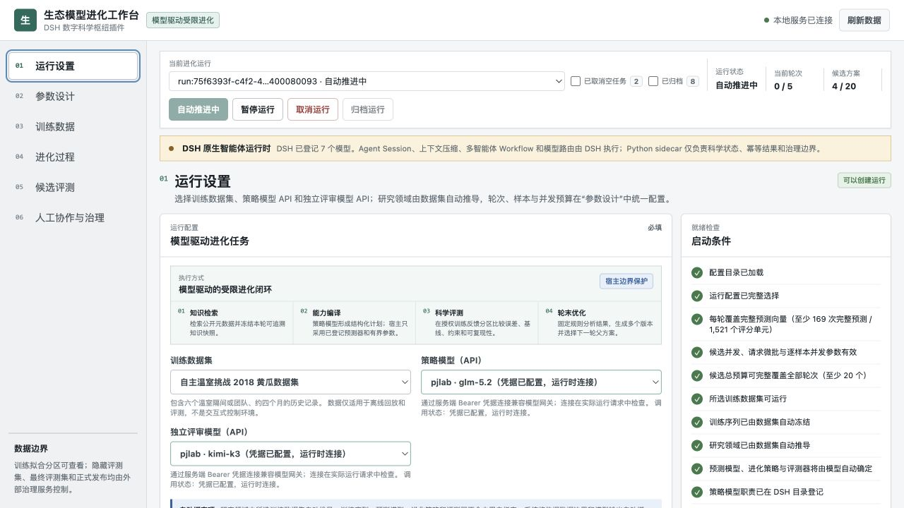
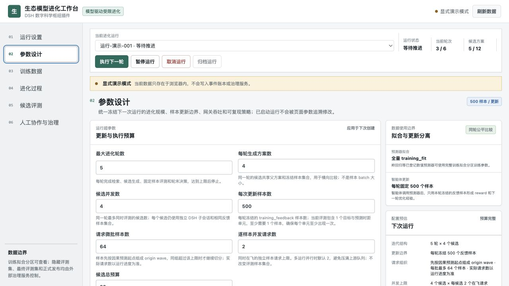
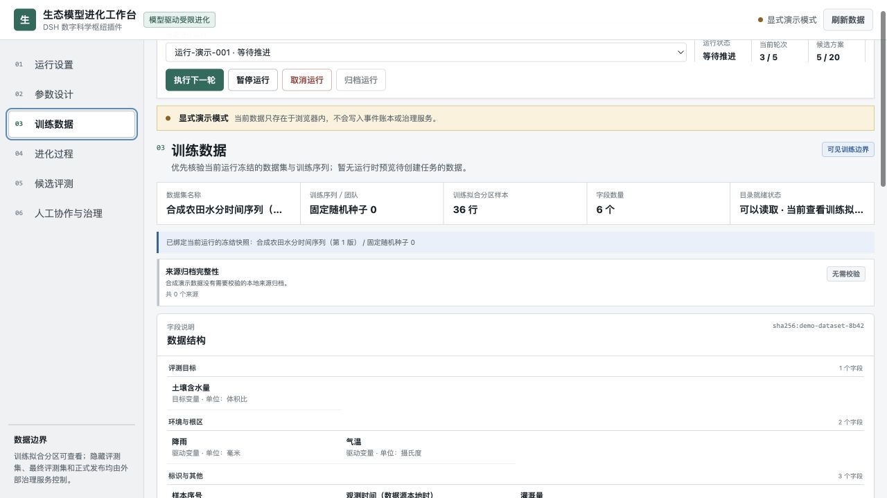
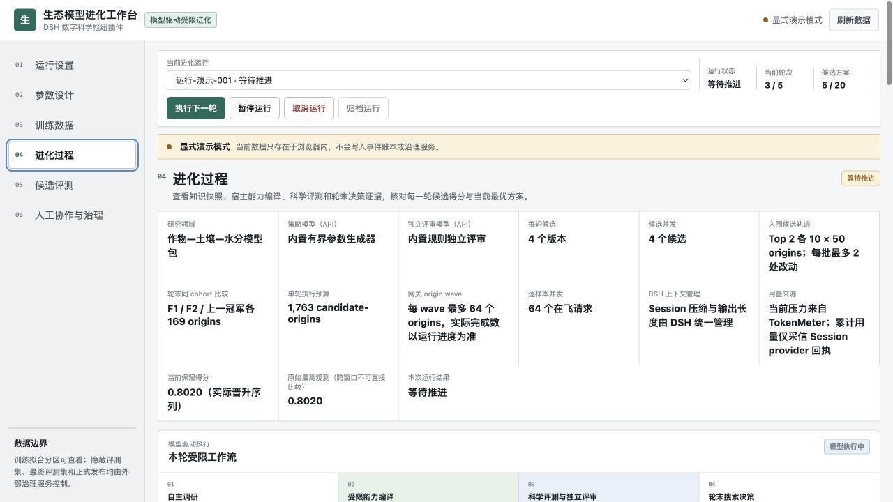
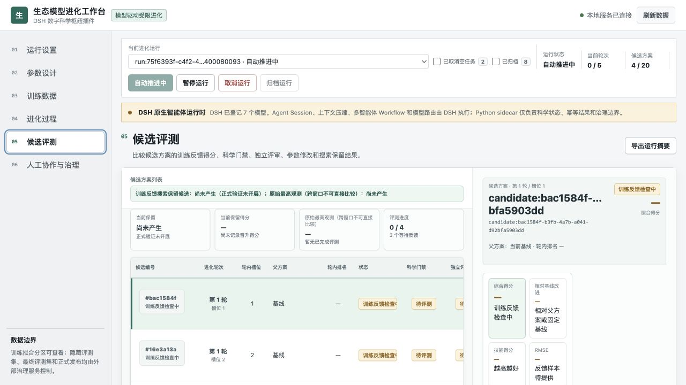
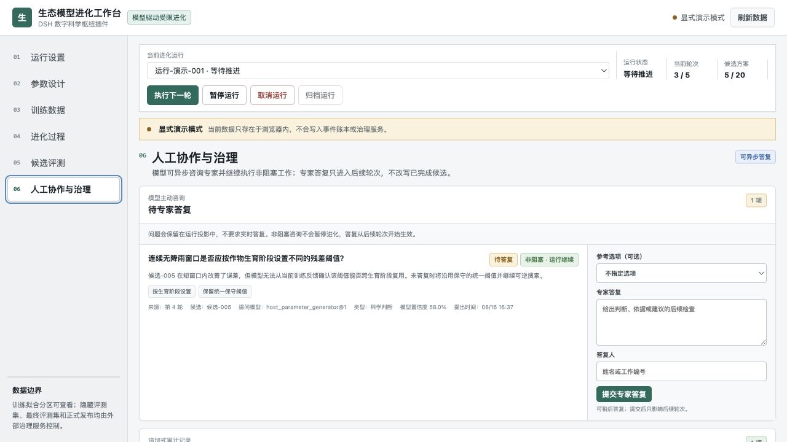

# EcologyRSI-DSH

**面向农业生态时序预测的、可审计的循环自进化工作台。**

EcologyRSI-DSH 基于 DeepSeek Harness，让模型根据研究资料和实验反馈提出改进，再由宿主在冻结的数据、预算与评测规则下验证。当前支持温室气温、相对湿度与 CO₂ 的 1／6／24 小时预测，改进范围包括模型参数、已登记预测器、提示词、Skill 程序和执行策略。

> **交付版本：0.9.0 · 本地研究版／预览**
>
> Python 3.10+ · DeepSeek Harness **0.2.0-rc.2** · 建议 Node.js 24 LTS
>
> 工程测试与部署链路已验证；证据引导协议的完整真实模型对照、预测成功率提升和独立科学认证仍待验收。

RSI 在这里指 Recursive Self-Improvement：依据已有证据循环提出、执行和检验改进。模型只能修改宿主登记的能力，不能改写评分规则、读取未授权分区或执行任意生成代码。**执行成功、搜索采用和独立认证是三个不同结论。**一次完整运行可以没有合格改进。

[快速启动](#快速启动) · [实验模式与预算](#实验模式与预算) · [数据与科学边界](#数据与科学边界) · [运行与排障](#运行与排障) · [开发与交付验收](#开发与交付验收) · [更新记录](CHANGELOG.md)

## 交付内容

| 组件 | 用途 |
|---|---|
| Python Host | 数据适配、时间分区、能力编译、预测工具、评分、版本选择与 SQLite 事件账本 |
| DSH 原生插件 | 六类 Agent 角色、工具权限、结构化提交、用量记录、网页托管与同源代理 |
| 中文工作台 | 开始运行、运行参数、数据、运行过程、候选方案、人工审核、独立评测七个工作区 |
| 验证与构建工具 | 确定性演示、重放、真实数据测试、隔离 Harness 验收、wheel／sdist／完整交付包 |

0.9.0 增加显式选择的证据引导试点、修改效果契约、同组父子与冠军增益展示、分阶段证据统计，以及绑定用途的评审。默认仍使用快速模式。完整变更见 [CHANGELOG](CHANGELOG.md)。

## 快速启动

以下命令从仓库根目录执行。完整模型运行需要自行配置的模型服务凭据，并会产生模型调用费用；静态演示和确定性工程演示不需要 API key。

### 1. 获取并安装

```bash
git clone https://github.com/ECNU-ICALK/EcologyRSI-DSH.git
cd EcologyRSI-DSH

python3 -m venv .venv
source .venv/bin/activate
python -m pip install -e .
npm install --global @deepseek-ai/dsh@0.2.0-rc.2

# 专用 Harness 目录；后续安装、配置和启动始终使用同一 DSH_HOME。
export DSH_HOME="$PWD/.runtime/dsh-home"
ecologyrsi-dsh install-dsh-runtime --profile web
```

安装器校验固定 Harness 版本、插件内容和当前六个不可变 preset。请使用 Python 3.10 以上的解释器创建虚拟环境；Python 包无第三方运行依赖，发布构建另需 `uv`。番茄数据解压另需系统提供 `bsdtar`。

已有独立配置的 Harness 可以将 `DSH_HOME` 指向该目录。不要在其他实验尚未收尾时覆盖其插件或 preset。

### 2. 准备真实数据

```bash
# 可选：不设置时使用 ~/.ecologyrsi-dsh/data/greenhouse
export ECOLOGYRSI_DATA_ROOT="$HOME/.ecologyrsi-dsh/data/greenhouse"
ecologyrsi-dsh data audit
ecologyrsi-dsh data fetch agc_cucumber_2018
# 需要番茄任务时再下载：
# ecologyrsi-dsh data fetch agc_tomato_2019
ecologyrsi-dsh data audit
```

下载器校验来源归档的大小与 MD5，并检查解压路径；已核验的文件会复用。数据不随仓库或交付包分发。`--archive-only` 只下载并校验归档，尚不足以创建真实运行。

### 3. 配置模型并启动服务

在专用 Harness 中配置可用的策略与评审模型连接。密钥由 Harness 或服务端环境变量保管；不要写入 README、前端源码或 Git。页面只读取脱敏模型目录。

下面在同一个终端启动两个本地进程。首次启动后可在 Harness 设置中完成模型配置；配置完成后重启这两个进程，让 Host 重新发现目录。

```bash
source .venv/bin/activate
export DSH_HOME="$PWD/.runtime/dsh-home"
export ECOLOGYRSI_DSH_SETTINGS_FILE="$DSH_HOME/settings.yaml"
export ECOLOGYRSI_DSH_CREDENTIALS_FILE="$DSH_HOME/.credentials.yaml"
mkdir -p .runtime

export ECOLOGYRSI_DSH_RUNTIME_TOKEN="$(python -c 'import secrets; print(secrets.token_hex(32))')"
export ECOLOGYRSI_SIDECAR_TOOL_TOKEN="$(python -c 'import secrets; print(secrets.token_hex(32))')"
export ECOLOGYRSI_DSH_RUNTIME_URL="http://127.0.0.1:8848"

ecologyrsi-dsh serve --host 127.0.0.1 --port 8777 \
  --db "$PWD/.runtime/ecologyrsi-dsh.sqlite3" &
ECOLOGYRSI_SIDECAR_PID=$!
trap 'kill "$ECOLOGYRSI_SIDECAR_PID" 2>/dev/null || true' EXIT

dsh web --no-open --host 127.0.0.1 --port 8848
```

打开 **<http://127.0.0.1:8848/>**，点击侧栏的“生态模型进化”入口。浏览器通过同源代理访问 Python Host；`8777` 是内部 sidecar 端口。两个进程必须继承同一组运行时令牌，重启时也应一起更新。

策略与评审使用两个不同的目录连接 ID。上面的两个文件路径变量让 Python 服务读取专用 Harness 目录；只设置 `DSH_HOME` 不会改变 Python 默认读取的 `~/.dsh/` 路径。显式服务端模型目录、运行时参数和权限说明见 [DSH 插件 README](integrations/dsh_ecology_plugin/README.md)。自定义模型网关应使用 HTTPS，并正确声明模型的工具与推理能力；不能通过忽略版本或响应校验来制造就绪状态。

### 4. 创建第一次运行

1. 在“开始运行”选择就绪数据集、策略模型和评审模型。
2. 在“运行参数”选择实验模式，核对轮数、候选预算、样本量和数据容量。
3. 点击“创建并开始”。系统先执行真实模型预检，通过后才冻结并创建运行；请勿重复提交。
4. 在“运行过程”查看预测落盘、局部修改、评审及轮末选择；需要干预时先暂停。

数据容量由实际 episode、历史上下文、时距和时间隔离共同决定。表单名义默认轮数为 5，但会根据容量下调，**不能保证每个数据集都能运行 5 轮**。在 0.9.0、默认参数及固定种子下，黄瓜 `AiCU` 已核验容量为快速模式最多 4 轮、证据引导模式最多 3 轮；创建时仍以容量检查为准。

### 无 API 的工程演示

```bash
# 确定性演示：验证编排与账本，不代表真实模型性能。
ecologyrsi-dsh demo --db /tmp/ecologyrsi-demo.sqlite3
ecologyrsi-dsh doctor --db /tmp/ecologyrsi-demo.sqlite3

# 独立静态界面演示，不连接 Host、不写账本、不调用模型。
python -m http.server 4173 --directory plugins/ecology_evolution
```

静态演示地址：<http://127.0.0.1:4173/?demo=1>。真实服务失败时不会自动切换为演示数据。

## 实验模式与预算

一个预测时点（origin）包含三个目标 × 三个时距，即 **9 个评分单元**。预测执行次数不等于 LLM 请求数；研究、提案、工具、条件评审与重试另有用量。

| 模式 | 一轮默认流程 | 完整预测执行预算 | 适用目的 |
|---|---|---:|---|
| 快速 `quick_adaptive_epoch@1` | 四提案中预登记一条主线；100 时点分 10 批；轮末候选与冠军各 50 次 | 200 次／1,800 单元 | 连续探索；修改先应用，收益待轮末验证 |
| 证据引导 `evidence_guided_epoch@1` | 四提案＋冠军在同组 10 起点初筛；父子同组 25 起点配对；轮末两臂各 50 次 | 最多 200 次／1,800 单元 | 比较多个提案，并核验一次局部修改 |
| 正式对照 `top2_adaptive_epoch@1` | 四候选预筛、Top 2 局部配对、共同留出与重复推理 | 由冻结 schedule 计算 | 更严格的搜索对照，仍不替代独立认证 |

**快速模式。**新原生运行按提示词、Skill、参数与模型、执行策略轮转训练方向；选择在评分前冻结。其余提案未进入本轮训练，不应被解释成已比较后淘汰。100 个训练起点跨轮回放，每轮另用新的 50 个比较起点。局部修订只表示已应用；轮末候选与轮初冠军必须在同组数据上完整执行、达到实用增益并满足分项约束，才更新搜索版本。

**证据引导模式。**初筛为 `5×10=50` 次；入围提案的初筛结果复用作诊断，不再次调用预测器；局部配对最多 `2×25=50` 次；轮末比较为 `2×50=100` 次。每轮需要 85 个不同评分起点，且跨轮使用新 cohort。没有不同子版本时只执行同一版本的 25 次，不为用满预算重复推理。该模式减少了快速模式的时点覆盖和连续修改深度，换取四个提案都有实测结果和一次父子比较；目前尚无完整对照证明其成功率更高。

所有模式都额外需要历史上下文和目标成熟隔离。容量不足会拒绝创建，不通过复用留出数据或降低门槛补足。独立验证与最终测试使用隔离分区，必须另行配置和批准预算，不计入以上搜索预算。

## 如何解读结果

| 页面证据 | 可以说明什么 | 不能据此认定什么 |
|---|---|---|
| 执行成功、预测已落盘 | 当前要求的预测向量与角色步骤完整 | 预测性能提升 |
| 相对基线技能分为正 | 当前 cohort 的综合评分高于冻结强基线 | 所有目标／时距均改善 |
| 修改已应用 | 新 revision 可用于后续实验 | 修改已验证有效 |
| 同组父版本／冠军增益 | 同一比较范围的新旧差异 | 跨窗口可直接累计的增益 |
| 搜索采用 | 通过该运行冻结的搜索规则 | 通过独立科学认证 |
| 效果回执为不确定 | 暂无足够证据确认行为契约效果 | 成功或确定失败 |

不同批次的原始分数不能直接连成“修改收益曲线”。本版分别展示基线分、父子增益和冠军增益，并区分执行故障、无效修改、证据不足和性能退化。模型评审只提供绑定用途的建议，不能覆盖宿主门禁。

修改效果契约检查实际生效值、受影响单元和执行证据。部分提示词／Skill 仍属于软约束；置信度加权等未给出明确权重的策略不能宣称已完成公式验证。当前并不保证每次局部修改都能改善预测。

## 数据与科学边界

| 数据集 | 当前能力 | 来源许可 |
|---|---|---|
| `agc_cucumber_2018` | 2018 黄瓜，温室环境历史回放与多时距预测 | CC0-1.0 |
| `agc_tomato_2019` | 2019 番茄，温室环境历史回放与多时距预测 | CC0-1.0 |
| 两个生菜 RGB-D 条目 | 仅目录登记，尚不能创建可执行运行 | CC-BY-4.0 |
| `generated-toy-series@1` | 确定性合成数据，工程回归使用 | 项目测试数据 |

数据来源、文件合同与完整性清单位于 [`datasets/`](datasets/)。页面将文件就绪和来源归档校验分开显示；有目录条目不等于本机已准备数据。

新运行冻结 `time-forward-four-stage@2`，依次划分：

```text
calibration_fit → 时间隔离 → calibration_uq → 时间隔离
     → model_selection → 时间隔离 → validation → 时间隔离 → final_test
```

- `training_fit` 是 `calibration_fit` 的公开别名，仅用于拟合、预处理与强基线选择。
- `training_feedback` 是 `model_selection` 的公开别名，用于搜索训练及轮末比较。
- 不确定性校准、独立验证和最终测试具有各自边界；浏览器不能读取隐藏分区原始行用于调参。
- 每个“目标 × 时距”仅在拟合段比较持续性与 24 小时季节性基线，选择后冻结。
- 评分检查覆盖率、物理范围、相对基线表现及分项退化；严格比较还检查配对证据和推理副本。
- 稀疏产量、能耗及资源记录不计入当前三目标环境预测评分；尚未实现跨 episode 联合认证。

这是离线历史预测研究，不能将预测差异解释成控制动作的因果收益。系统不控制真实温室设备，不授予正式发布权限，也不自动把搜索轨迹认证为训练数据资产。

## 运行与排障

| 现象 | 检查与处理 |
|---|---|
| 没有工作台入口 | 检查 Harness 是否为固定版本、插件是否安装在正在使用的 `DSH_HOME` 和 `web` profile；安装后重启宿主 |
| 数据集不可用 | 执行 `data audit`，检查数据根目录、必需文件和解压依赖 |
| 模型未就绪／预检失败 | 核对两个模型的目录 ID、职责、HTTPS 路由和服务端凭据；查看脱敏错误码 |
| 一段时间没有新事件 | 查看真实子任务、最近活动、配额与输出预算；没有事件不等于模型已经失败 |
| HTTP 429／503 | 等待现有的有界退避、冷却与并发调节，不反复创建运行 |
| 输出额度耗尽／不可恢复协议错误 | 核对失败阶段及实际回执；修正配置或实现后创建新运行，不能伪造结构化结果 |
| 总分为正但未通过 | 核对目标／时距退化、覆盖率、约束及比较证据；不是通过放宽门槛解决的问题 |
| 新协议容量不足 | 减少预登记轮数或换用足够数据；保持样本量与隔离要求 |

暂停后等待在途任务收尾，再做受限人工干预。恢复沿用同一冻结合同和已验收检查点；取消后的记录保留用于复核。归档隐藏终态记录，不等于删除账本。

升级步骤：**暂停 → 等待子任务收尾 → 备份账本和本地配置 → 安装新版本 → 使用独立运行目录创建新实验**。不要在活跃运行中更换模型路由、数据、源码身份或 preset。旧账本需要其对应的固定版本解释，本版不自动迁移历史合同。

```bash
ecologyrsi-dsh doctor --db .runtime/ecologyrsi-dsh.sqlite3
ecologyrsi-dsh summary RUN_ID --db .runtime/ecologyrsi-dsh.sqlite3
ecologyrsi-dsh export-policy RUN_ID CANDIDATE_ID \
  --db .runtime/ecologyrsi-dsh.sqlite3 --output .runtime/agent-policy.json
```

策略包包含冻结的 Agent 策略、模型配置与证据身份，不包含凭据。加载入口为 `ecologyrsi_dsh.integrations.agent_policy_bundle`；部署使用仍须匹配冻结合同与授权边界。

## 架构与接口

```text
浏览器工作台（Harness :8848）
  ├─ DSH 原生 Agent：研究、提案、预测、条件评审、反思
  └─ 同源代理 /api/ecology-evolution
       ↓
Python Host（回环 :8777）
  ├─ 应用编排与唯一运行状态机
  ├─ 数据合同、能力注册表、数值工具与科学评测
  └─ SQLite 追加式事件 → 只读投影、检查点、导出
```

| 目录 | 职责 |
|---|---|
| `src/ecologyrsi_dsh/application/` | CLI、依赖装配、轮次与批次编排 |
| `src/ecologyrsi_dsh/core/` | 事件、回放、运行状态、评审与版本选择 |
| `src/ecologyrsi_dsh/evolution/` | 候选基因组、变更轴、效果契约、协议和预算 |
| `src/ecologyrsi_dsh/evaluators/` | 预测执行、cohort、分项评分与配对比较 |
| `src/ecologyrsi_dsh/data/`、`knowledge/` | 数据适配、分区与冻结研究资料 |
| `src/ecologyrsi_dsh/api/`、`integrations/` | HTTP、脱敏投影与 DSH 连接 |
| `integrations/dsh_ecology_plugin/` | 原生插件、角色清单、Skill、Schema、安装包 |
| `plugins/ecology_evolution/` | 中文网页及按工作区加载的前端模块 |
| `tests/`、`scripts/` | 回归、交付构建、验收与诊断 |

网页 API 前缀为 `/api/ecology-evolution`，由 DSH 代理到 sidecar 的 `/api`。常用相对路径：

| 方法与路径 | 用途 |
|---|---|
| `GET /health`、`GET /catalog` | 服务版本、就绪能力与脱敏目录 |
| `GET /datasets/{id}`、`GET /datasets/{id}/samples` | 数据说明和授权训练分区样本 |
| `POST /evolution-capacity` | 创建前容量与预算检查，不调用模型 |
| `POST /model-preflight` | 真实模型工具与结构化输出预检，有模型用量 |
| `POST /runs` | 幂等创建与可选自动推进 |
| `GET /runs/{id}?view=process` | 过程投影；另有 overview、candidates、candidate 视图 |
| `GET /runs/{id}/events?after={seq}` | 追加式事件增量读取 |
| `POST /runs/{id}/control` | 暂停、恢复与取消等运行控制 |
| `POST /runs/{id}/interventions` | 追加受限人工意见 |
| `POST /runs/{id}/archive`、`POST /runs/{id}/restore` | 归档与恢复终态记录 |

API 客户端应复用网页的预检与冻结创建合同，并使用新的 `idempotency_key` 创建新实验；重试同一创建请求保持原 key。原生运行不接受任意生成代码或通过客户端改写科学门槛。更多宿主协议见 [前端 README](plugins/ecology_evolution/README.md) 与 [原生插件 README](integrations/dsh_ecology_plugin/README.md)。

## 开发与交付验收

```bash
make test-fast PYTHON="$PWD/.venv/bin/python"
make verify PYTHON="$PWD/.venv/bin/python"

# 准备真实 AGC 数据后：
ECOLOGYRSI_TEST_REAL_DATA=1 make test PYTHON="$PWD/.venv/bin/python"

# 使用已安装的固定 Harness，在隔离目录和本地模型替身上验证：
DSH_BIN="$(command -v dsh)" node scripts/verify_dsh_harness.mjs
```

`make verify` 包括确定性演示、账本重放、完整 Python／Node 检查、前端 smoke、版本和打包资源一致性；真实数据及 Harness 检查是否执行取决于环境，须查看实际跳过项。真实 Harness 本地替身测试不使用用户 API key，也不等于真实远程模型验收。

**交付证据（2026-10-02，0.9.0）：**1830 项 Python、277 项 Node 检查通过，包含已准备的真实 AGC 数据和隔离 Harness 本地适配器验收，无跳过。真实远程模型已验证预检、研究、四类提案和部分逐批预测落盘；完整四轮、协议成功率对照与独立认证仍待验收。测试数量不是永久保证，接收方应重新执行验收。

### 构建交付包

构建需要 `uv` 和干净的 Git 工作区；先完成源码、文档及内置插件包更新，再提交并构建：

```bash
make release PYTHON="$PWD/.venv/bin/python"
make verify-artifacts PYTHON="$PWD/.venv/bin/python"
```

`dist/` 输出 Python wheel、源码 sdist、完整交付归档及 `SHA256SUMS`，归档记录源码与产物校验信息。源码安装所需的原生插件 `.tgz` 随仓库提供。可用 `python -m pip install dist/<wheel-file>.whl` 验证离线交付安装，再执行同一运行时安装命令。完整验收清单见 [RELEASE-CHECKLIST](RELEASE-CHECKLIST.md)。

真实远程链路验收脚本 `scripts/real_api_agent_tool_acceptance.py` 需绑定既有冻结运行与同源发布物，会产生额外调用；它是工程检查，不能作为候选晋级或科学评分证据。

## 界面示意

以下六张图来自仓库保留的静态演示，展示主要工作区布局；并非本次真实运行成绩，也不是 0.9.0 全部界面的验收截图。当前已增加独立评测工作区。截图约束见 [截图清单](docs/screenshots/README.md)。

<details>
<summary>展开演示截图</summary>








</details>

## 安全、限制与许可

- API key、认证令牌、本地模型配置、运行数据库及原始会话日志不进入 Git 或交付包；`.runtime/` 和常见凭据文件默认忽略。上传导出物前仍须单独核验内容。
- 两个本地服务默认绑定回环地址。非回环 API 需要服务令牌；当前进程级令牌不是多用户权限体系，前端 capability 列表不等于后端用户授权。
- 对外提供的是脱敏结构化证据，不包括私密推理或原始认证头。外部论文元数据仅作为研究线索，不能直接变成可执行算法。
- 本地单进程与 SQLite 面向研究交付；未完成生产多租户、插件签名、官方市场发布或设备控制验收。
- 源码遵循仓库 [LICENSE](LICENSE) 的授权评估／交付条款，**不是宽松开源许可**；第三方软件、数据及模型服务各自遵循其许可。详情见 [NOTICE](NOTICE)。
