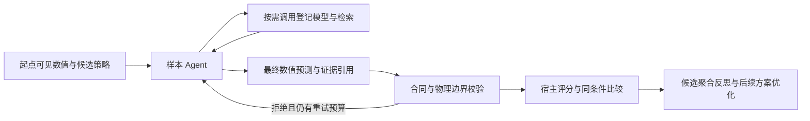

# 0.6.0 Agent 自主预测改造与验收

本版将最终数值预测的决定权移到逐起点 Agent。每个起点对应一个 DSH 子会话和温度、相对湿度、CO₂ × 1/6/24 小时的 9 个评分单元。Agent 读取截至起点可见的数值，决定是否使用工具、使用哪些模型以及如何组合结果，最后提交自己的预测。宿主负责训练数据边界、调用预算、结果校验、独立评分与公平比较。

## 执行结构

- `DshSampleCollaborationAdapter` 直接消费 Agent 的 `predicted`，允许 `direct`、`model`、`blend`、`adjusted` 四种方法。移除强制单工具调用和宿主确定性修复。
- `DshPredictionToolBinding` 为每个起点绑定独立能力目录、调用身份和样本集合。相同调用身份可幂等重放；其他起点、未收到或失败的输出不能作为有效预测证据。
- `AgentModelTools` 提供四类登记岭回归、受限参数调整和候选内拟合缓存。模型只拟合 `training_fit`；起点只得到自己的预测输出，不得到未来评分标签。
- 最终预测和工具输出分别持久化。恢复检查回执、数值和身份摘要，复用实际记录，不重新调用模型或重拟合来“补造”历史。
- Host 继续负责完整向量原子保存、暂停取消、条件 Critic、评分后反思和配对比较。直接预测可以没有数值工具调用，但必须有真实 Agent 最终提交。

## 自主范围与预算

每个起点的每次 Agent 分析尝试最多 6 次数值工具调用、3 次检索；失败的数值执行也占用调用额度，重试次数另受宿主策略限制。每个候选评测实例最多缓存 8 种拟合配置，残差倍率调整复用相同拟合。可调范围由登记模型校验：历史窗口 1–12、岭系数 0.0001–1、残差倍率 0–1。Planner/修复默认模型输出上限 8192，Critic 为 2048，仍受阶段超时与重试约束。

Agent 可以改变已登记模型参数、选择不同模型、融合或调整预测；跨候选仍可优化登记的科学配置和 Agent 策略。任意新增算法代码、依赖和未登记模型不属于本次运行时能力，需要实现和测试后登记。这里的“自主预测”不是取消科学边界或允许读取未来标签。

## 评分、产物与网页

评分始终使用 Agent 最终提交并经宿主接受的数值。工具输出仅是分析证据，不能把最终收益记给第一个调用的模型。样本归档带 `prediction_source=sample_agent`、预测方法、置信度和最终尝试的工具摘要；完整失败与重试证据仍保留在执行轨迹中。

网页显示 Agent 逐样本决策、直接/采用模型/融合/调整，以及最终尝试的工具调用数与失败状态。训练产物标明其为可选默认模型工具，单独导出这份权重不能复现完整 Agent 推理；复核最终结果应使用候选策略、执行记录和样本归档。无有效预测的失败样本仍明确显示失败，不用宿主填充值冒充 Agent 输出。

离线影子复算脚本升级到 `/2`：核验 Agent 最终提交与已封存评分；若调用过默认模型，可从其原始拟合产物独立复算该工具输出。其他模型的输出按持久化回执验证，报告明确区分“数值复算”和“回执核验”。

## 验收证据

工程测试覆盖直接预测且零模型调用、多模型融合、工具失败后另选路径、数值拒绝后交回 Agent、参数调整、因果隔离、六次调用上限、幂等恢复、证据篡改拒绝、评分归属与归档展示。前端 smoke 和 DSH Node 测试通过；最终构建校验同时检查源码、wheel、sdist、插件包与完整交付包。

真实 DSH 验收使用 `pjlab/deepseek-v4-flash-0731`，一个合成温室预测起点共 9 个单元，耗时约 **86.75 秒**。Agent 自主调用：

1. `candidate-model`
2. `greenhouse-horizon-targetwise-ridge@1`
3. `greenhouse-baseline-aligned-ridge@1`

三次调用成功后，Agent 以 `adjusted` 提交 9 个最终值；9 个值均与默认模型输出不同，全部完成结构化提交及宿主物理边界校验。此次真实运行使用工具默认参数；参数覆盖、零工具直接预测和融合路径由自动化测试验证。简化后的可分享记录见 [验收数据](agent-prediction-0.6.0-acceptance.json)。

Chrome 验收加载实际前端文件并核对字节摘要，用上述真实结果检查 9 行数值、方法和工具信息，未发现页面脚本错误。该检查验证页面组件，并未通过浏览器执行一整轮科学进化。

失败尝试也被保留：首次 DeepSeek Pro 路由返回 `model_not_available`；GLM-5.2 在 4096 和 8192 上限下都以 `max-tokens` 结束。这些路由没有被记录为成功预测，不能据此声称所有模型路由都通过验收。单起点合成数据验收不证明真实温室精度提升或多代稳定进化，后者仍需在准备好的真实数据集上进行配对实验。

## 使用与交付边界

版本统一为 0.6.0，样本 preset 为 `ecology-sample-planner-v6`，预测协议为 `ecology-sample-predictions@2`，链路证明为 `/4`。不迁移或恢复旧版未完成运行。启用本版时安装同版 Python 包、DSH 插件和 presets，重启对应服务，并用新账本创建运行。

本次联调使用独立 DSH 8849 / 后端 8877。原 8848 / 8777 服务没有切换到新后端；原历史账本至序号 28490 的摘要复核完全一致。独立预览账本为空，可查看新版界面；真实温室数据根目录仍需准备，不能把演示数据当作正式数据。

交付物是当前工作区构建的本地候选包，`BUILD-INFO.json` 如实标记工作区存在未提交改动。未提交 Git，也未签名发布，不将其表述为经过干净提交校验的正式发行版。运行账本、账户配置、凭据、会话原文和测试临时目录均不进入交付包。
