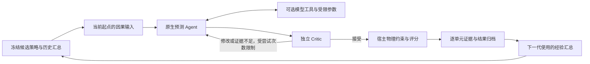

# 0.7.0：Agent 策略闭环与交付说明

本版优化对象是完整 Agent 预测策略：指令、可选默认模型、工具选择与参数、历史经验，以及最终数值。默认数值模型不代表最终预测主体。



## 已实现的主线

| 问题 | 当前实现 |
|---|---|
| 研究仍按固定模型输出推理 | 研究与代际反思的 Skill、方向检查和变异合同统一为 Agent 最终数值；保留宿主对队列、样本数与统计门禁的控制 |
| 零残差过度裁剪搜索 | 默认工具的参数敏感性仅作为说明，允许 Agent 策略继续探索历史步数、正则化与指令 |
| Critic 修改意见被忽略 | `ecology-sample-review@2` 明确返回 accept/revise/uncertain；后两者进入原有有界 Agent 重试，不替换成宿主预测 |
| 新原生链依赖旧路由调度器 | 原生起点适配器独立；外层执行器拥有并发与检查点，DSH 拥有子会话准入、用量结算及传输恢复 |
| 工具与最终预测归因混淆 | 逐单元记录 call_id、有效参数、工具原值、是否被引用；分开统计工具误差、Agent 调整效果与调用延迟 |
| 经验未传给新候选 | 上一代适应批次的汇总进入冻结 Agent 策略；使用明确的阶段和队列摘要排除留出结果，策略摘要参与运行身份 |
| 拟合重复、缓存耗尽即失去模型能力 | 分离拟合与当前起点输入生成；使用训练段身份持久化拟合，LRU 容量不再作为探索额度，数值拟合最多两个工作者 |
| 暂停在数值计算阶段响应慢 | 在目标/时距训练、特征构建和矩阵累积阶段检查控制状态 |
| 热路径读取完整事件历史 | 准入存在性查询、阶段检索计数及幂等事件查询使用 SQLite 索引 |
| 重放被误认为稳定性证据 | 正式留出阶段运行两次独立推理，执行身份不同；认证逐次配对收益，独立统计样本数不随重复次数增加 |
| 只导出数值模型，无法重新运行 Agent | `export-policy` 导出策略、经验、默认拟合、可选工具配方、训练段摘要与运行合同；加载器校验后使用正常原生 Agent 链 |
| 页面预测方法不一致 | 过程与候选视图共享方法说明，显示自报置信度、调用参数和实际引用状态 |
| 页面容量通过、创建时又被拒绝 | 容量预览和实际创建共用独立日块检查，证据不足在启动前展示 |
| 执行预算漏算重复推理 | 原生留出两次推理计入页面、创建合同和接口的执行预算，独立观测容量不变 |
| 研究阶段停止后记录消失 | 保留用户刚停止的运行供核查，未产生候选也可以查看终态 |

## 执行边界

- Agent 每次尝试最多调用六次数值工具；失败调用占用额度，同一 call_id 的幂等重取不重复消耗。
- 缓存容量为八个拟合项；淘汰后可以重新加载或重建。缓存身份只依赖训练段、特征角色及拟合参数，未来反馈标签不会成为拟合输入。
- 基线对齐岭回归分别验证拟合参数与推理残差缩放参数；合法的推理参数调整不会被误判为拟合身份漂移。
- 同一留出队列的重复推理保留独立检查点，不把更多调用当成更多观测。搜索保留和严格认证仍分别表示；稳定性证据不足时不颁发稳定认证。
- 新增协议不迁移历史运行。旧账本保持原样，交付使用新运行；不能把已启动的旧后端进程与新的网页或 preset 混用。

## 策略包使用

```bash
python -m ecologyrsi_dsh export-policy RUN_ID CANDIDATE_ID \
  --db run.sqlite3 --output agent-policy.json
```

`load_policy_bundle(path)` 校验版本和内容摘要。`create_policy_adapter(...)` 校验训练段、工具目录及运行合同，返回原生适配器及冻结计划上下文。宿主提供已准入的 DSH 运行绑定；凭据不导出到策略包。可选工具携带重建配方，使用时只拟合被冻结的训练段。

## 实机协议探针

`scripts/agent_policy_canary.py` 使用官方 AGC 数据的一个完整起点，通过真实 DSH 运行两次独立预测，并允许 Critic 触发有界重试。它写入独立诊断账本，不参与科学排名或晋级。

```bash
python scripts/agent_policy_canary.py \
  --runtime-url http://127.0.0.1:8850 --backend-port 8878 \
  --data-root /path/to/verified/greenhouse --model provider/model \
  --output-dir /path/to/probe-output
```

DSH 的 backendOrigin 必须指向该独立探针端口，且使用配套的运行时与 sidecar 凭据。模型服务中的可用路由应通过实时目录和实际协议调用验证；两种验证分别记录，不能把目录可见性当成实际工具协议已经通过。

## 验证与交付级别

完整源码检查覆盖 Python、DSH Node 测试、前端 smoke、版本及 preset 清单。新增回归覆盖 Critic 修改与不确定分支、工具误差归因、跨代策略身份、缓存淘汰与重启、取消、索引查询、不把重放当重复推理，以及策略包加载后的原生预测。

真实协议及网页流程记录见 [工程验收记录](agent-policy-0.7.0-acceptance.json)。黄瓜、番茄官方数据均已校验，5 项真实数据回归通过。一个起点的实机协议探针只能证明链路能够运行，不能证明整个进化系统已达到科学意义上的稳定提升；后者必须通过冻结留出队列的正式认证。

最终自动检查：1499 项 Python 测试全部通过（含 5 项真实数据测试、无跳过）；229 项前端及 DSH 测试通过；独立安装的 wheel 通过 43 项原生执行、策略加载与容量合同集成检查。正常网页完成创建、暂停、继续、停止，停止记录保持可见。

本机网页复测首屏约 0.54 秒，预热后的读取请求最长 50 毫秒；首次真实数据解析仍可能需要数秒。远程 Agent 预测的单起点探针两次合计约 343 秒，不能将网页加载速度视作模型推理速度。
