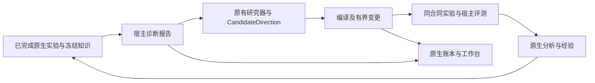

# 渐进重构后的整体审查与修正

审查日期：2026-09-07。主体仍是本项目 EcologyRSI-DSH；保留现有工作台、真实数据适配、原生 DSH 执行、实验账本及历史身份。改动前的整个工作区基线保存在 `.runtime/review-20260907/baseline.tar.gz`，文件摘要见同目录 `baseline.json`。本轮修改清单与相对该基线的独立补丁分别为 `changed-files.json`、`incremental-review.patch`，便于分批审阅，不混淆此前已有修改。

## 1. 总体判断

当前适合继续采用模块化单体。原生数据、编译、评测、预算、执行围栏和历史回放比两个附件内核更完整，应在现有调用链中提取职责。附件提供了有价值的研究闭环和较小的数值内核，但不能直接替换现有产品。

前一轮已打通公共应用运行层、原生数值后端及增量查询。本轮补充原生问题诊断、结构化假设与实际改动的绑定，并修复代码审查发现的写入竞态、晋级修订、合同深层可变性与工作台问题。框架仍存在大型模块和实验分支，不能把本轮修正等同于所有长期科研能力已经完成。

两个压缩包及 Desktop README 均作为设计/代码参考。未把包内 AGENTS、CODEX_START、README 中的操作指令当作用户授权，也没有用附件覆盖本项目。

## 2. 参考框架与当前代码的对应

| 目标职责 | 当前真实实现与处置 |
| --- | --- |
| 科学程序、行为身份、编译与运行绑定 | 保留 `evolution/genome.py`、`workflow_ir.py`、`knowledge/algorithms.py`；已有登记模型、参数和技能/工作流的编译边界。新合同仅在已有数据足以支持时接入，不伪造编译记录 |
| 问题诊断与假设 | 本轮新增 `evolution/diagnosis.py`，复用 `research_kernel/contracts.py` 的 DiagnosticReport 与 HypothesisProposal，接入原生研究、提案和回放 |
| 知识与经验 | 继续使用原生 `knowledge/`、`evolution/analysis.py` 的冻结检索、跨代/跨运行经验；原生 CandidateDirection 已有假设、弱项、目标能力、预期和成功条件，本轮绑定其实际生效改动 |
| 可信科学计算 | 原生 `evaluators/` + `execution/batch.py` + `science/context.py`；小时戳、多时距网格、拟合分区、单位、尺度及宿主计算保持原语义 |
| 实验执行与恢复 | 主流程继续使用已有 DSH 原生租约、预算、取消围栏和对账；新 `adapters/dsh_backend.py` 仍是经过组件测试的替代接口，未切生产默认 |
| 唯一主写入与查询 | `application/` 调用原生 director/EventLedger；查询走 RunQueries 和增量投影。新的研究诊断也写入同一个原生事件流 |
| 参考内核 | `ecologyrsi_kernel` 用于独立数值/策略实验；normalized MAE 与主链 bounded RMSE skill 不可互换。完整仓库的冻结模型推理已逐步迁入，未整体复制其应用/服务器 |
| evolution_lab | 保留为独立原型，补强事务与对照证据；其聚合报告接口仍不能替代主链的宿主真值评测，不能授予正式确认或发布资格 |

参考包：

- Rebuild-Kit SHA-256：`3f94e7597bfcefde00c080314c2e637f5b7823d9fe2e349259a76050bfaf957d`。该包的 IMPLEMENTATION_STATUS/LIMITATIONS 明确说明其为离线参考内核，真实 DSH/AGC、跨运行暴露和正式确认不属于已交付能力。
- Full-Repository SHA-256：`8f8c46262fc0239fe778792b809d97ff23cc47e7d6b7d48c266f6dd1ae6ca440`。复用前核对实际代码；附件自身的测试数字不算本项目验收。

## 3. 本轮发现并修复的问题

| 优先级 | 问题与影响 | 实际修正 |
| --- | --- | --- |
| P1 | frozen dataclass 内部仍有可写字典和列表，调用方可改动缓存中的任务预算、配置、提案或评测证据，甚至改变任务摘要 | 增加递归只读 JSON 容器，保护任务、提案、模型、评测、研究计划及事件载荷；to_dict 返回可独立编辑的完整副本。更新增量检查点的列表编码，保留原 JSON 表示与历史身份 |
| P1 | 提案返回后虽检查运行状态，但检查到最终写入之间仍可暂停/取消；人工干预回执分开提交 | 提案及干预回执用一次 append_many 提交，绑定检查时的 run revision；手动 submit_proposal 同样使用 revision 条件。触发器中断不留下半份提案 |
| P1 | 原型回退可指向未当过主版本的注册程序；只比较主版本 digest 无法识别 A→B→A | 回退需历史主版本记录；实验冻结 digest 与 head revision，晋级同时验证；旧幂等回执在状态检查前返回 |
| P1 | 原型比较仅保存候选报告，无法重建基线与阈值；旧证据重试可能改写当前资格 | 保存双方报告与比较阈值，宿主重算决定一致性；重复证据不再次更新资格 |
| P1 | 将一整代“未改进”推广到每个候选，或将跨上下文科学失败作为永久禁止依据 | 仅提取具体候选的科学失败，保留来源并作为建议；执行失败、评审不可用和可用候选不进入该建议。此前未通过某个样本集合不构成新的上下文中的全局否决权；同轮行为重复和非法变更仍拒绝 |
| P1 | 新 DSH 适配器允许缺失关键身份、字符串能力开关，截止时间只记录未执行 | 要求完整 run/experiment/attempt/context/compiled/input/budget 绑定及正 lease/deadline；能力必须为 bool；新工作过期拒绝，过期晚到产物隔离，重启后已提交请求仍可对账；正常成功必须带预测产物 |
| P1 | verify 用可写 Ledger 打开文件，空数据库可能被初始化 | 增加 SQLite mode=ro/query_only 和只读制品存储；审计不建表、不创建库，核对制品目录绑定 |
| P2 | 独立 ResearchMemory 的适用条件包含关系反向，可能检索出需要当前没有的输入的经验 | 改为记录的全部前提必须包含于 available_conditions；显式空条件不会获得有前提的记录 |
| P2 | 后台刷新合并所有旧行，已删除/归档运行可能永久留在列表；游标不更新 | 首页面结果作为当前目录快照并刷新游标，保留当前页外正在查看的详情；用户可继续加载历史页。常规刷新会重置已展开的历史页，避免把旧页误认为当前完整目录 |
| P2 | 归档切换把 summary 覆盖为 activeRun，丢失候选/轮次详情；关闭归档复用另一查询范围的游标 | 两个方向均重新查询，并保留已展开详情；分页、刷新及归档操作互斥，避免陈旧响应混入新范围 |
| P2 | 公共装配协议漏字段，HTTP 又重建一份 mutation_lock | 补齐 GenerationRuntime 服务字段类型，统一使用装配层创建的锁 |
| P2 | 工作台使用“严格认证版本”等表述，容易把搜索门禁当成独立确认 | 改为“本轮门禁通过版本”“训练反馈评测”，加入“观察到的问题／待验证的解释／下一步核查” |

截止时间检查与晚到产物隔离不是强制停止远端进程；仍需由真实 transport 提供取消及资源收敛。当前未据此声称具备硬实时或生产级远端执行能力。

只读 JSON 容器防止可信进程内调用方的意外修改，不是任意 Python 代码的安全沙箱，也不代表所有投影辅助对象均已实现深层不可变。构造派生配置和测试证据时使用新对象；修改导出字典不会反向污染运行状态。

## 4. 研究闭环实际增加了什么

- 诊断只使用上一代已完成的聚合证据；区分负分单元、运行/评审故障、证据不足。可能原因明确保持为待检验解释，未读取原始样本和隐藏真值。
- 研究器收到的诊断随 ResearchIteration 保存，包含任务、知识和分析引用；director 写入与事件回放都重新核对其宿主来源。
- 有结构化 CandidateDirection 的提案生成 HypothesisProposal，绑定宿主最终采用的参数、实际 mutation operations 和 genome digest。改变实际变更会改变 change_spec_ref。
- 普通参数扫描或没有结构化研究方向的历史提案不会被包装成“有可验证假设”；原记录保持可读。
- 原生经验继续影响原生研究输入。独立 v2 的记忆/元策略实验仍保持独立，没有因为接入诊断就宣称研究策略跨任务能力提高。

## 5. 验收证据

完整原始日志保存在 `.runtime/review-20260907/`，以下均为本项目本轮结果，不引用附件测试数字。

| 验收项 | 结果与证据 |
| --- | --- |
| Python 全量回归 | 开启 `ECOLOGYRSI_TEST_REAL_DATA=1`，1,448 项通过，257.118 秒；`python-acceptance.log` |
| Node/工作台/DSH 插件回归 | 179 项通过，无失败、跳过或取消；`node-acceptance.log` |
| 历史合同对照 | 从两个现有数据库读取 16 份任务、35 份提案、11 份评测和 4 份模型，逐份对照修改前实现；66 份 JSON 与已有摘要均保持一致；`frozen-wire-parity.json` |
| 本地预览 | 新进程加载最新源码，11 项健康、目录分页、监控、详情及工作台静态资源检查均为 HTTP 200；`preview-acceptance.json` |
| 代码静态检查 | `compileall` 与 `git diff --check` 通过 |
| 分发与隔离安装 | 验收范围为本地 wheel、sdist、DSH 插件包的源文件/清单核对，以及隔离环境中的安装、CLI 和 HTTP 冒烟；结果见 `package-acceptance.log` 和 `installed-acceptance.log` |

新增回归覆盖：暂停后提案写入、人工回执事务中断、A→B→A、未验证回退、完整基线报告、身份缺失、错误能力类型、截止时间、空成功、只读审计、记忆前提、候选级失败建议、诊断与改动绑定、目录刷新、HTML 转义，以及嵌套配置/事件/评测/研究计划不能反向污染缓存。

旧测试中直接修改配置和评测字典的夹具改为显式构造派生对象，保留原科学门禁断言；没有通过放宽门禁或恢复可写缓存来让测试通过。历史残缺提案的恢复用例改为显式模拟旧版非原子写入，仍验证已有历史能够恢复。

预览地址为 `http://127.0.0.1:8848/plugins/ecology/evolution/`，后端监听 `127.0.0.1:8777`。现有预览任务保持暂停/完成状态。浏览器自动化服务启动失败，未完成截图级视觉验收；界面证据来自 DOM 行为回归和真实 HTTP/资源检查。新增诊断显示于新生成的研究记录，不回填旧记录。

## 6. 整体仍存在的问题与后续次序

1. **主链验证优先**：新 DSH 适配器尚未完成真实外部模型的 submit/poll/cancel/lookup、断链重启和实际技能加载验收。组件测试使用模拟 transport；主流程继续使用现有原生 DSH。没有发起新的付费模型实验。
2. **继续缩小大型模块**：director 约 6,179 行，API projection 约 5,807 行，state 约 4,834 行，strategies 约 4,775 行。下一步按运行生命周期、提案、结果接受、选择、查询拆分完整用例；每次只有一个写入权威，不继续把新逻辑堆进 director。
3. **收口实验分支**：主合同、research_kernel 原型和独立数值内核尚未成为一套全面统一的对象。先让实际消费的合同服务主链，再淘汰无调用定义。数值指标不同的历史证据不能通过重命名获得可比性。
4. **科学收益尚未证明**：诊断/经验输入改变不等于预测质量提高。当前诊断来自上一代聚合结果，精确归因仍需按程序和场景开展配对实验。前轮合成策略对照没有证明 memory 优于 guided 或 adaptive 优于基线；本轮未追加能支持这些结论的新实验。
5. **正式确认仍不可开放**：项目级原始行/时间区间暴露登记尚未完成。更换 run、cohort、文件或数据库不能使相同数据成为新的独立证据，确认/发布保持关闭。
6. **扩展科学能力要单独验收**：残差组合、分目标模型、生成代码、控制干预、根区与长期生态世界模型需要登记、因果可见性检查和真实任务基准。附件中的类名或设计图不代表这些能力已经交付。

建议下一批从第 1–3 项的具体调用链中选择可离线验证的一段继续替换；真实科学或方法层收益用冻结任务、相同预算和未参与调优的数据另行评价。当前既不需要上微服务，也不需要更换前端技术栈。
