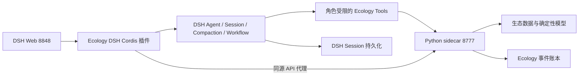

# DSH 原生智能体运行时迁移设计

> **状态：已被取代。** 本文只解决“智能体迁入 DSH”问题，没有把 Ecology
> 插件基因组定义为真正的进化对象，并且对 DSH `0.1.0-rc.6` 的 Workflow
> 恢复与根作用域能力有过度假设。后续设计与实施以
> `docs/superpowers/specs/2026-08-20-dsh-native-plugin-evolution-design.md`
> 为唯一权威规范；本文仅保留为决策演进记录。

## 1. 目标

将 EcologyRSI-DSH 中所有需要大模型或智能体参与的能力迁移到 DeepSeek Harness（DSH）原生运行时。迁移完成后：

- DSH 是智能体创建、模型路由、会话、上下文压缩、Token 计量、子智能体和工作流的唯一权威运行时；
- EcologyRSI Python sidecar 只负责生态数据边界、宿主注册工具、确定性预测计算、科学评测、候选晋级规则和事件账本；
- 新运行不再由 Python 读取模型密钥或直接调用 OpenAI-compatible 模型网关；
- 新运行不设置总 Token 硬上限，也不向 DSH Agent 指定 `maxTokens`；模型上下文容量、自动压缩和输出上限使用 DSH 当前模型适配器与运行时策略；
- DSH 原生能力不可用时拒绝创建或暂停运行，不回退到 Python 直连模型。

## 2. 当前状态与迁移动机

当前 DSH Web Profile 负责页面托管和模型目录展示，但逐样本 planner、repair、critic，以及 research、proposal、judge 仍由 Python sidecar 直接调用 OpenAI-compatible 网关。Python 同时冻结运行级 Token 硬预算和逐操作 `max_tokens`。因此当前实现虽然使用了 DSH 的模型配置，却没有让 DSH Session、Compaction、Subagent 和 Workflow 管理智能体执行。

本机 DSH `0.1.0-rc.6` 已提供以下公开能力：

- `ctx.agents` / Agent Loop：原生 Agent 创建、取消、恢复和会话绑定；
- DSH Session 与持久化：追加式会话日志、恢复和派生消息历史；
- Token Meter 与 Compaction Basic：基于模型上下文容量的压力计量与自动压缩；
- Subagent spawn/fork：受控子智能体生命周期和父子归属；
- Workflow Worker：带并发、子智能体数量限制和取消语义的多智能体工作流；
- Agent-scoped Tools 与 MCP Client：按智能体角色限制工具集合。

DSH Web Profile 当前已启用 Agent、Agent Loop、Token Meter 和 Subagent，但默认禁用了 Compaction Basic 与 Workflow Worker。本迁移会由生态 Cordis 插件显式声明并探测这些依赖。

## 3. 设计原则

1. **DSH 唯一执行权威**：任何模型调用都必须属于一个可追踪的 DSH Agent/Session，不存在隐藏的 Python 直连路径。
2. **科学控制留在宿主**：数据划分、标签隔离、可执行算法、约束、评分、reward 和晋级仍由 Python 决定，不能交给模型自由解释。
3. **结构化结果通过工具提交**：不解析智能体自由文本作为科学结果；Agent 必须调用具备 JSON Schema 的生态提交工具。
4. **最小权限**：生态 Agent 默认没有 Bash、文件系统、任意网络和提问用户权限，只能访问其角色所需的生态工具和 DSH 协作工具。
5. **无静默降级**：DSH 不可用、会话不可恢复、角色模型缺失或工具合同不匹配时，创建失败或运行进入可恢复暂停。
6. **双账本、单一职责**：DSH 保存完整智能体会话；EcologyRSI 保存科学状态、工具输入输出摘要、DSH 标识符和可重放决策证据。

## 4. 运行拓扑

用户只访问 DSH 的 `8848` 端口。`8777` 继续是回环 sidecar，不提供独立用户入口。Cordis 插件既托管现有工作台，也承载 DSH 原生智能体运行时适配层。

Python 发起智能体阶段时调用 DSH 宿主的回环内部运行时 API。DSH Agent 调用生态工具时，由 Cordis 插件使用服务端凭据访问 Python。浏览器不能访问内部运行时 API，也不会收到服务令牌或模型凭据。

## 5. DSH 运行时能力合同

生态 Cordis 插件启动时必须探测以下服务：

- `ctx.agents`；
- `ctx.sessions`；
- `ctx.tokenMeter`；
- `ctx.compaction`；
- `ctx.subagents`；
- `ctx.workflowEngine`；
- `ctx.tools`；
- DSH session persistence。

缺少任何必需服务时，插件仍可提供只读页面和历史查询，但运行时能力返回 `ready=false`；Python 创建新自主运行时返回 `503 dsh_native_runtime_unavailable`。不得切换回 `ModelGateway.sample_decide()`。

DSH Web Profile 补丁显式启用：

- `@deepseek-ai/dsh-compaction-basic`，使用 DSH 模型容量和 Token Meter 的默认自动压缩策略；
- `@deepseek-ai/dsh-workflow-worker-thread`，使用 `spawn` subagent provider；
- 现有 `dsh-subagent-spawn-in-process` 和 Agent Loop。

生态插件只依赖 DSH 公共 Cordis 服务，不导入 DSH 私有源码路径。运行时兼容以能力探测为准，并记录实际 DSH 版本。

## 6. 智能体拓扑与职责

每个 EcologyRSI 运行创建一个长期存在的 DSH 根智能体 `run-coordinator`。其 DSH Session ID 与 EcologyRSI `run_id` 一一绑定并写入事件账本。

根智能体不直接修改科学状态。Python 在确定性状态机到达需要智能判断的阶段时，向根智能体提交结构化阶段任务；根智能体通过 DSH Workflow/Subagent 运行以下角色：

| 角色 | 模型来源 | 会话策略 | 主要职责 |
|---|---|---|---|
| `researcher` | 策略模型 | 每轮 spawn 子会话 | 检索与整理模型方法，提交受约束研究计划 |
| `candidate-proposer` | 策略模型 | 每候选或候选批次 spawn | 根据父方案、历史聚合指标和研究证据提交候选 IR |
| `sample-planner` | 策略模型 | 每候选一个可恢复子会话 | 在无标签样本 wave 上选择已注册预测工具或 repair 路径 |
| `sample-critic` | 独立评审模型 | 与 planner 分离的 spawn 会话 | 审查工具结果和约束，提交接受、修复或终止决定 |
| `generation-judge` | 独立评审模型 | 每轮独立 spawn | 阅读脱敏聚合评测与治理意见，提交轮末审查 |

`sample-critic` 和 `generation-judge` 不从 proposer/planner fork，避免继承其隐含推理。需要共享的信息由 Python 生成脱敏、带摘要版本号的阶段上下文，再作为新会话输入。

Workflow 负责 fan-out、并发、取消和子智能体数量上限；Python 仍决定阶段顺序、候选数、样本集合和是否允许晋级。多智能体数量限制来自现有候选预算、样本并发和 DSH Workflow 部署上限，不再使用 Token 总预算。

## 7. 上下文与输出管理

所有 Agent 创建请求省略 `AgentOptions.maxTokens`。生态插件不在请求层设置 `max_tokens`。DSH 模型适配器负责解析 provider/model 的上下文容量和默认输出配置。

每个 Agent 使用 DSH Session 作为唯一消息历史，并启用自动 Compaction：

- Token Meter 根据当前精确模型路由报告上下文压力；
- Compaction Basic 在 DSH 策略阈值触发时压缩旧消息；
- 原始 DSH 会话事件保持追加式可追踪，压缩只替换模型可见 surface；
- EcologyRSI 不再维护第二份智能体聊天历史，也不实施自己的上下文截断；
- UI 只展示 DSH 提供的 Token 用量和上下文压力，不提供 Token 硬上限输入框。

结构化结果必须通过生态提交工具落账。Agent 最终自由文本仅用于 DSH 会话可读性，不作为 research plan、candidate、sample decision 或 judge 结果。若 Agent 结束但未成功调用提交工具，该阶段以 `structured_submission_missing` 进入可恢复失败/暂停。

## 8. 生态工具边界

Cordis 插件在 Agent 的 `setup(agentCtx)` 中注册角色级工具。工具通过服务端回环 HTTP 调用 Python，并把 `run_id`、阶段、候选、revision 和 DSH Session ID 作为显式身份；Python 对每次调用进行账本状态和幂等键校验。

首批工具合同：

- `ecology_get_run_context`：读取脱敏运行状态、目标、父方案和治理意见；
- `ecology_get_research_evidence`：读取冻结知识证据，不接受任意 URL；
- `ecology_submit_research_plan`：提交受 schema 约束的研究计划；
- `ecology_submit_candidate`：提交可由宿主编译的候选 IR；
- `ecology_get_sample_wave`：读取冻结的无标签 training_feedback wave；
- `ecology_execute_prediction_tool`：执行宿主登记的预测工具，模型不能提交任意代码；
- `ecology_submit_sample_decisions`：提交 planner/repair 决策；
- `ecology_submit_sample_review`：提交 critic 决策；
- `ecology_get_generation_summary`：读取无原始标签的聚合评测与门禁结果；
- `ecology_submit_generation_review`：提交独立轮末评审。

根智能体只拥有阶段调度、运行上下文和 DSH Workflow/Subagent 控制能力。子智能体按角色使用交集后的工具白名单。所有角色均禁止 Bash、文件系统、任意 Web、任意 MCP 和用户提问工具；未来新增工具必须显式加入角色白名单并通过标签泄漏测试。

## 9. 内部运行时 API

DSH Cordis 插件提供仅回环可用的版本化 API：

- `GET /api/ecology-agent-runtime/v1/capabilities`：DSH 版本、服务就绪状态、可用 provider/model、compaction/subagent/workflow 能力；
- `POST /api/ecology-agent-runtime/v1/runs`：创建根 Agent/Session 并返回绑定；
- `POST /api/ecology-agent-runtime/v1/runs/{run_id}/stages`：幂等执行一个阶段或恢复已有阶段；
- `POST /api/ecology-agent-runtime/v1/runs/{run_id}/cancel`：取消活动 Workflow 和子智能体；
- `POST /api/ecology-agent-runtime/v1/runs/{run_id}/resume`：从 DSH 持久化 Session 恢复；
- `GET /api/ecology-agent-runtime/v1/runs/{run_id}`：返回脱敏状态和 DSH 标识符。

内部 API 要求：

- 请求来源必须是回环地址；
- 使用独立 `ECOLOGYRSI_DSH_RUNTIME_TOKEN` Bearer 令牌，不复用浏览器 capability token；
- 每个写请求包含 `run_id + stage + revision + idempotency_key`；
- 返回值不包含模型凭据、完整系统提示词或完整会话内容；
- 浏览器同源代理明确拒绝转发该前缀。

Python 新增 `DshNativeAgentRuntimeClient`，只负责能力探测、阶段调用、取消和状态读取，不具备模型 API 调用方法。

## 10. 账本、恢复与幂等

EcologyRSI 账本新增以下事件：

- `DshRuntimeBound`：记录 DSH 版本、能力 digest、根 Session ID 和执行协议版本；
- `DshAgentStageStarted`：阶段、revision、Workflow ID、角色 Session IDs；
- `DshAgentToolSubmissionRecorded`：工具名、schema 版本、输入摘要、输出摘要和幂等键；
- `DshAgentStageCompleted`：结构化产物 digest、DSH stop reason 和会话边界；
- `DshAgentStagePaused` / `DshAgentStageFailed`：稳定错误码与可恢复性。

完整对话、推理和 compaction checkpoint 保留在 DSH Session 持久化中，不复制进 EcologyRSI 账本。EcologyRSI 导出包记录 DSH Session 引用和必要的结构化产物；若需要独立审计，可另行调用 DSH Session Log Export，而不是把会话偷偷嵌入科学导出。

重启后：

1. Python 从事件账本恢复科学状态和 DSH Session ID；
2. 调用 DSH runtime `resume`；
3. DSH 从自身持久化恢复根 Agent 和未完成角色上下文；
4. 通过阶段 revision 与幂等键判断继续、复用已提交产物或暂停人工处理。

## 11. 失败与取消语义

- 创建时 DSH 能力不完整：HTTP `503 dsh_native_runtime_unavailable`，不创建自主运行；
- 运行中 DSH 暂时不可达：暂停为 `dsh_runtime_unavailable`，保留 checkpoint，可恢复；
- 模型路由缺失：暂停为 `dsh_model_route_unavailable`；
- compaction 或上下文恢复失败：暂停为 `dsh_context_management_failed`；
- 子智能体/Workflow 普通失败：记录角色级诊断，由阶段策略进行有界重试；
- 未提交结构化结果：`structured_submission_missing`；
- 工具 schema、身份或 revision 不匹配：确定性失败，不能由模型重试绕过；
- 用户 pause/cancel：先调用 DSH Workflow/Agent cancel，等待有界 quiescence，再由 Python 追加运行状态事件；
- DSH 返回未知或无法证明幂等的工具结果：停止并要求人工确认，不盲目重放。

任何失败路径都禁止回退到 Python `ModelGateway`。

## 12. 模型目录与凭据

DSH 是模型目录和凭据的唯一权威来源。Cordis 插件从 DSH `llm.models` / provider 路由解析模型，并通过 capabilities API 只返回脱敏目录。

Python 不再读取 `~/.dsh/.credentials.yaml`，也不接收 DSH provider token。旧的 `ECOLOGYRSI_DSH_MODELS_JSON`、`ECOLOGYRSI_DSH_GATEWAY_URL` 和 `ECOLOGYRSI_DSH_TOKEN` 仅保留为历史运行诊断/迁移提示，不能驱动新运行。

UI 仍允许选择策略模型和独立评审模型，但选项来自 DSH 宿主实时目录；创建时冻结 provider/model ID 和 DSH 能力 digest。模型后续从 DSH 配置中消失时，恢复运行必须暂停而不是改用同名或默认模型。

## 13. UI 变化

- 删除“逐样本智能体 Token 硬上限”输入项和创建请求中的 `budget.token_limit`；
- 将 Token 展示改为“DSH Token 用量 / 上下文压力”，只读显示 DSH Token Meter 和 Session 统计；
- 增加“DSH 原生运行时”状态：Agent、Session、Compaction、Subagent、Workflow、Persistence；
- 展示根 Session、当前 Workflow、活动角色和恢复状态；
- DSH 能力不完整时禁用“启动运行”，显示缺失能力，不提供降级开关；
- 历史 sidecar 运行标记为“旧执行协议（只读/可回放）”。

## 14. 兼容与迁移策略

新协议标识为 `dsh_native_agent_runtime@1`。只有新创建的自主运行使用它。

已有 `sidecar_openai_compatible_gateway` 运行：

- 可以查询、导出和重放已经落账的科学结果；
- 不允许继续产生新的模型调用；
- 若要继续实验，基于其冻结科学状态创建一个新的 DSH-native 运行，并明确记录来源 run/digest；
- 不自动伪造 DSH Session 或迁移隐藏对话历史。

Toy/纯确定性演示不需要智能体，可继续运行；一旦请求 research/proposal/sample-agent/judge 等自主能力，就必须通过 DSH。

## 15. 分阶段交付

### 阶段 A：DSH 能力与安全边界

- 启用并探测 Compaction、Workflow、Subagent 和 Session Persistence；
- 实现内部 runtime capabilities API、认证和浏览器隔离；
- 实现 Python `DshNativeAgentRuntimeClient`；
- 新运行先以能力门禁阻止旧直连路径。

### 阶段 B：单智能体结构化工具闭环

- 注册角色受限的生态工具；
- 建立根 Agent/Session 与 Ecology run 绑定；
- 完成 researcher、candidate-proposer、generation-judge 的 DSH 调用；
- 验证无 `maxTokens`、DSH compaction 和结构化提交。

### 阶段 C：逐样本与多智能体工作流

- 将 planner/repair/critic 迁移到独立 DSH 子智能体；
- 用 Workflow 管理 fan-out、并发、取消和角色结果；
- 完成无标签边界、独立评审、工具幂等和中断恢复验证。

### 阶段 D：切换与清理

- 删除 UI Token 硬预算和新请求 token limit；
- 禁止新运行使用 Python ModelGateway；
- 保留旧事件的只读投影与导出；
- 更新 README、交付检查、安装补丁和发布物。

每一阶段必须具备独立测试和回滚点；但“回滚”只允许禁用新运行或回到前一交付版本，运行时不能静默降级到 Python 直连模型。

## 16. 测试与验收

### 单元测试

- Cordis runtime 能力探测、缺失服务失败和版本投影；
- 内部 API 回环限制、Bearer 校验、未知字段、重放与幂等；
- Agent 角色工具白名单和禁止工具；
- Python runtime client 的超时、取消、稳定错误码映射；
- 新清单不含硬 Token 预算与逐操作 `max_tokens`；
- 历史清单继续可投影和导出。

### 合同测试

- 每个结构化提交工具的 JSON Schema 与 Python validator 双向一致；
- planner/critic 请求中不存在 observed/label/ground-truth 字段；
- reviewer 不继承 proposer/planner Session；
- 模型凭据、系统提示词和 runtime token 不出现在浏览器响应或 Ecology 导出；
- DSH 失效时无任何 ModelGateway 请求。

### 集成测试

- 在真实 DSH Web Profile 内创建根 Agent，完成一个结构化研究阶段；
- 触发 DSH Compaction 并验证会话可继续、Ecology 科学状态不丢失；
- Workflow 并行启动 proposer/planner 与独立 critic，验证父子关系、上限和取消；
- DSH/Python 分别重启后按 Session ID、revision 和幂等键恢复；
- 用户 pause/cancel 后无遗留 Agent 或继续写账本；
- DSH 能力缺失或模型路由移除时运行按设计暂停。

### 端到端验收

- 用户只访问 `http://127.0.0.1:8848/`；
- 页面显示 `dsh_native_agent_runtime@1` 且所有必需能力 ready；
- 完成至少一轮真实数据的 research → proposal → sample planner/critic → judge；
- DSH Session 中存在角色会话、Token Meter 和 compaction 证据；
- Ecology 账本能重放科学状态，但不包含完整私有会话；
- 网络观测证明模型请求只由 DSH 发出，Python 无直连模型请求；
- 全量 Python、Node、插件 smoke、安全测试和交付产物验证通过。

## 17. 非目标

- 不改变当前生态数据划分、reward 公式、评分门禁或候选晋级科学定义；
- 不允许智能体执行任意 Python/JavaScript/Bash 代码；
- 不在本次迁移中实现公网部署、OAuth、插件签名或多租户授权；
- 不复制或改写 DSH 的 Session、Compaction、Subagent、Workflow 实现；
- 不用 EcologyRSI 自定义 Token 截断逻辑替代 DSH 上下文管理。

## 18. 完成定义

满足以下条件才可以宣称迁移完成：

1. 所有新自主运行均冻结 `dsh_native_agent_runtime@1`；
2. Python 新运行路径不存在任何模型 HTTP 请求；
3. 所有智能体均有 DSH Agent ID、Session ID 和角色；
4. 上下文压力与压缩由 DSH Token Meter/Compaction 处理；
5. 多智能体由 DSH Subagent/Workflow 创建、限制、取消和回收；
6. UI 不再设置 Token 硬上限，Agent 创建不设置 `maxTokens`；
7. DSH 不可用时明确拒绝/暂停且无回退；
8. 结构化工具、标签隔离、独立评审、幂等恢复和凭据隔离验收通过；
9. 历史运行保持只读投影、重放和导出兼容；
10. 全量测试、DSH 集成测试、发布验证与最终代码审查全部通过。
