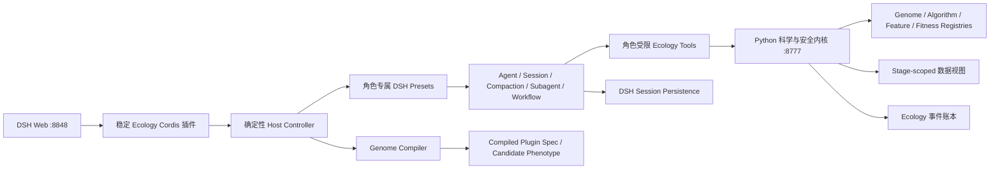

# DSH 原生 Ecology 插件进化架构设计

## 1. 决策摘要

本项目后续采用以下单一架构方向：

1. **DSH 是稳定运行时，不是进化对象。** Agent、Session、上下文压缩、
   Token 计量、Subagent、Workflow、模型路由和会话持久化全部由 DSH 管理。
2. **Ecology 插件基因组才是进化对象。** 每个候选表示一个版本化、可继承、
   可验证、可编译的 `EcologyEvolutionPluginGenome`，而不是一组零散参数，也
   不是对 DSH 源码或 DSH 配置的修改。
3. **插件源码保持稳定。** 运行时不生成或安装任意 JavaScript/Python 插件；
   稳定的 Cordis 插件把声明式基因组编译为已登记的科学算法、特征/训练策略、
   DSH 角色工作流和工具权限子集。这是“数据驱动的插件程序进化”，不是源码
   自修改。
4. **Python sidecar 是科学与安全内核。** 它只负责数据分区、算法注册表、
   确定性训练/推理、reward、适应度、正式验证统计、事件账本和结构化工具；新运行
   不得从 Python 直连模型。
5. **不设置智能体 Token 硬上限。** 新 DSH-native Agent 创建请求省略
   `maxTokens`，上下文容量、输出长度和 compaction 使用 DSH 与模型适配器的
   策略。Token、时延和调用数只作为观测指标和最后一级软排序指标。
6. **科学性能是非补偿式主目标。** 安全或科学门禁失败时，更少 Token、更低
   时延或更简单的工作流均不能弥补失败。

新执行协议命名为：

```text
dsh_native_plugin_evolution@1
```

基因组合同命名为：

```text
ecologyrsi-dsh.plugin-genome/1
```

## 2. 当前系统诊断

### 2.1 当前实际在进化什么

当前候选的可变内容分散在：

```text
Proposal.changes
+ Proposal.metadata["plan"]
+ Proposal.metadata["prediction_model_adoption"]
+ 宿主派生的 DerivedExecutionPlan
```

`Candidate` 本身只包含候选 ID、提案 ID、代次、槽位和生命周期状态。现有
`AlgorithmIR` 已经安全、版本化并限制为已登记 pipeline，但它是从提案派生的
编译产物；特征策略、训练策略、DSH 工作流、角色指令和工具策略尚未形成统一、
可继承的候选基因组。

因此当前闭环更准确地说是在搜索“已登记预测器的有界参数和每代研究建议”，
还不是完整的插件程序进化。

### 2.2 当前 DSH 集成状态

现有 `integrations/dsh_ecology_plugin/lib/index.js` 只负责：

- 托管 Ecology 工作台静态资源；
- 将 `/api/ecology-evolution` 代理到回环 Python sidecar。

研究、提案、逐样本 planner/repair/critic 和 generation judge 仍由 Python
`ModelGateway` 直接发起模型请求，因此没有使用 DSH Session、Compaction、
Subagent 和 Workflow 作为真实执行面。

### 2.3 当前科学闭环的优点和缺口

可直接保留的基础：

- `training_fit → training_feedback → development → gate` 时间前向分区与 digest；
- fit-only baseline、逐样本归一化 reward；
- target × horizon 完整网格、覆盖率惩罚和物理约束门禁；
- sibling 共享 cohort、不同 cohort 不直接替换正式 incumbent；
- 实用提升阈值 `0.005` 和配对区块证据；
- proposer/judge 分离与 `scientific_pass AND judge_accepted`；
- 追加式事件账本、私有样本结果和公共投影脱敏。

需要优化的关键缺口：

- 没有第一类插件 genome、lineage、behavior digest 和 compiler contract；
- 适应度只有一个主要 score，稳健性、不确定性和效率没有分层表达；
- 少量配对区块可能按点估计通过，未严格 fail-closed；
- 同一 `training_feedback` 被多代自适应复用，过去把其 bootstrap 下界当正式置信证据并不成立；
- 当前所谓 moving-block bootstrap 并未真正抽取连续移动区块；
- development、gate 和 external reference 尚未形成不可逆的正式验证状态机；
- selection 阶段宿主仍可装入 development 数据，边界主要依赖合同而非最小数据视图。

## 3. 目标系统和允许的科学结论

当前首要目标系统是 Autonomous Greenhouse Challenge 历史温室序列：

- 目标：室内气温、相对湿度、二氧化碳浓度；
- 时距：1、6、24 小时；
- 输入：历史室内状态、外部气象、辐射、设定值、执行器/动作、根区与资源变量，
  具体可用字段由 dataset contract 冻结；
- 决策：从已登记的预测模型、特征/训练策略和多智能体执行策略中选择一个可审计
  插件基因组。

V1 推荐的科学模型族是 Python-first、可复现的多输出自回归/外生变量残差模型：

- persistence 和 seasonal-24h 作为 fit-only 强基线；
- rolling residual；
- exogenous ridge；
- targetwise ridge；
- horizon-targetwise ridge。

过程机理或状态空间温室模型可在完成单位、执行器、边界条件、可辨识性和参数证据
预检后，以新的已登记 adapter 加入；不能让智能体直接生成不可审计的过程方程源码。

系统允许报告：特定 episode、时间段和观测支持下的离线预测性能及相对冻结基线的
误差改善。系统不得声称控制动作的因果效应、反事实控制收益、产量或资源效率提升、
跨年份/作物/团队泛化或线上控制安全性。

## 4. 固定内核与可进化边界

### 4.1 固定内核

以下内容永远不能由 genome 修改：

- DSH 源码、DSH provider 凭据、Session/Compaction/Subagent/Workflow 实现；
- Cordis 插件的认证、路由、运行控制器和角色 preset 安全代码；
- TaskManifest、dataset/split/evaluator/fitness profile digest；
- `training_fit`、`training_feedback`、`development`、`gate`、external holdout 边界；
- reward 公式、覆盖率惩罚、物理约束、探索性选择规则和正式验证多重比较规则；
- 算法/operator/feature/fit/tool/instruction/workflow 模板注册表；
- 禁止任意代码、动态 import、Bash、文件系统、任意网络、任意 MCP 的规则；
- planner/critic 的标签隔离和 reviewer 会话隔离；
- 事件追加、digest、revision fence、幂等键、generation lease；
- 浏览器/导出的凭据与私有证据脱敏规则。

### 4.2 可进化内容

V1 允许基因组在注册表范围内改变：

- 科学 pipeline 选择及其有界参数；
- 已登记 feature policy 和 fit policy 及其有界参数；
- 已登记 uncertainty policy；
- `candidate_execution_program` 中已登记 DSH workflow template 的选择与有界 fan-out、
  wave、重试参数；
- candidate planner/repair 角色 instruction template 的选择、受 schema 限制的参数和工具子集；
- `reproduction_program` 中 researcher/proposer 的模板与参数；该程序只在候选成为下一代
  search parent 后用于生成子代，不能生成或评审自身。V1 记录并继承该程序但将其 mutation mask
  冻结为 false，因为当前候选分数不能为其后代生成质量提供同代因果 credit；
- 有界恢复策略和候选执行策略。

基因组只能缩小权限，不能新增工具、provider、数据分区或执行能力。

`sample-critic`、`generation-judge` 和正式统计 evaluator 属于固定
`selection_reviewer_program`，其 preset、instruction、schema、工具和模型路由由
fitness/security kernel 冻结，不属于任何候选 genome。共享 researcher/proposer 使用本代父 genome
的 reproduction program；首代使用 seed genome 的 reproduction program。候选不能选择自己的
proposer、critic 或 judge。

未来只有在新增独立 lineage-level reproduction fitness（例如固定后代预算下的有效子代率、后代
主要科学提升分布和失败率）后，才能在新 schema 版本中开放 reproduction program 变异；该
meta-fitness 不能混入当前候选的科学 score。

## 5. 总体架构



用户只访问 `http://127.0.0.1:8848/`。`8777` 和内部 runtime API 都只监听
回环地址，不提供单独前端入口。

## 6. `EcologyEvolutionPluginGenome` V1

### 6.1 递归不可变合同

建议新增 `src/ecologyrsi_dsh/evolution/genome.py`，定义 typed、递归不可变的子合同。
`dataclass(frozen=True)` 只冻结顶层属性，不足以保护嵌套 JSON；所有有界参数必须通过
`deep_freeze_json()` 转成 immutable tuple/frozen scalar representation，内部不得保存调用者的
dict/list 引用。`to_dict()` 每次返回新的深拷贝。

规范化源合同形态如下；`AlgorithmIR` 和完整 Workflow DAG 故意不在 genome 中：

```json
{
  "schema_version": "ecologyrsi-dsh.plugin-genome/1",
  "genome_id": "genome:<digest-prefix>",
  "genome_revision": 1,
  "lineage": {
    "origin_kind": "bounded_mutation",
    "parent_candidate_id": "candidate-<parent-ulid>",
    "parent_genome_digest": "sha256",
    "generation": 3,
    "slot_index": 1,
    "slot_seed": 7342,
    "generation_batch_digest": "sha256",
    "mutation_budget_digest": "sha256",
    "mutation_operator_id": "bounded-single-parent-mutation@1",
    "mutation_digest": "sha256",
    "source_research_iteration_digest": "sha256",
    "source_knowledge_snapshot_digest": "sha256",
    "migration_source": null
  },
  "scientific_program": {
    "predictor_ref": {
      "id": "greenhouse-horizon-targetwise-ridge@1",
      "catalog_digest": "sha256"
    },
    "parameter_overrides": {},
    "feature_policy_ref": {
      "id": "registered_greenhouse_features@1",
      "catalog_digest": "sha256",
      "overrides": {}
    },
    "fit_policy_ref": {
      "id": "time_forward_fit@1",
      "catalog_digest": "sha256",
      "overrides": {}
    },
    "uncertainty_policy_ref": {
      "id": "none@1",
      "catalog_digest": "sha256",
      "overrides": {}
    }
  },
  "agent_program": {
    "candidate_execution_program": {
      "workflow_template_ref": {
        "id": "candidate-sample-execution@1",
        "catalog_digest": "sha256"
      },
      "workflow_overrides": {},
      "role_profiles": [
        {
          "role": "sample-planner",
          "preset_id": "ecology-sample-planner-v1",
          "instruction_template_ref": {
            "id": "sample-planner@1",
            "catalog_digest": "sha256"
          },
          "instruction_parameters": {},
          "response_schema_id": "sample-decisions@1",
          "base_tool_policy_id": "sample-planner-tools@1",
          "enabled_tool_ids": ["ecology_execute_prediction_tool"]
        }
      ]
    },
    "reproduction_program": {
      "workflow_template_ref": {
        "id": "research-and-propose@1",
        "catalog_digest": "sha256"
      },
      "workflow_overrides": {},
      "role_template_refs": ["researcher@1", "candidate-proposer@1"]
    }
  },
  "runtime_binding": {
    "protocol": "dsh_native_plugin_evolution@1",
    "required_capability_digest": "sha256",
    "resolved_policy_route_digest": "sha256",
    "resolved_review_route_digest": "sha256",
    "registry_catalog_digest": "sha256"
  },
  "frozen_contract_refs": {
    "task_manifest_digest": "sha256",
    "dataset_snapshot_set_digest": "sha256",
    "split_manifest_digest": "sha256",
    "data_protocol_digest": "sha256",
    "stage_policy_digest": "sha256",
    "evaluator_digest": "sha256",
    "fitness_profile_digest": "sha256",
    "security_kernel_digest": "sha256",
    "selection_reviewer_program_digest": "sha256"
  },
  "evidence_refs": ["knowledge:<content-digest>"],
  "behavior_digest": "sha256",
  "genome_digest": "sha256"
}
```

`scientific_program` 只保存注册项引用和有界覆盖；编译器产生唯一 `AlgorithmIR`。
`agent_program` 只保存 Workflow template 引用和有界覆盖；完整 nodes/edges 只存在于宿主注册表
及编译产物。候选提交任何 `algorithm_ir`、`nodes`、`edges` 或脚本字段都直接拒绝，避免双重
真相源。

### 6.2 Canonicalization 与 identity digest

Genome canonicalization 单独版本化为 `plugin-genome-canonical-json@1`：

- 字符串先做 Unicode NFC；对象键按 Unicode code point 排序；
- schema 声明为 set 的数组先校验唯一性再按规范值排序，顺序有语义的数组保持原顺序；
- bool 不能作为整数；拒绝 NaN、Infinity 和非 JSON 类型；`-0.0` 规范化为 `0.0`；
- 所有 ID 去除首尾空白后必须与对应正则完全匹配；
- digest 使用域分隔，例如
  `sha256(b"ecologyrsi-dsh/plugin-genome/1\0" + canonical_bytes)`，不能与普通对象 digest
  混用。

身份、行为去重与实例防串换使用五类 digest，禁止复用一个字段承担两种语义：

- `behavior_digest` 只覆盖会影响候选行为的 `scientific_program` 和
  `agent_program` 规范化源内容；
- `genome_digest` 覆盖 schema、lineage、行为、runtime binding、冻结合同和证据引用，
  但排除 `genome_id` 和两个 digest 字段；`genome_id` 必须确定性等于
  `genome:<genome_digest前24字符>`，不能随机生成；
- `runtime_execution_digest` 覆盖精确解析后的 policy/review route config digest、DSH 能力、
  compiler/registry/security/data/stage binding；模型 ID 字符串本身不能代替解析后 digest；
- `compiled_behavior_digest` 覆盖解析后的有效 `AlgorithmIR` 行为投影、feature/fit/UQ spec、完整
  Workflow/role/tool 行为、compiler/registry/security/runtime 的**语义版本与内容**；它明确排除
  run/proposal/candidate/generation/slot、lineage、`genome_id`、`genome_digest` 和其他实例身份。
  `AlgorithmSpec` 中的实例字段必须先剥离，不能直接整对象进入该 digest；
- `phenotype_instance_digest` 覆盖 `compiled_behavior_digest + genome_digest`，再加入 task/run/
  proposal/candidate/generation/slot、冻结 route/data/stage/evaluation binding。它用于 artifact、
  evaluation、promotion 和事件链防串换，行为相同的 sibling 也必须具有不同实例 digest。

候选重复签名为：

```text
digest(compiled_behavior_digest + evaluation_cohort_digest)
```

这样才能真正识别“lineage/文字不同但解析后行为相同”的候选；实例完整性另由
`phenotype_instance_digest` 保证，也不会把不同 cohort 的科学评测误当作同一次执行。

`algorithm_behavior_projection@1` 是显式白名单，而不是“把 IR 序列化后删几个 ID”：只包含解析后
predictor/operator graph、target/horizon、特征与 lag、填满默认值并数值规范化的有效参数、feature/
fit/UQ policy、允许的数据角色，以及有效 Workflow/role/instruction-parameter/tool behavior。它排除
run/proposal/candidate/generation/slot、title/rationale、自由文本 evidence、knowledge mapping 说明、
source-plan/proposal digest、展示字段和 lineage。省略默认值与显式写出同一默认值必须产生完全相同
投影。compiled behavior 直接使用 runtime binding 的去实例化语义投影；不得把包含 run/data
instance 的完整 `runtime_execution_digest` 原样塞入其中。

### 6.3 Genome 不包含的内容

以下是 phenotype 或环境证据，不能由 genome 自报：

- 训练后的模型 artifact；
- reward、score、fitness、judge 结论；
- DSH Session/Agent/Workflow ID；
- Token、时延、调用失败率；
- development/gate/external 结果；
- promotion decision。

这些内容由宿主产生，并通过 digest 与 genome 绑定。

### 6.4 Legacy 投影

历史 proposal 不使用当前可变化的 registry 投影。发行包永久保留不可变
`legacy-program-catalog@0.2.2`，适配器签名为：

```text
legacy_genome_from_proposal(
  proposal, task_manifest, frozen_knowledge_snapshot: KnowledgeSnapshot | None,
  legacy_catalog="legacy-program-catalog@0.2.2"
)
```

旧 `plan.algorithm_blueprint`、`algorithm_synthesis`、`prediction_model_adoption` 和
`Proposal.changes` 作为 legacy compiler source；`DerivedExecutionPlan` 是当时宿主派生的 phenotype
证据，不伪装为可遗传字段。golden fixture 必须证明完整新 `AlgorithmIR.to_dict()` 与旧编译器输出
相等，且当前 registry 后续变化不会改变 legacy genome/digest。适配器必须显式覆盖历史
`KnowledgeSnapshot=None`：内部使用版本化的 no-snapshot sentinel 参与 adapter identity，但投影的
`knowledge_snapshot_digest` 与完整旧 `AlgorithmIR` 仍保持 `None`，不能伪造快照 digest。golden
fixtures 同时保存“有 snapshot”和“无 snapshot”两条完整旧 IR。

事件重放不补写或改变旧 Proposal。`RunState.persisted_genome_for()` 只返回真正落账的 genome；
`projected_legacy_genome_for()` 返回带 `projected=true`、adapter version 和 source proposal digest 的
只读视图；无 snapshot 时同样返回稳定只读投影。投影视图不能直接用于晋级、继承或续跑，继续
实验必须经过显式 migration seed 物化并派生新的 DSH-native run。

## 7. 继承、变异与编译

### 7.1 Seed 物化与继承

全局 catalog 只能登记不含 task/run/route/data/lineage binding 的 `SeedGenomeTemplate`，不能登记
一个可跨任务复用的完整 genome。创建 run 时执行唯一物化链：

```text
SeedGenomeTemplate
→ materialize_seed_genome(template, FrozenRunInitialization)
→ RunSeedGenomeMaterialized(canonical full genome)
→ GenerationBatch.parent_genome_digest
```

完整的 `FrozenRunInitialization` envelope 至少包含 TaskManifest、dataset snapshot set、split/data/
stage/fitness/security、精确模型 route、DSH capability 和 registry/compiler digest；其中只有 genome
schema 明列的 `GenomeBindingSubset` 进入 genome。compiler digest 不进入 source genome，而进入
compiled behavior/runtime execution identity，因此同一 genome 在不同 compiler 下仍可产生不同
compiled behavior。

materializer 在追加事件前纯函数式地产生完整 seed。`RunCreated` 必须同时保存 seed template 的
canonical content/digest、完整 materialization input、materializer version、预期 materialized seed
canonical JSON/digest，并把 run 置为 `INITIALIZING`。随后、首个 `GenerationBatch` 之前幂等追加唯一
`RunSeedGenomeMaterialized`；只有该事件落账后 run 才能进入 READY。若两事件之间崩溃，恢复程序只用
`RunCreated` 中已持久化的 canonical seed 进行 digest 验证并补写同一事件，绝不读取当前 catalog；
部分初始化永远不能启动 generation。

legacy 继续实验必须走：

```text
projected legacy view
→ migrate_legacy_seed(projection, FrozenRunInitialization, frozen migration template)
→ RunSeedGenomeMaterialized(origin_kind="legacy_migration")
→ 新 run 的 GenerationBatch
```

migration seed 把冻结 legacy scientific projection 与明确版本的 DSH-native agent/reproduction
template 合成，并记录 source proposal/adapter/catalog/migration-template digest。投影视图本身仍不可
晋级、继承或恢复。

- 第一代只从本 run 已落账的 materialized seed genome 生成；
- 后续每代只从冻结的 `search_parent_candidate_id` 继承完整父 genome；
- 正式 incumbent 与 search parent 保持两个独立概念；
- 同代所有 sibling 共享相同父 genome、GenerationBatch、知识快照、研究迭代、
  数据 cohort、fitness profile 和编译器版本。

catalog seed 的 lineage 使用 `origin_kind="seed_catalog"`，migration seed 使用
`origin_kind="legacy_migration"`；两者的 parent/generation/slot 均为 null。第一代候选以已物化 seed
为 parent genome、`parent_candidate_id=null`、`generation=0`。legacy **投影** ID 从 source Proposal
digest 和 legacy catalog digest 确定性派生；新 migration seed ID 则从完整新 run binding 确定。

### 7.2 变异

模型不返回完整任意 genome，而只返回 `GenomeMutation@1`：

```text
select_registered_pipeline
set_bounded_parameter
select_registered_feature_policy
select_registered_fit_policy
select_registered_uncertainty_policy
select_registered_workflow_template
set_bounded_workflow_parameter
select_instruction_template
set_instruction_parameter
narrow_role_tool_policy
```

V1 采用单父有界变异，不实现自由 crossover。每次调用必须带不可变
`GenomeMutationContextV1`：

```text
run_id, generation, slot_index, slot_seed,
parent_candidate_id, parent_genome_digest,
generation_batch_digest, research_iteration_digest,
knowledge_snapshot_digest, mutation_budget_digest,
mutation_operator_id
```

接口为 `apply_genome_mutation(parent, accepted_mutation, context, registry)`。`mutation_digest` 覆盖
规范化的已接受 mutation 与完整 context，不覆盖模型原始自由文本。宿主按 slot 设定变异预算，应用 patch，
再进行 schema、注册表、权限单调性、标签隔离和 digest 校验。任何未知字段、任意 prompt、
源码、命令、模块、URL 或工具扩权都在编译前拒绝。

V1 的 instruction/workflow mutation 只能指向 `candidate_execution_program`；任何修改
`reproduction_program` 或固定 `selection_reviewer_program` 的操作都由 mutation mask 拒绝。

必须交叉校验：lineage parent 与 GenerationBatch parent 一致；Proposal parent 与 lineage 一致；
Candidate generation/slot 与 lineage 一致。`genome_revision`、工具请求的 `run_state_revision`、
`stage_attempt` 和 `ledger_expected_revision` 是四个不同字段，禁止复用含糊的 `revision`。

### 7.3 编译

编译与实例绑定分成两个纯步骤：

```text
compile_plugin_behavior(
  genome, task_manifest, frozen_knowledge_snapshot, registry_snapshot
)
  -> CompiledEcologyBehaviorSpec

bind_phenotype_instance(
  compiled_behavior,
  CompilationInstanceContext(
    run_id, proposal_id, candidate_id, generation, slot_index,
    task/data/stage/evaluation/runtime bindings
  )
)
  -> BoundEcologyPluginSpec
```

输出至少包含：

- 现有 `AlgorithmSpec` / `AlgorithmIR`；
- `CompiledFeatureTrainingSpec`；
- `CompiledDshWorkflowSpec`；
- 每角色 preset、instruction template、response schema 和 tool policy binding；
- compiler/registry/security/runtime-execution digest；
- 去除实例字段后的 `compiled_behavior_digest`；
- 第二步才产生包含 genome 与完整实例 binding 的 `phenotype_instance_digest`；
- 与输入 `genome_digest` 的双向绑定。

Workflow IR 只能降低为宿主编写并登记的固定脚本/模板。DSH Worker VM 明确不是安全
沙箱，因此绝不能把模型或 Python 提交的任意 JavaScript 传给
`workflowEngine.start()`。

## 8. DSH 原生运行时设计

### 8.1 已验证的 rc.6 能力边界

以本机 `@deepseek-ai/dsh 0.1.0-rc.6` 为准：

- `ctx.agents`：create/resume/get/list/roots；销毁必须保留 `AgentHandle.dispose()`；
- Agent：followup/steer/inject/cancel/whenIdle；cancel 后必须等待 idle；
- `ctx.sessions`：live Session 管理，不等同于持久化；
- `ctx.sessionPersistence`：JSONL 持久化、inspect/load/read/list；
- `ctx.tokenMeter.measure()`：当前上下文 surface 压力，不是累计费用账本；
- `ctx.sessionProjections.snapshot(session).values.tokenUsage`：累计 provider usage 投影；
- `ctx.compaction`：由角色 preset 隔离启用；
- `ctx.subagents`：one-shot 和 continuable 子智能体，所有 run/handle 必须释放；
- `ctx.workflowEngine.start()`：返回内存 `WorkflowRun`，没有 resume/get/list；
- `ctx.tools`：register/restrict/guard/execute；`restrict()` 不是授权边界，必须叠加 guard；
- `ctx.llm.resolveModelInfo()`/`resolveCallConfig()`：可检查精确路由，但目录出现不代表
  凭据或连通性已经验证。

### 8.2 角色专属 preset，而不是根作用域全局启用

Web Profile 根作用域没有 Compaction/Workflow，但标准 preset 的隔离 realm 已启用。
Ecology 不应全局打开服务，而应安装版本化角色 preset：

```text
ecology-coordinator-v1
ecology-researcher-v1
ecology-candidate-proposer-v1
ecology-sample-planner-v1
ecology-sample-critic-v1
ecology-generation-judge-v1
```

Preset ID 遵守 rc.6 的 `[a-z0-9][a-z0-9-]*` 约束；版本使用 `-v1`，不在 preset
ID 中使用 `@`。协议、schema 和宿主模板 ID 仍可保留 `@1`。

每个 preset 只挂载本角色工具、persona、Compaction，以及确实需要时的 Workflow。
不挂载 Bash、FS、Web、任意 MCP、Ask User 或通用执行技能。

Host Controller 通过 `ctx.agentPresets.mount(agentCtx, presetId)` 挂载 preset，并从 Agent realm 取得
`workflowEngine`。Cordis 根插件注入：

```text
webServer, agents, sessions, tokenMeter, subagents,
tools, sessionPersistence, sessionProjections, agentPresets, llm
```

Compaction/Workflow 不作为根插件硬注入。

每个 preset 的 standing scope 先以 `restrict({allow: []})` 清空继承的全局工具，再在同一
preset scope 注册角色工具；role-local 工具名不能放进 inherited allowlist。preset 只挂载
`dsh-workflow-worker-thread` 服务，不挂载模型可调用的 `dsh-tool-workflow` 或通用 subagent tool。
运行创建时冻结 preset 文件内容、standing tool schema set 和 resolved route config digest；安装后
任何漂移都使新运行/恢复失败。

### 8.3 多智能体拓扑

跨角色顺序由确定性 Host Controller 管理：

```text
researcher → candidate-proposer → sample-planner
           → independent sample-critic → generation-judge
```

每个 DSH Workflow 只 fan-out 同质角色。rc.6 Workflow child 继承父 Agent preset，
不支持每次 `agent()` 单独设置 toolFilter/persona；因此不能由一个拥有全部工具的
coordinator Workflow 混合启动 proposer、planner、critic 和 judge。

- researcher/proposer/judge 的 role-host Agent 只承载 preset 和父身份，不直接 followup 驱动；
  Host 通过该 role-host 启动带 `outputSchema` 的 one-shot spawn child，读取
  `SubagentResult.structured` 后由 Host 自己以幂等 sidecar 调用持久化。这三类 child 不暴露
  `submit_*` 工具，也不解析最终自由文本；
- sample-planner 如需跨 wave 保持上下文，使用 continuable subagent 或长期角色 Agent；
- critic 和 judge 必须从全新角色会话启动，不能 fork proposer/planner 的私有上下文；
- Host Controller 只传递 Python 生成、脱敏、带 digest 的阶段上下文。

本代 researcher/proposer 的可变模板来自冻结父 genome 的 `reproduction_program`；子 genome
产生后，其 reproduction program 只有在下一代被选为 search parent 时才生效。sample-planner 使用
当前候选的 `candidate_execution_program`。sample-critic 和 generation-judge 始终使用固定
`selection_reviewer_program`，候选无权改变其 preset、instruction、工具、schema 或模型路由。

### 8.4 上下文和 Token

- Agent 创建省略 `AgentOptions.maxTokens`；
- 不在 Ecology 请求中设置 provider `max_tokens`；
- DSH Session 是唯一智能体消息历史；
- Compaction 根据精确模型路由和 context pressure 执行；
- Python 不维护平行聊天上下文，不实施自己的截断/摘要；
- UI 用 `tokenMeter.measure()` 展示当前 context pressure；累计 provider usage 只从
  `sessionProjections.snapshot(session).values.tokenUsage` 读取。两者都标注 reported/estimated，
  不能冒充精确累计账单；
- Token/成功样本、时延/成功样本、失败调用率只进入末级效率评估。

### 8.5 取消与恢复

取消/暂停顺序：

1. Python 以 CAS 将 active stage 改为 `cancelling`/`pausing`，原子关闭该
   `run_state_revision + stage_attempt` admission fence；该 fence 同时拦截 model-callable 工具提交和
   Host-owned structured-result 持久化；
2. 所有 `subagents.start()` / `startContinuable()` 调用前都必须同步登记
   `PendingChildStart{AbortController,startPromise,kind,run?,childId?}`，并把 controller.signal 传入 request。
   barrier 先 abort 全部 pending controller，再等待每个 start Promise settle；one-shot 若已经返回
   `SubagentRun` 则 `await dispose()`（`SubagentRun` 本身没有 abort 方法）；continuable 若已经接受并
   返回 childId，则进入下一步。任何 pending start 未结算都不能标 clean；
3. 对所有保留的 `WorkflowRun` 执行 `cancel(reason)`；Workflow start 同步返回 handle。pause 时对 continuable planner 执行
   `subagents.interrupt(childId,{kind:"ancestor",agent:roleHost})`，等待 live child idle 并 flush；terminal
   cancel/teardown 时执行 `await subagents.drainContinuableDescendants([roleHost])`；
4. `await WorkflowRun.dispose()`，再释放所有已结算的 one-shot run/其他 child state；
5. `Agent.cancel({kind: "user"}, {keepInbox: pause})`；
6. `await Agent.whenIdle()` 并 `await ctx.sessions.flush(agent.session)`；pause 保留 role-host handle，
   terminal cancel/teardown 随后 `await AgentHandle.dispose()`；
7. Host/Python 对 durable accepted items、Session 和关闭后的 fence 做 reconciliation，确认没有可接受的
   晚到结果后，Python 才追加 clean paused/cancelled 事件。

rc.6 `WorkflowRun.dispose()` 是有界 cleanup，不是无限 quiescence 保证。任何 dispose/idle/flush
超时都进入稳定失败/暂停状态，admission fence 保持关闭，不能标记 clean cancelled。

Agent 可从精确 Session ID、preset 和冻结模型路由恢复。Workflow 不能恢复；进程重启后
必须把旧 Workflow 标为 interrupted/reconciled，依据 Python 账本、DSH 子 Session 和
幂等提交重建“尚未完成 item”的新 Workflow。不得宣称从旧 Workflow ID 继续。

child 可能在 `start()` Promise 返回、`subagent/start` 或 `workflow/agent-start` 事件被 Host 处理之前
就执行首个工具。故 structured one-shot 与 Workflow 在启动前都必须先原子预登记
`ChildBindingReservation(parentSessionId, safe_label)`，并冻结不可变的
parent/label/run/candidate/role/preset/tool-policy identity，同时分配单次 activation。对 continuable child
必须明确拆成不可变 `ChildIdentityBinding` 与可轮换、
单次使用的 `StageActivationLease`（run-state revision/stage attempt/wave/idempotency/activation epoch）。
业务 `idempotency_key` 在重跑时保持不变，但每次实际 child launch 必须由
Python durable ledger 按 `run/stage_attempt/role/item/idempotency` 用 CAS 原子分配并落账全程单调的
`launch_attempt`，令
`reservation_id=digest("dsh-child-reservation@1",run_id,stage,stage_attempt,role,item_digest,
idempotency_digest,launch_attempt)`，safe label 包含该
reservation ID；label 永不复用。reservation 只允许 pending → claimed → terminal，或 pending/claimed
→ revoked/tombstoned，不能覆盖、回到 pending 或删除 tombstone，避免旧 child claim 新 reservation。
进程重启后必须先从 ledger 取得下一个 attempt，不能从 Host 内存计数恢复。

rc.6 `SubagentDescriptor v2` 不含 parent Session。child 的已知 `subagent/descriptor` 在首个 pre-step 前
已经写入 Session；standing tool guard 必须从 `exec.agent.session.header.parentSession` 取得 parent，使用
`foldSubagentDescriptor(session events).label` 取得 label，再以 CAS 把唯一 pending reservation claim 到
`exec.agent.id` 后才允许第一次工具执行。缺失、重复、错 label、错 parent、错 launch attempt、已 terminal
或已撤销 reservation 一律 fail-closed。

continuable planner 每次 `followup()` 前必须由 Python ledger 预登记新的 activation lease，并将 lease
ID 注入 Host closure；只有前一 turn 已 idle、Session 已 flush、前一 lease 已 terminal/revoked 且没有
在飞工具调用时才能 CAS 轮换。guard 同时校验已 claim 的 immutable child identity 和当前 open lease。
pause 先关闭 lease，再 interrupt → idle → flush；resume 可复用 child identity，但必须取得新 lease。
任何携带旧 revision/attempt/wave/lease 的迟到工具或结果都拒绝。禁止通过重写 descriptor reservation
为同一 child 换 stage binding。

Host 仍须在启动前订阅 `subagent/start`/`workflow/agent-start` 及相应 end 生命周期事件，事后映射只能
用于交叉核对和恢复，不能作为首次授权来源。事件中的
`(parentSessionId,label) → childSessionId` 映射要尽快写入 Python 账本，禁止仅以 label 建索引。
重启时，**只有 Python durable accepted submission 才代表 item 完成**；
DSH child Session 显示 completed 只用于审计，不能据此跳过未落账 item。未接受 item 用新的
Workflow ID 和原 idempotency key 重跑。

one-shot 在调用 `start()` 前逐项 reserve。Workflow Worker 内部没有 Host 的 per-child pre-start hook，
因此 Host 必须在 `workflowEngine.start()` 前对已知、有界 batch 的**全部** item/label 一次性原子分配
launch attempts 并建立 reservations，固定脚本只能使用这些预分配 labels；start 抛错、item 未发布、
cancel 或 reconciliation 时 revoke/tombstone，正常 end/dispose 时 terminal。禁止等
`workflow/agent-start` 后再补 reservation。

### 8.6 分级 capability 语义

只读 capability GET 不创建探针 Agent，也不产生 Session。状态分为：

1. `declared`：根服务和 preset 文件已声明；
2. `preset_mountable`：`agentPresets.standingKeyFor()` 能解析 composition；
3. `tool_surface_verified`：对 standing key 的 `tools.schemas(key)` 与冻结工具集一致；
4. `live_agent_service_ready`：创建真实 role-host 后，`serviceFor(agent, "compaction")` 和所需
   `serviceFor(agent, "workflowEngine")` 可用；
5. `route_resolvable`：精确模型 route/config 可解析；
6. `first_call_verified`：该冻结 route 的真实 stage 调用至少成功一次后缓存的事实。

目录可见或 `resolveCallConfig()` 成功不能伪装成 `first_call_verified`。Task 6 只能实现前三项和
route 解析；Task 7 创建 role-host 后才能验证 live service；first-call 状态只能由实际阶段更新。

## 9. 工具与权限设计

建议按角色固定工具面与唯一结果通道：

| 角色 | 工具 |
|---|---|
| coordinator | `ecology_get_run_context`；调度由 Host Controller 直接执行 |
| researcher | 只读 `get_run_context`、`get_research_evidence`；结果由 one-shot structured output 返回 Host |
| candidate-proposer | 只读 `get_run_context`、`get_research_evidence`、`get_generation_summary`；结果由 one-shot structured output 返回 Host |
| sample-planner | `get_run_context`、`get_sample_wave`、`execute_prediction_tool`、`submit_sample_decisions` |
| sample-critic | 只读冻结 wave/预测摘要、`submit_sample_review` |
| generation-judge | 只读 `get_generation_summary`；结果由 one-shot structured output 返回 Host |

研究、提案和 judge 的唯一结果通道是 one-shot Subagent/Workflow 的 `outputSchema` 结构化结果，
Host 再直接持久化；顶层 Agent API 没有 output schema，不能把 role-host 的自由文本当结果。
需要多次工具执行或跨 wave 的 planner/critic 使用幂等提交工具，并且只有在 Python durable accept
成功后才可 `exec.concludeTurn()`。一个角色不能同时使用 structured result 和 model-callable
`submit_*` 两条终止通道。

每次工具执行必须校验：

- `exec.agent.id`、Session ID 与 Host 内存绑定；rc.6 中 Agent ID 与 Session ID 相同；
- Ecology `run_id`、role、stage、run-state revision、stage attempt、genome digest；
- `idempotency_key` 和 Python 当前账本状态；
- 输入/输出 JSON Schema；
- planner 输入中没有 observed/label/ground-truth；
- 角色工具 allowlist 与执行时 guard 同时通过。

run/role/stage/run-state revision/stage-attempt/ledger-expected-revision/Session/idempotency 身份由 Host closure 构造，不作为模型可以填写或覆盖的
工具参数。固定 Workflow script 不插值 prompt/args；args 必须经过 structured clone、schema 和
字节上限校验，并同时限制 `maxTotalAgents`、`maxConcurrent`、`maxItems` 与同步超时。

## 10. 同代公平性和上下文隔离

同代候选必须从完全相同的冻结上下文起点执行：

```text
GenerationBatch digest
+ parent genome digest
+ knowledge snapshot digest
+ research iteration digest
+ stage context digest
+ dataset/cohort/fitness/compiler digests
```

实现方式不是复制 DSH 私有推理，而是为每个 sibling 创建全新角色 Session，向每个 Session
注入同一个规范化阶段上下文 envelope。候选之间禁止读取 sibling 的中间结果。只有整代
完成后的宿主聚合 `GenerationAnalysis` 才能进入下一代上下文。

研究者可以为整代产生共享研究证据；候选 proposer 只能看到该共享证据与同一父 genome。
critic/judge 只能看到与其职责匹配的脱敏结构化证据，不能继承被评角色的会话。

## 11. Reward 与层级适应度

### 11.1 保留的逐样本 reward

对样本 (i)：

\[
r_i = |b_i-y_i| - |\hat y_i-y_i|
\]

\[
\tilde r_i = \operatorname{clip}(r_i/\sigma_t,-1,1)
\]

其中 baseline 与尺度都只由新协议的 `calibration_fit`（历史协议的 `training_fit`）确定。正值表示候选优于 baseline。失败或 fallback
样本不能获得正 reward。该 reward 继续用于诊断和学习反馈，不直接等于候选总适应度。

### 11.2 保留的主要科学 score

对 target × horizon 单元 (c)：

\[
s_c=\operatorname{clip}\left(1-\frac{NRMSE_c}{NRMSE_c^{(0)}},-1,1\right)
\]

覆盖率 (q_c=n_c^{success}/n_c^{eligible})，缺失按 `-1` 惩罚：

\[
s'_c=q_cs_c+(1-q_c)(-1)
\]

三个目标和所有时距等权聚合为主要 score (S)。现有公式不重写，避免把运行时迁移与
科学目标变更混为一体。

### 11.3 新的非补偿式 `FitnessAssessment`

适应度按以下顺序词典序比较：

1. **Validity/Safety**：digest、stage、完整网格、有限指标、覆盖率、物理约束、标签隔离、
   reviewer 独立性全部通过；
2. **Primary Science**：当前 (S)、相对 comparator 的实用提升，以及与 evidence class 匹配的
   selection stability floor 或 formal LCB；
3. **Robustness**：最差 target × horizon、最低 25% 单元和预注册时间子段稳定性；
4. **Predictive Uncertainty**：若 profile 要求，检查区间覆盖率和 interval score；
5. **Efficiency**：DSH tokens/成功样本、时延/成功样本、失败率、agent 数、工作流复杂度；
6. **Deterministic Tie-break**：更低行为复杂度、更早 slot、稳定 ID。

后一级永远不能补偿前一级失败，且 `exploratory_adaptive_data` 与 formal evidence 不在同一个排序
空间比较。selection 排序键为：

```text
validity_pass
primary_selection_gate
primary_selection_stability_floor
robustness_min_selection_stability_floor
uq_pass_or_not_required
negative_interval_score
efficiency_score
negative_complexity
negative_slot_index
```

validation/final-test 不做多候选排名，只对已锁定候选执行 point/UQ gate 与预注册 formal LCB；它们
产生 `validated_candidate` / final report status，而不是回写 selection 排名。

### 11.4 自适应 selection 与正式统计结论的边界

`training_feedback` 会被多代策略反复观察并用于产生下一代候选，因此任何基于该分区的 reward、
score、bootstrap bound 或 max-T 结果都属于**探索性模型选择证据**。它们可以更新内部
`search_parent` / `selection_incumbent`，但不能产生 `validated`、`confirmed`、正式“统计晋级”或
控制 I 类错误的声明。创建新 run、限制查看次数或只在结果有利时登记 look 都不能恢复独立性。

新 `fitness_profile@1` 的探索性 selection 默认：

- 实用 score 提升参考：`0.005`；
- 每单元/总体 coverage：`>= 0.90`；
- 每单元最少成功样本：`40`；
- 至少 `8` 个配对 24h 日块，否则 `insufficient_evidence`；
- 同轮所有预声明、同 cohort 且具有可计算配对主分数的 sibling 使用同一冻结区块索引进入
  non-studentized centered max-T 重采样；不可计算候选确定性排在可计算候选之后，不能看结果换入；
- 对第 (r) 次重采样计算
  `M_r=max_k(delta_star[r,k]-delta_hat[k])`，由冻结的 `B=10,000` 次重采样得到
  `q=sorted(M)[ceil(0.95*B)-1]` 与 `selection_stability_floor_k=delta_hat[k]-q`；该值只用于同轮风险排序，UI 与导出必须标记
  `exploratory_adaptive_data`，不得称为置信下界、p 值或 alpha-controlled 证据；
- 内部 winner 同时参考 `delta_hat > 0.005` 与 `selection_stability_floor > 0`，但即使满足也仍是
  `selection_only`；
- 点估计与重采样摘要使用同一完整 cohort 和同一冻结 block selection；私有计算使用全部配对
  区块，公共投影只输出摘要和 evidence digest。

唯一正式确认路径是：在任何 development 指标被读取前锁定一个候选、artifact、完整分析计划与
objective family，然后首次打开未暴露的 development partition。正式 95% LCB 只在该阶段产生；
通过后才可进入一次性 final-test。测试必须证明复用 selection 行、变更 run 或先读当前 cohort
reward/score 都不能生成 confirmatory promotion。

旧 `assess_promotion_improvement()` 在新协议中只是兼容投影，强制输出
`evidence_class="exploratory_adaptive_data"`；历史 `confidence_pass` 字段不得触发 validated/confirmed
状态或 formal stage token。

3 日 moving-block 的含义冻结如下：按数据合同中的冻结 calendar/timezone basis 把 origin 分成
24h 日历块；只把
块索引连续且中间没有数据时间缺口的 3 日序列视为合法起点；使用 non-circular 抽样，不从末尾
回绕到开头；重复抽取合法 3 日序列并依次拼接到原区块数后截断；candidate、incumbent 和所有
sibling 始终使用同一序列索引。旋转窗口中时间不连续的两个区块不得被视为相邻。单块内单元
缺失仍按既有 coverage/missing penalty 进入统计，而不是删掉困难单元。

探索性 selection 至少需要 `4` 个合法三日起点；formal partition 至少需要 `10` 个。仅满足总日块数
但合法起点不足时分别返回 exploratory `insufficient_evidence` 或 formal
`inconclusive/insufficient_temporal_continuity`，不得退化为独立日/小时 bootstrap。

这些阈值在 TaskManifest 的 host-owned fitness profile 中冻结并进入 digest。数据不足时不降低
阈值；系统可以继续探索，但不能宣称正式确认。

V1 只有单一 optimization episode，因此 `episode_robustness_status="not_available"`。所谓
season robustness 只能是预注册的同 episode 时间子段稳定性，并标为 subperiod evidence；不能
把旋转 cohort 当成跨 episode 或跨季节泛化证据。

## 12. 校准、验证与不确定性协议

### 12.1 四阶段协议

| 科学角色 | 当前分区 | 用途 | 是否反馈进化 |
|---|---|---|---|
| calibration-fit | `training_fit` 前段 | 点模型、预处理、baseline、尺度 | 可以 |
| calibration-UQ | `training_fit` 后段 | 锁定点模型的区间校准 | 不参与参数搜索或再训练 |
| model-selection | `training_feedback` | 多候选、多代自适应搜索 | 可以 |
| validation | `development` | 唯一锁定候选的独立确认 | 不可以 |
| final-test | `gate` | 一次性最终报告 | 永不反馈 |

新运行使用 `time-forward-four-stage@2`。`training_fit` 内部再冻结互不重叠的
`calibration_fit` 与 `calibration_uq`，两者之间以及 `calibration_uq → training_feedback`
之间都使用最大预测时距，即当前 `24h` 的 embargo。点模型、baseline 选择和归一化尺度只用
`calibration_fit`；`calibration_uq` 只计算已经锁定的点模型非一致性分数，之后不得用它重新训练
点模型。所有分区按 target timestamp 执行，任何拟合标签不得跨越边界。

`time-forward-four-stage@2` 的切点算法是合同的一部分，两个实现必须得到逐字节相同的 manifest：

1. 当前 AGC 源文件是无可靠 offset 的 naive local clock；合同分别冻结
   `source_timezone="unspecified-naive-local"` 与
   `calendar_encoding="excel-serial-hour-fixed-24h@1"`。后者只表示确定性、无 DST 的计算编码，不能
   宣称源数据为 UTC；日块为 `floor(timestamp/24)`。未来补充可信 IANA timezone 必须发布新 adapter/
   protocol 版本，不能原地解释；
2. 对旧 split manifest 的半开区间 `training_fit=[a,b)`，令
   `raw_cut=a+floor(0.70*(b-a))`；`calibration_fit=[a,raw_cut)`；
3. `calibration_uq_start` 是首个满足
   `timestamp >= timestamp[raw_cut-1] + 24` 的索引，
   `calibration_uq=[calibration_uq_start,b)`；中间行为 embargo，不能进入任何训练/校准；
4. `model_selection_start` 是旧 `training_feedback.start` 与首个满足
   `timestamp >= timestamp[b-1] + 24` 的索引二者较大者；
   `model_selection=[model_selection_start, training_feedback.end)`；
5. 样本按 **target timestamp** 落入半开边界；origin/history 可以只向过去读取，target/label 不能
   跨边界。`raw_cut` 不合法、任一结束索引不存在、calibration-fit 任一 cell 少于 80 个
   eligible、标签完整且历史窗口可构造的样本或 14 个日块、calibration-UQ 任一 cell 少于 40 个此类
   样本或 8 个日块时，创建 run 直接
   `data_protocol_insufficient`；不得移动切点、缩短 embargo 或降低阈值求通过；
6. manifest 明确保存 raw/derived index、首末 target timestamp、被 embargo 丢弃的 index range、
   比例、calendar/timezone basis、每 cell 样本/日块数，并分别产生 calibration-fit、calibration-UQ、
   model-selection、development、gate、每段 embargo 及整体 protocol digest。

历史 `time-forward-four-stage@1` / 1h fit-feedback embargo 只用于旧事件重放。新协议改变了
训练样本范围，因此保证不变的是 reward/score 的数学公式和相同输入下的结果，不承诺重新分区后
候选数值与历史 run 完全相同。

进入 validation 前冻结唯一候选、artifact、genome、fitness profile 和统计分析计划。development
只打开一次；结果不能进入 proposal、knowledge retrieval、parameter effects 或 search parent。
若失败或证据不足，本次正式验证都封口。仅创建新 run/study 不能恢复独立性；继续正式研究必须
使用未暴露的新时间尾部、新 episode 或新外部数据。复用已暴露 development 的结果只能标记为
exploratory。

gate 只有 validation 通过后才能一次性打开；原始行不进入插件或公共投影。AGC Reference
episode 作为独立 external test，不与 gate 合并。

### 12.2 Stage-scoped 数据视图与跨 run 暴露登记

selection evaluator 只收到类型化 `SelectionDatasetView`，内容仅含 calibration-fit、
calibration-UQ 必需的冻结产物引用和 model-selection 行；不能把 development 先装入同一个
`DatasetSeries` 再靠调用约定保护。旧 `DatasetRegistry.series()` 在新协议下主动拒绝，只供 legacy
重放。所有新 evaluator 的类型合同必须要求 stage-scoped view。

validation/final-test 使用一次性 stage token。token 与 run、stage、candidate、artifact、genome、
统计计划和 partition digest 绑定；跨 run、跨 artifact 或重复使用都拒绝。普通调用路径拿不到
formal raw `DatasetSeries`，formal evaluator 只返回聚合结果。

顺序必须是 candidate/artifact/analysis plan 全部锁定 → registry 原子 reserve raw holdout 与 analysis
family → 发放一次性 token → 首次解密/读取任何该 partition 行、reward、score 或摘要。任何预读、
预计算 cache hit 或 reserve 失败都不得返回 formal 指标；重试只能复用同一 reservation/idempotency，
不能再次打开。

新增持久的跨 run `ScientificExposureRegistry`，拆分两个不可替代的身份。原始 formal holdout 的
唯一暴露键为：

```text
dataset_digest + split_manifest_digest + episode_id
+ stage + stage_partition_digest
```

该键不含 objective、target、horizon、baseline、fitness 或统计计划，因此这些内容的任何变化都
不能再次打开同一 development/gate partition。首次打开前，另以

```text
holdout_exposure_key + objective_family_digest
```

登记冻结分析族与完整分析计划；分析族键用于审计多重性和确认“打开时评估的假设”，绝不能绕过
raw holdout 唯一键。registry 原子登记 development/gate 的 reserved → opened → sealed 状态；已暴露
development 不能再次称为独立 validation，gate 不能重复打开，复用数据只允许 `exploratory` 投影。

`objective_family_digest` 覆盖 dataset/episode/partition、targets、horizons、冻结 baseline、point/UQ
score、effect margin、multiplicity、bootstrap/区块方法和完整 fitness/statistical profile；不含候选
实例或展示配置。selection 的 adaptive data 暴露另行记录 evidence digest，但不登记 inferential
alpha，因为 11.4 已明确它不产生正式结论。

### 12.3 正式阶段的点预测规则

validation 和 final-test 都只评估一个锁定候选，主要比较对象是 calibration-fit 选择并冻结的
baseline，不是 selection incumbent。默认 formal 门禁：

- overall 与每单元 coverage `>= 0.95`；
- 每个 target × horizon 至少 `80` 个成功样本和至少 `14` 个 24h 日块；
- coverage-penalized formal score `S_formal > 0`；
- 每单元 skill `s_c >= 0`；
- 使用与 selection 相同的 non-circular 时间区块方法，要求候选相对 baseline 的单侧 95%
  `LCB(S_formal) > 0`；
- 数据不足返回 `inconclusive/insufficient_evidence`，既不是通过也不是科学失败，但数据已经暴露，
  因而仍封口。

formal 的三个区间统计统一使用 `formal-time-block-bootstrap@1`：`B=10,000`，三日 non-circular moving
blocks，至少 10 个合法起点；每次抽中的日块携带其全部冻结 eligible rows，cell 内逐行等权，九个 cell
按现有 score 等权，candidate/baseline/所有指标共享同一抽样索引。跨语言随机流用
`SHA256(domain + analysis_plan_digest + stage_partition_digest + replicate + draw_counter)` 的前 64 位
无符号整数对合法起点数取模，禁止使用语言默认 PRNG。

令 `Q_p(x)=sorted(x)[ceil(p*B)-1]`。primary 取
`delta*=S_candidate*-S_baseline*`，
`LCB=delta_hat-Q_0.95(delta*-delta_hat)`；每 cell coverage 以
`alpha_c=0.05/9` 取
`LCB_c=p_hat-Q_(1-alpha_c)(p*-p_hat)`；interval score 差
`d=IS_candidate-IS_baseline` 取
`UCB=d_hat+Q_0.95(d*-d_hat)`。所有 seed、row/block spine、权重、B、quantile index 与统计量进入
analysis plan digest；不足或非有限结果 fail-closed。

validation 任何点预测或 UQ 门禁失败都不能进入 final-test。final-test 失败或 inconclusive 只改变
最终结论等级，不修改 candidate、genome、selection incumbent 或 search parent。

### 12.4 时间序列预测区间

V1 selection profile 可设置 `require_predictive_intervals=false`，以兼容现有模型。正式 validation
profile 最终要求：

- 名义覆盖率 `0.90`；
- 每个 target × horizon 独立校准，不跨单元池化；
- 有限样本分位数索引 `k=ceil((n_c+1)*(1-alpha))`，不足以取得该分位数时为
  `uq_insufficient_calibration`；
- calibration 时间戳按规范时区排序，时间缺口切断 block，不能把缺口两侧样本当作相邻；
- formal 命中序列按 24h 日块 bootstrap，九个单元使用 Bonferroni 校正的单侧 coverage LCB，
  每单元校正后 LCB `>= 0.85`；不得把逐小时命中当作独立 Bernoulli；
- normalized interval score 与冻结 UQ baseline 做同样本、同区块配对非劣效检验，要求
  `UCB(IS_candidate-IS_baseline) <= delta_IS`，默认 `delta_IS=0.05`，该值进入 profile digest；
- 没有区间时为 `uq_not_available`，不能正式验证。

首个已登记策略命名为 `cellwise_time_block_calibrated_residual@1`。它借用 conformal 的有限样本
分位数构造，但对强相关、非平稳温室序列不声称 exchangeability 下的 distribution-free coverage；
正式结论只报告在冻结时间区块协议下观察到的经验覆盖与区块置信界。过程/参数不确定性可在后续
机理模型 adapter 中增加 Morris 筛选、Sobol 分析和结构模型分歧，但不能把参数敏感性解释为
因果效应。

`IS_baseline` 的可执行定义同时冻结：对每个 target × horizon，先在 calibration-fit 仅用既有规则
在 persistence 与 24h seasonal predictor 中选择 RMSE 更低者，冻结 baseline ID、point artifact、
`baseline_profile_digest` 与正的 calibration-fit scale `sigma_c`；若 scale 不可得则 fail-closed。然后
在相同 calibration-UQ 行上分别为候选和该 point baseline 计算
`a_m,i,c=abs(y_i-yhat_m,i)/sigma_c`，两者都使用同一
`cellwise_time_block_calibrated_residual@1`、相同 nominal alpha、相同 finite-sample quantile index、
calendar/gap/block 规则，但各自由自己的非一致性分数得到 `q_m,c`。formal interval 为
`[yhat_m-q_m,c*sigma_c, yhat_m+q_m,c*sigma_c]`。

每个 formal 行的 normalized interval score 固定为
`((U-L) + 2/alpha*(L-y)*I[y<L] + 2/alpha*(y-U)*I[y>U]) / sigma_c`。
候选与 baseline 只在相同 formal row、相同 target/horizon 和相同 24h 日块上做配对差；缺失一侧
不能删行获益，而按 UQ failure 处理。UQ baseline artifact 必须保存 point/baseline/calibration rows、
scale、nonconformity、quantile、policy 与 protocol digest，任何一项不同都拒绝比较。

## 13. 事件、状态和兼容迁移

### 13.1 最小侵入式 genome 双读

第一阶段复用现有事件链，但按执行协议强制不同完整性：

- `Proposal.metadata["evolution_genome_canonical_json"]` 保存 immutable canonical JSON 字符串，
  避免 Proposal 的浅层 mapping 被嵌套修改；
- `Candidate` 增加 `genome_digest` / `behavior_digest` / `compiled_behavior_digest` /
  `phenotype_instance_digest`；
- `AlgorithmSpec` 和 `AlgorithmAttemptRecorded` 同时绑定 `genome_digest`、
  `compiled_behavior_digest`、`phenotype_instance_digest`、`compiler_digest`、`registry_digest`、
  `security_digest`、`runtime_execution_digest`；
- `ModelArtifact` 绑定上述 digest 并产生自身 `artifact_digest`；
- `Evaluation` 绑定同一组 digest 和实际 `artifact_digest`；
- `PromotionDecided` 绑定 evaluation/artifact/phenotype-instance/compiled-behavior/genome digest 与
  结构化统计 assessment，并明确 `selection_only` 或 formal stage；
- `GenerationBatch` 增加 `parent_genome_digest` 并纳入 context digest；
- `RunCreated` 冻结 seed template ref 与 run bindings；首个 `GenerationBatch` 前必须存在唯一
  `RunSeedGenomeMaterialized`，其中保存完整 canonical seed genome，而不只是 digest；
- `dsh_native_plugin_evolution@1` 按事件时序分层要求字段：`ProposalSubmitted` 只要求 canonical genome、
  source `behavior_digest` 和 lineage 非空；`CandidateSpawned` 产生 candidate ID 后才能执行
  `bind_phenotype_instance`，最迟在首次 `AlgorithmAttemptRecorded` 要求 `compiled_behavior_digest` 与
  `phenotype_instance_digest` 非空；Artifact/Evaluation/Promotion 要求完整逐级 binding。任何阶段把尚
  不可计算字段用 null 相等冒充有效、仅 genome 相等但 phenotype-instance 不同、或 compiled behavior
  相同却实例 binding 串换都必须拒绝；
- 只有历史协议允许这些新增字段缺失。

旧事件缺字段时继续按原逻辑重放。legacy adapter 使用冻结 knowledge snapshot（允许 `None`）与永久
`legacy-program-catalog@0.2.2` 投影只读 V1 genome，并标记
`migration_source="legacy_proposal_projection"`。只有显式新 run migration 才追加
`RunSeedGenomeMaterialized`；旧 run 不补写事件。

`RunState.materialized_seed_genome()` 返回唯一 seed event 中的完整 genome；
`RunState.parent_genome_for_generation(0)` 只能返回该 seed，generation > 0 只能返回 GenerationBatch
冻结引用的 persisted candidate genome。replay 强制每个新 run 恰好一个 seed materialization，并校验
RunCreated 预期 canonical/digest、seed event canonical/digest、GenerationBatch parent digest 三者一致。

### 13.2 DSH 运行事件

运行时没有现有等价事件，因此新增：

- `DshRuntimeBound`；
- `DshAgentStageStarted`；
- `DshAgentSubmissionRecorded`；
- `DshAgentStageCompleted`；
- `DshAgentStagePaused` / `DshAgentStageFailed`；
- `DshWorkflowReconciled`。

Ecology 账本只保存结构化产物、digest、Agent/Session/Workflow 引用和 stop reason。完整会话与
compaction 历史保留在 DSH Session Persistence 中，不复制进科学账本。

### 13.3 历史运行

- 新自主运行只允许 `dsh_native_plugin_evolution@1`；
- `sidecar_openai_compatible_gateway` 历史运行可查询、导出和重放，不再发起模型调用；
- `ModelGateway` 仅保留 legacy 读取/诊断，不得被新路径 import 或调用；
- `TaskManifest.token_limit` 和旧逐操作 `max_tokens` 字段仅供历史事件解码；新创建请求和新元数据
  均不写入这些字段；
- 继续实验时，从历史冻结科学状态派生一个新的 DSH-native run，并记录来源 digest。

## 14. 内部 API 与代理安全

Cordis 插件提供仅回环可访问的内部 API：

```text
GET  /api/ecology-agent-runtime/v1/capabilities
POST /api/ecology-agent-runtime/v1/runs
POST /api/ecology-agent-runtime/v1/runs/{run_id}/stages
POST /api/ecology-agent-runtime/v1/runs/{run_id}/cancel
POST /api/ecology-agent-runtime/v1/runs/{run_id}/resume
GET  /api/ecology-agent-runtime/v1/runs/{run_id}
```

要求：

- 只接受字面量 `127.0.0.1` 或 `::1`；
- Python → DSH 控制使用独立 `ECOLOGYRSI_DSH_RUNTIME_TOKEN`；DSH → Python
  生态工具使用另一个 `ECOLOGYRSI_SIDECAR_TOOL_TOKEN`。两者都不复用浏览器或
  现有 sidecar service token；
- 写请求必须分别包含 `run_id`、`stage`、`run_state_revision`、`stage_attempt`、
  `ledger_expected_revision` 和 `idempotency_key`；不得使用含糊的单一 `revision`；
- 严格方法、路径、content type、请求/响应大小和总超时；
- 浏览器代理明确拒绝 runtime API 前缀；
- token、模型凭据、完整系统指令和完整会话不得出现在响应、URL、日志或错误 cause；
- capability 按 8.6 区分 `declared`、`preset_mountable`、`tool_surface_verified`、
  `live_agent_service_ready`、`route_resolvable` 和 `first_call_verified`，不能把模型目录项或
  resolveCallConfig 伪装成已通过真实调用认证。

Python 新增 `DshNativeAgentRuntimeClient`，只实现 capability、run/stage、cancel/resume/status，
不存在任何模型 completion 方法。

### 14.1 安装与依赖闭环

发布安装不能依赖当前机器已有的 `link:` package。Cordis 插件先产生包含全部 direct dependencies、
nested modules、schemas 和 presets 的版本化 npm tgz；安装器再通过官方命令
`dsh plugin --profile web add --save-exact file:<absolute-tgz>` 安装，使 Web Profile package/lock
获得真实依赖闭包。wheel/sdist/release archive 必须携带该 tgz 和可定位的安装器入口。

安装器从 DSH 配置或 `DSH_HOME`/`os.homedir()` 解析目标，不能硬编码用户目录；拒绝 symlink 和
非预期 target。修改前备份 profile patch、package、lock 和六个同名 preset；所有写入使用临时文件、
fsync、atomic rename，任一步失败执行完整 rollback。已存在同名 `-v1` preset 但内容 digest 不同
时拒绝覆盖。

安装验收必须验证：插件自身子路径可以 import、`dsh --profile web --dump-config` 成功、六个
preset 目录 basename 与冻结 preset ID 完全相同并可 mount、standing tool schema set 正确、
发布物与 profile/Session/credential 文件完全隔离。

## 15. UI 信息架构

创建页：

- 删除“逐样本智能体 Token 硬上限”；
- 不提交 `token_budget`；
- 模型目录显示真实 route 状态，不显示未经验证的 `authentication_verified=true`；
- DSH 必需能力不完整时禁用启动，无 Python fallback 开关。

运行页：

- 展示 genome schema、genome/behavior digest、父子 lineage 和结构化 mutation diff；
- 展示科学 program、feature/fit/UQ policy、workflow topology、角色 preset 和工具策略；
- 展示编译状态、compiled-behavior/phenotype-instance/runtime-execution/compiler/registry/security digest；
- 展示 selection incumbent、search parent、validated candidate、final-test candidate 四种状态；
- 展示 validity、primary、robustness、UQ、efficiency 分层适应度，而不是单一混合分；
- 展示 DSH Agent/Session/Workflow、context pressure、compaction 和恢复状态；
- Token 只读展示并标注 provider reported/estimated，不能作为硬预算。

## 16. 失败语义

| 失败 | 处理 |
|---|---|
| DSH 必需能力缺失 | 新运行 `503 dsh_native_runtime_unavailable` |
| 冻结模型路由消失 | 暂停 `dsh_model_route_unavailable`，不替换模型 |
| Compaction 失败 | 暂停 `dsh_context_management_failed` |
| Genome/schema/digest 失败 | 候选编译失败，训练前终止 |
| 工具越权或标签泄漏 | 安全失败并终止相关阶段 |
| Workflow 进程中断 | reconcile 幂等 item，以新 Workflow 重建未完成部分 |
| 结构化结果缺失 | `structured_submission_missing` |
| 配对证据不足 | `insufficient_evidence`；可探索，不作正式确认 |
| validation 失败/证据不足 | 当前 exposure 封口；只有未暴露的新时间段、episode 或外部数据可建立新的独立 validation，复用数据只能 exploratory |
| final-test 重复打开 | 拒绝并记录协议违规 |

所有失败路径都禁止回退到 Python `ModelGateway`。

## 17. 分阶段交付优先级

### P0：合同与统计正确性

- 冻结 genome、compiler、fitness 和 data protocol schema；
- 修复少区块 fail-open、block 范围不一致和假 moving-block；
- 建立 stage-scoped 数据视图；
- 保持现有 reward 公式不变。

### P1：Genome 双读和稳定编译器

- 引入 genome/lineage/digest/legacy adapter；
- 让现有 AlgorithmIR 从 genome scientific section 编译；
- 将当前固定 feature/fit/workflow 登记为 V1 唯一初始选项；
- artifact/evaluation/promotion 与 genome、compiled behavior、phenotype instance、artifact 及
  compiler/runtime digest 绑定。

### P2：DSH 原生运行时底座

- 模块化 Cordis 插件、加固代理；
- 安装角色 preset、capability gate、内部 runtime API；
- 实现 Agent/Session/Compaction/Session Persistence 生命周期；
- 新运行硬阻断 Python 直连模型。

### P3：结构化角色迁移

- 先迁 researcher、candidate-proposer、generation-judge；
- 再迁 sample-planner、sample-critic；
- Host Controller 串联同质 Workflow；
- 完成取消、恢复和 Workflow reconciliation。

### P4：完整插件进化闭环

- 父 genome 全量继承与 `GenomeMutation@1`；
- 开放已登记 feature/fit/workflow/instruction/tool-subset 变异；
- 强制 sibling 同上下文起点与无中间泄漏；
- 层级 fitness 排名与明确标记为探索性的同轮 max-T 稳定性排序。

### P5：正式科学验证与 UQ

- 不可逆 validation/final-test 状态机；
- cellwise time-block calibrated residual interval 与 coverage/interval score；
- external episode 独立验证；
- 明确结论等级和因果限制。

### P6：UI、交付和清理

- genome/fitness/DSH 状态 UI；
- 移除 Token 输入和新运行旧网关配置；
- 历史双读、导出、安装和 wheel/npm 资源清单；
- 全量安全、恢复、科学、Node、Python 和真实 DSH smoke。

## 18. 完成定义

只有同时满足以下条件，才能宣称本优化完成：

1. 新候选都拥有递归不可变、单一真相源的 genome、behavior/genome/compiled-behavior/
   phenotype-instance digest、lineage 和完整 compiler/runtime binding；seed/migration parent 已以完整
   canonical JSON 落账并可重放；
2. 进化只改变注册表允许的插件行为，不改变 DSH 或安全内核；
3. 新模型请求全部由 DSH Agent/Session 发出，Python 网络观测为零模型请求；
4. Agent 不设置 `maxTokens`，上下文与压缩由 DSH 管理；
5. 每角色 preset、工具 guard、会话隔离和同质 Workflow 验收通过；
6. 同代 sibling 使用相同冻结上下文，不能读取彼此中间结果；
7. reward、score 和层级 fitness 有独立版本、digest 与手算测试；
8. 证据不足 fail-closed；adaptive selection 明确只产生探索性证据，centered max-T 只作同轮稳定性
   排序，跨 run raw holdout exposure 与冻结分析计划可重放；
9. validation/final-test 不反馈搜索，stage-scoped 数据边界无法被普通调用绕过，暴露数据不能通过新 run 重置；
10. Workflow 重启按幂等 item reconcile，而不是虚假恢复旧 handle；
11. UI 无 Token 硬上限且清楚展示 genome、fitness 和 DSH 状态；
12. 历史事件、导出和只读投影兼容；
13. 全量 Python/Node/安全/恢复/打包/真实 DSH 验收通过；
14. 文档只声明离线预测能力，不作因果、控制或跨域泛化声明。

## 19. 最小可执行下一步

第一批实现只做三个不可逆风险最低、能建立后续边界的改动：

1. 先冻结 canonicalization、永久 legacy catalog、递归不可变 genome、seed/migration materialization、
   mutation context、compiled-behavior/phenotype-instance compiler golden tests，不改变现有执行结果；
2. 新增 DSH capability contract 和代理 runtime-prefix 隔离测试，不调用真实模型；
3. 将统计证据不足改为 fail-closed，并用固定合成时间序列验证连续 moving-block。

这三项完成后再接入真实 DSH Agent，能够避免在基因组、安全和科学门禁尚未冻结时过早迁移运行流。
