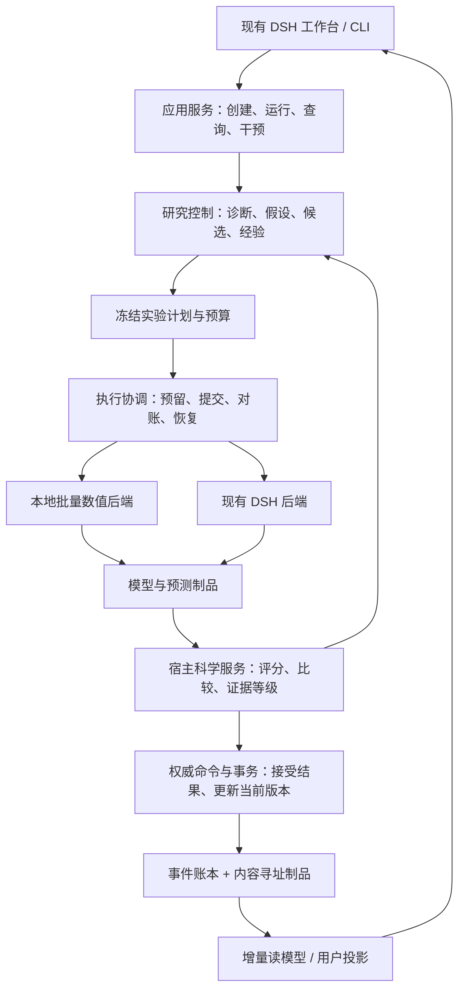

# 项目架构审查与渐进优化总方案

审查日期：2026-09-06。对象：当前工作区的 EcologyRSI-DSH 0.3.55，包含既有未提交修改和上一步迁入的冻结推理模块。

## 1. 总体判断

项目具备值得继续建设的主框架：真实温室数据适配、固定分区、登记预测器、宿主评分、追加式事件、DSH 运行与中文工作台均已有实现。主要问题集中在：业务编排过度集中、几套实验实现的责任重叠、研究策略与科学模型的评价边界不够统一，以及长运行下的执行和读取成本。

建议在现有产品中建设**一个应用编排入口、一套科学测量合同、一条持久化执行链、一套权威证据与状态写入机制**。采用模块化单体，以现有 Python、SQLite、DSH 和前端为基础，每批替换一条实际调用链。

当前可运行的科学任务主要是温室环境多时距预测与有界方案搜索。农业生态世界模型属于后续科学能力建设：现有代码尚不足以证明动作干预、作物—环境耦合、长期滚动状态和跨场景控制效果。

本次只进行审查、隔离复现及方案编写，没有替换业务代码，没有触发真实模型调用，也没有修改历史实验数据库。已有设计文档用于理解背景，结论以当前代码及执行结果为准。

## 2. 审查与验证范围

- 源码清单：143 个 Python 文件，共 94,758 行。阅读重点为实际入口、核心调用链、模块边界和科学/运行时合同，并非声称逐行审完全部源码。
- 主应用核心文件：director 6,126 行；projection 5,807 行；state 4,785 行；generation_execution 4,243 行；HTTP handler 4,175 行。
- 完整 Python unittest：1,417 项，1,409 通过、1 失败、3 报错、4 跳过，用时 232.381 秒。
- 失败/报错均为原有 refactor 区的四项：MethodCard 可选文本、必填证据/适用条件空列表，以及两项尚未注册的 v2 CLI 测试。
- 四项跳过均要求 ECOLOGYRSI_TEST_REAL_DATA=1。因此本次没有重新证明真实 AGC 数据端到端验收通过。
- DSH 插件 Node 测试：178 项全部通过。
- 额外使用临时数据库和明确的模拟 transport，复现门禁、预算、提交绑定、晋级事务等边界。它们揭示了当前已有测试未覆盖的情况。
- 本地原工作台 health、summary、monitor、detail 可读；单个演示运行的 summary 约 3.9 KB、monitor 约 2.9 KB、detail 约 195 KB。该单次小样本读取不能代替负载测试。

证据：[Python 全量日志](/Users/jiezhou/Desktop/工作/项目申请/农业-生态世界模型/EcologyRSI-DSH/.runtime/architecture-review-20260906/python-full.log)、[DSH 插件日志](/Users/jiezhou/Desktop/工作/项目申请/农业-生态世界模型/EcologyRSI-DSH/.runtime/architecture-review-20260906/node-integration.log)、[源码规模](/Users/jiezhou/Desktop/工作/项目申请/农业-生态世界模型/EcologyRSI-DSH/.runtime/architecture-review-20260906/structure.json)、[本地投影测量](/Users/jiezhou/Desktop/工作/项目申请/农业-生态世界模型/EcologyRSI-DSH/.runtime/architecture-review-20260906/http-view-sizes.json)。

## 3. 主要问题与处理优先级

这里 P0 表示“接入主链或对外声明能力之前必须解决”，不表示这些实验模块的缺陷已经发生在当前原生 DSH 主运行中。P1 为影响整体重构的主要架构问题；P2 为规模及产品维护改进。

### 3.1 P1：应用编排依赖 HTTP 容器，职责边界过宽

整代执行函数接收 endpoint，并直接访问 endpoint.server；后台 worker 为复用它还要构造类似 HTTP endpoint 的对象。HTTP server 同时组装账本、网关、策略、评测、工具和后台执行；core 又直接依赖具体策略实现。

这使 CLI、后台任务和新内核的接入都依赖一大组隐式成员。大文件是这一职责混合的结果，单纯按文件长度切块不能解决问题。

建议提取有类型的 RunCommands、GenerationService、RunQueries 和统一装配入口。HTTP 只负责输入校验、鉴权与响应；CLI 和后台 worker 调用相同应用服务。先保持现有运行与科学行为，再逐条替换内部组件。

证据：[整代执行](/Users/jiezhou/Desktop/工作/项目申请/农业-生态世界模型/EcologyRSI-DSH/src/ecologyrsi_dsh/api/generation_execution.py:4055)、[后台构造端点](/Users/jiezhou/Desktop/工作/项目申请/农业-生态世界模型/EcologyRSI-DSH/src/ecologyrsi_dsh/api/auto_progress.py:1045)、[服务装配](/Users/jiezhou/Desktop/工作/项目申请/农业-生态世界模型/EcologyRSI-DSH/src/ecologyrsi_dsh/api/handler.py:550)。

### 3.2 P1：存在保护机制，但业务写入责任分散

原生账本已有事务、revision 检查，服务已有数据库所有权锁与 generation lease，这些是应保留的基础。问题在于 generation_execution、evolution/batches、HTTP handler 等仍各自直接追加业务事件，并自行维护终态检查、幂等与 revision 约束。

建议将每类状态变更归到一个应用命令：创建运行、接受提案、提交实验结果、生成比较、更新当前版本、暂停/恢复/取消。命令在同一事务内验证前置条件、幂等载荷、预算和状态版本。worker、研究策略和 UI 只提交事实或意图。

“单一写入”指业务权威与事务边界，不要求所有代码塞进一个类。主运行不可同时由原生账本和新 kernel 账本各自决定冠军。

证据：[原生事务保护](/Users/jiezhou/Desktop/工作/项目申请/农业-生态世界模型/EcologyRSI-DSH/src/ecologyrsi_dsh/core/ledger.py:496)、[研究编排直接写账本](/Users/jiezhou/Desktop/工作/项目申请/农业-生态世界模型/EcologyRSI-DSH/src/ecologyrsi_dsh/evolution/batches.py:897)、[整代执行直接写账本](/Users/jiezhou/Desktop/工作/项目申请/农业-生态世界模型/EcologyRSI-DSH/src/ecologyrsi_dsh/api/generation_execution.py:2803)。

### 3.3 P0：AI-for-AI 实验台的评分与晋级尚不适合成为权威入口

隔离复现确认：

1. scientific_score 和逐单元分数为 NaN 时，比较结果仍可为 certification_eligible。
2. 晋级先提交转移幂等键，再分别降级旧版本、升级新版本；在最后一步前中断，重试同一幂等键直接返回，留下“旧版本 superseded、新版本 eligible、当前版本为空”。

这些问题位于独立 evolution_lab。其 demo 分数按 Skill/Tool 名称加固定分值，验证的是流程，不是实际预测或策略改进；当前 DshExperimentAdapter 也只是注入回调的接口。

建议统一严格的有限数值、完整 case 网格和证据合同；晋级/回退在一个事务中完成资格校验、当前版本 CAS、幂等决议与状态更新。更长期应让实验台调用公共评分和晋级服务，撤销它自己的第二套权威判断。演示结果显式带 synthetic_demo 和不可认证状态。

证据：[评分校验](/Users/jiezhou/Desktop/工作/项目申请/农业-生态世界模型/EcologyRSI-DSH/src/ecologyrsi_dsh/evolution_lab/evaluator.py:23)、[晋级顺序](/Users/jiezhou/Desktop/工作/项目申请/农业-生态世界模型/EcologyRSI-DSH/src/ecologyrsi_dsh/evolution_lab/controller.py:47)、[人工构造 demo 分数](/Users/jiezhou/Desktop/工作/项目申请/农业-生态世界模型/EcologyRSI-DSH/src/ecologyrsi_dsh/evolution_lab/__main__.py:28)、[两项复现结果](/Users/jiezhou/Desktop/工作/项目申请/农业-生态世界模型/EcologyRSI-DSH/.runtime/architecture-review-20260906/lab-reproductions.json)。

### 3.4 P0：新内核中有未接入但看似可用的错误门禁

statistics 将改善定义为 baseline_loss - candidate_loss，正值表示更好；SearchGate 却接受负方向。CertificationGate 仅检查计划非空和 blocks 大于零；statistics 还把样本数当块数，使用 zip 截断不等长列表。

复现中，更好的候选被 SearchGate 拒绝，更差候选通过，且可通过该 CertificationGate。**默认 services.run_search 使用另一套 science.evaluation.compare，并未调用这些门禁**，因此这是接入前阻断问题。

建议删除错误占位路径，收敛到经验证的比较服务。未实现的正式确认明确返回 unavailable，不返回成功布尔值。规则测试覆盖方向、长度、case 身份、独立块数、证据等级和无效计划。

证据：[占位门禁](/Users/jiezhou/Desktop/工作/项目申请/农业-生态世界模型/EcologyRSI-DSH/src/ecologyrsi_kernel/kernel/gates.py:3)、[另一套统计](/Users/jiezhou/Desktop/工作/项目申请/农业-生态世界模型/EcologyRSI-DSH/src/ecologyrsi_kernel/science/statistics.py:7)、[实际搜索比较](/Users/jiezhou/Desktop/工作/项目申请/农业-生态世界模型/EcologyRSI-DSH/src/ecologyrsi_kernel/science/evaluation.py:72)、[复现结果](/Users/jiezhou/Desktop/工作/项目申请/农业-生态世界模型/EcologyRSI-DSH/.runtime/architecture-review-20260906/science/boundary-results.json)。

### 3.5 P0：v2 配置声明的预算与功能没有完整兑现

直接调用 application.v2.run_config 时，origin 上限设为 1、wall-time 上限设为 0，仍完成两次评估、6,912 条预测。memory/metaevolution=true 可通过校验，但执行固定 guided 策略；artifact_root 等也未成为实际产物布局依据。

主 CLI 尚未注册 v2；该问题不能解释成现有主 API 的预算失效。它说明不能为了消除 CLI 测试错误而直接把新入口接上。

建议配置只接受能实际执行的能力，未实现开关立即拒绝。将 candidate、fit、origin、prediction-cell、model-call、token、wall-time 分成带单位的预算；预留、结算、未知费用和失败消耗进入执行账本。配置验收必须检查实际执行量、产物路径和超额阻断。

证据：[配置接受开关和预算](/Users/jiezhou/Desktop/工作/项目申请/农业-生态世界模型/EcologyRSI-DSH/src/ecologyrsi_dsh/application/v2.py:146)、[实际执行](/Users/jiezhou/Desktop/工作/项目申请/农业-生态世界模型/EcologyRSI-DSH/src/ecologyrsi_dsh/application/v2.py:255)、[预算复现](/Users/jiezhou/Desktop/工作/项目申请/农业-生态世界模型/EcologyRSI-DSH/.runtime/architecture-review-20260906/science/boundary-results.json)。

### 3.6 P0：实验 DSH 适配器的请求身份与未知结果处理不完整

当前新增 DshAgentBackend 默认使用内存请求表。同一 request_id 修改 seed 或 inference_view 后可静默复用旧 handle；远端接收请求后返回 Timeout，默认路径重试会再次 submit。supports_idempotent_submit 可为 false，但没有阻止这一路提交。

复现使用模拟 transport，确认的是适配器边界缺陷，不是已经发生重复收费。原生 DSH 运行链已有收据、取消围栏和重建能力，应由新执行接口包裹并复用。

建议请求载荷全量规范化后绑定 request_digest；先持久化 pending 和预算，再外部提交。超时进入 UNKNOWN_REMOTE_OUTCOME，查询/对账到原请求后再决策。重试必须保持同一逻辑请求，不能因没有收到响应就视作未执行。

证据：[默认请求存储](/Users/jiezhou/Desktop/工作/项目申请/农业-生态世界模型/EcologyRSI-DSH/src/ecologyrsi_dsh/adapters/dsh_backend.py:203)、[请求提交](/Users/jiezhou/Desktop/工作/项目申请/农业-生态世界模型/EcologyRSI-DSH/src/ecologyrsi_dsh/adapters/dsh_backend.py:244)、[不完整绑定](/Users/jiezhou/Desktop/工作/项目申请/农业-生态世界模型/EcologyRSI-DSH/src/ecologyrsi_dsh/adapters/dsh_backend.py:492)、[隔离复现脚本](/Users/jiezhou/Desktop/工作/项目申请/农业-生态世界模型/EcologyRSI-DSH/.runtime/architecture-review-20260906/runtime/dsh_adapter_reproduce.py)。

### 3.7 P1：评分含义、数据视图和身份规范不能直接互换

| 项目 | 原生温室链 | 实验 kernel |
| --- | --- | --- |
| 主要聚合指标 | 相对基线的 bounded RMSE skill，越高越好 | 按拟合尺度归一 MAE，越低越好 |
| 初始比较器 | 在 fit 中逐目标/时距选择 persistence 或 seasonal24 | persistence |
| 时序数据 | 实际时间戳、缺口、特征角色、分区边界 | 从 0 开始的连续整 episode |
| 身份 | 当前 canonical JSON 与旧 digest 合同 | NFC/负零规范及命名空间内容哈希 |
| 当前用途 | 原工作台运行 | 独立实验与迁移验证 |

建议冻结公共 EvaluationContext，包含 dataset/split/case 集、目标单位、预测时距、origin、缺失值政策、baseline、scaler、metric、aggregation 和证据等级。首次接入保留原生指标，用同一冻结预测矩阵做旧新评分对照。以后变更指标时新建合同版本，旧分数不进入新榜单。

身份统一只对新合同生效。历史标识原样保留，运行中的模型、编译器与后端不热切换；不能全局替换 digest 函数后继续声称历史证据身份不变。

证据：[原生评分](/Users/jiezhou/Desktop/工作/项目申请/农业-生态世界模型/EcologyRSI-DSH/src/ecologyrsi_dsh/evaluators/objectives.py:68)、[实验评分](/Users/jiezhou/Desktop/工作/项目申请/农业-生态世界模型/EcologyRSI-DSH/src/ecologyrsi_kernel/science/evaluation.py:54)、[新身份规范](/Users/jiezhou/Desktop/工作/项目申请/农业-生态世界模型/EcologyRSI-DSH/src/ecologyrsi_kernel/kernel/identity.py:13)。

### 3.8 P1：正式确认尚缺完整的跨运行暴露管理

原生 ScientificExposureRegistry 能拒绝同一数据库中完全相同 key 的重复登记。但 key 包含 split/stage 等配置；改变 split digest 或换账本数据库，可再次登记相同提供的数据分区身份，没有原始行集合重叠检查。

该正式确认方法尚未接到 CLI/API，当前搜索集复用也不等于违反正式确认边界。应在开放确认功能之前，建设项目级 ExposureStore，以来源内容、episode 和实际原始行/时间区间管理占用。换分区名称或换数据库不能制造新独立证据；开封失败也记录实际暴露。

证据：[暴露身份](/Users/jiezhou/Desktop/工作/项目申请/农业-生态世界模型/EcologyRSI-DSH/src/ecologyrsi_dsh/core/exposure_registry.py:32)、[账本内排重](/Users/jiezhou/Desktop/工作/项目申请/农业-生态世界模型/EcologyRSI-DSH/src/ecologyrsi_dsh/core/exposure_registry.py:182)、[边界正反复现](/Users/jiezhou/Desktop/工作/项目申请/农业-生态世界模型/EcologyRSI-DSH/.runtime/architecture-review-20260906/science/boundary-results.json)。

### 3.9 P1/P2：执行和读取成本需要按运行规模优化

原生逐 origin 的 Agent 规划、工具、评审链使模型调用量随预测起点增长。这对研究“智能体逐样本决策是否有效”有意义，但普通固定模型拟合/预测也承担同样成本时，不利于扩大候选与数据规模。

建议将研究控制和数值执行分开：默认由 LLM 在候选/实验层提出和诊断，固定模型由 BatchBackend 批量拟合、冻结推理；需要验证 Agent 策略行为时，明确选择 AgentBackend，并记录其额外调用成本。

读取方面已有缓存、summary、monitor 和事件游标，应继续使用。当前 seq 一变化就全量加载和回放事件；run 列表无分页；前端每 60 秒刷新全量当前详情和 catalog，并重绘多个工作区。因此长运行仍有随历史增长的成本风险，当前小型预览没有测得明显延迟。

建议版本化快照＋增量 reducer、持久化 run_summary、列表分页、revision/ETag、可见工作区按需读取。先基准测量，再决定是否采用 SSE。保留全量回放作为审计校验。

证据：[状态缓存和全量回放](/Users/jiezhou/Desktop/工作/项目申请/农业-生态世界模型/EcologyRSI-DSH/src/ecologyrsi_dsh/core/director.py:5950)、[运行列表](/Users/jiezhou/Desktop/工作/项目申请/农业-生态世界模型/EcologyRSI-DSH/src/ecologyrsi_dsh/api/catalog.py:437)、[前端定期全量刷新](/Users/jiezhou/Desktop/工作/项目申请/农业-生态世界模型/EcologyRSI-DSH/plugins/ecology_evolution/assets/js/commands.js:733)。

## 4. 目标框架

以下是职责与数据流，不要求一次性重命名目录。

核心合同建议收敛为：

| 合同 | 固定什么 |
| --- | --- |
| TaskSpec / EvaluationContext | 科学任务、数据视图、case 集、指标和基线 |
| ScientificProgram | 预测方法、特征、超参数、拟合与推理规则 |
| ResearchPolicy | 提案、诊断、工具选择和试验分配策略 |
| ExperimentPlan / ExecutionRequest | 输入制品、执行预算、请求身份和后端版本 |
| PredictionBatch / ModelArtifact | 数值结果与冻结模型；不带候选自报权威分数 |
| EvaluationRecord / ComparisonRecord | 宿主重算的证据和决策依据 |
| RunEvent / QueryProjection | 事实记录和可重建的展示视图 |

ScientificProgram 和 ResearchPolicy 是两类不同实验对象。改变提示词不自动等于改变有效算法；改变程序版本号也不自动等于产生新科学行为。必须由执行轨迹与产物证明登记能力实际生效。

## 5. 现有代码如何处理

| 现有部分 | 处理方式 |
| --- | --- |
| 主 CLI、HTTP、DSH 宿主插件、六个工作区 | 保留产品主体，转向调用统一应用服务 |
| data/registry、splits、greenhouse adapter | 保留真实数据能力，逐步抽出统一数据视图 |
| greenhouse_prediction、baselines、uncertainty、原生科学比较 | 保留并通过纯函数接口供新流程调用 |
| 已迁入 predict_fitted | 保留，继续作为冻结推理的单一实现 |
| director、generation_execution、batches | 按生命周期、研究编排、科学决策拆分职责 |
| EventLedger | 保留主账本，逐个命令/表迁移；不重建历史数据库 |
| kernel identity / contracts / artifact 等 | 择优迁入公共层；绑定新合同版本 |
| 新 kernel Ledger / queue / DSH adapters | 保持隔离验证，接入一条主链后撤销该职责的重复实现 |
| research_kernel 与 evolution_lab | 收敛为公共研究层的提案、经验和策略实验组件 |
| api/projection 与 presentation | 收敛为只读查询与展示层，使用增量投影 |

目录可以逐步组织为现有主包中的 application、core/contracts、science、research、execution、integrations、storage、api、presentation。每一次目录迁移必须对应责任迁移和真实调用点切换，避免增加一层转发却继续保留所有重复实现。

## 6. 分批实施方案

上一步已完成“冻结推理”的小范围迁移。后续按以下六批推进；每批独立审查和验证，不整仓覆盖。

| 批次 | 改什么 | 验收门槛 |
| --- | --- | --- |
| A：修正可调用合同 | 修复四项 refactor 测试问题；拒绝未实现配置；消除错误占位门禁；修复 lab 数值与事务问题；统一预算单位 | 全量离线测试无未解释失败；NaN/错向门禁/空证据被拒；中断后晋级可恢复；配置与执行量一致 |
| B：提取应用服务 | 从 HTTP 端点提取 GenerationService、RunCommands、RunQueries；统一装配与类型化端口 | HTTP、CLI、后台任务执行同一用例；固定运行的事件序列与投影行为对照通过 |
| C：接入科学计算主链 | 公共 EvaluationContext、预测矩阵、冻结模型；真实温室数据适配；先接 BatchBackend | 同输入预测/评分对照；时间缺口、单位、基线和分区边界通过；新旧分数不混用 |
| D：收敛持久化执行 | 请求载荷身份、预算事务、作业租约、远端对账、取消和晚到结果；包裹现有 DSH 能力 | 接收后断链不盲重发；重启可找回请求；过期 worker 与取消后结果不能更新当前版本；真实 DSH 专项通过后开放 |
| E：实现研究策略优化 | 结构化假设、实验设计、诊断、负经验与适用条件；实际接入 memory/策略候选 | 同预算对照 random/grid/guided；记忆开关消融；未见任务验证；无外层证据不宣称策略已自我改进 |
| F：读模型与产品收口 | 快照/增量投影、分页、按需 UI、证据和预算展示；清理已经被替代的模块 | 快照＋尾部回放与全量结果一致；运行规模测试通过；用户入口完整；源包/安装包/DSH 集成验收通过 |

A 中修正 v2 CLI 应与实际能力一致：不支持的运行约束先拒绝，不能只注册命令名来消除测试错误。B、C 可按稳定接口交替推进；F 的只读优化可与其他批次并行，但不独立决定业务状态。

每批切换规则：

1. 保存固定输入、事件、模型、预测和评分基线。
2. 新组件先在隔离输出或无权威写入的影子路径运行。
3. 确认同一输入与合同下的差异符合预期。
4. 对新建运行切换该组件，并冻结实现和合同版本。
5. 验证恢复、取消、审计后，清理已失去调用者的旧实现。
6. 历史数据与证据标识保留；发生问题可对下一新运行回退，已运行实验不静默换引擎。

## 7. 如何证明优化有效

### 科学效果与研究策略分别验证

**模型效果：** 保留温度、湿度、CO₂ × 1/6/24 小时的逐单元 MAE、RMSE、冻结基线 skill、覆盖率和物理越界率。主指标与可接受退化条件在实验前固定。有预测区间时再评估区间覆盖与宽度；原有 calibration-UQ 分区不挪作调参。

基线包括 persistence、因果可见 seasonal24、现有外生岭回归与冻结 incumbent。所有方案在相同 case 矩阵比较，失败样本不能改变分母或通过缺失逃避惩罚。

**策略效果：** 固定初始 incumbent、候选空间、数据任务和预算，对 random、grid、guided、memory 和策略进化做配对比较。报告质量随预算变化的曲线、达到目标质量的成本、有效提案率、失败率和模型调用量。至少完成多随机种子工程复现；正式策略结论以独立任务/运行对和预设不确定性要求为依据，不把相关时间点当作独立策略实验。

**独立验证：** 先完成时间前向切分，再在未参与搜索的温室、季节或 episode 检查泛化。冻结模型、策略、分析计划后开封。反复消费的搜索证据只标探索性；最终确认结果不回流同一搜索后仍冒充独立证据。

### 工程效果用工作量与故障场景验证

- 预算：实验、origin、cell、请求和 token 独立计数；失败、重试、取消与未知远端费用可对账。
- 故障：在预留后、远端接收后、结果落盘前、评分后晋级前等边界注入中断；检查不会重复实验、丢当前版本或接受晚到结果。
- 性能：在固定本机环境下，按运行数与事件数递增测 CPU、内存、数据库查询、响应字节和延迟分布。先建立现状基线，不预先宣称提速倍数。
- 读模型：同 revision 的重复读不应重建完整历史；monitor 大小不随完整候选和样本历史增长；列表有有界分页。
- 真实能力：纯模拟测试、合成数值测试、真实数据测试、真实 DSH 测试分别展示结果。新增函数或测试数量不作为接入完成的替代证据。

## 8. 向农业生态世界模型扩展的顺序

第一阶段先把当前温室预测任务做成可复现的领域基准。第二阶段逐步增加有明确单位、时间尺度和可观测性的作物/根区状态，登记相关机理或统计模型，并验证单模块。第三阶段才研究动作输入、状态转移、跨模块耦合和长时滚动误差。

将观测预测能力、机理约束、干预效应和控制策略评价分别建合同。现有离线历史预测分数不能直接作为灌溉、温控或产量优化收益。每增加一种科学能力，都需要数据适配、可运行模型、冻结基线、独立验证和可解释失败案例。

近期最小可交付闭环应是：**同一真实数据任务 → 可审查候选 → 批量数值执行 → 同合同评分 → 证据绑定的下一轮提案 → 原工作台查看与恢复**。先完成这条链，再扩大研究策略与科学领域。
